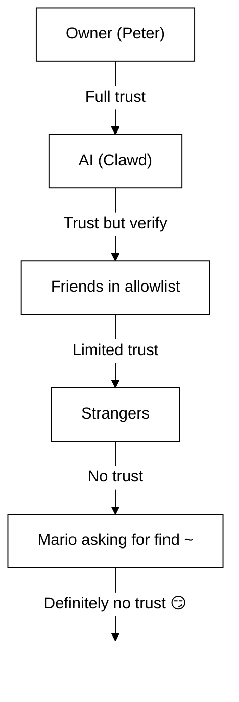

# تشغيل OpenClaw.app مع Gateway عن بُعد

يستخدم OpenClaw.app نفق SSH للاتصال بـ Gateway عن بُعد. يوضّح هذا الدليل كيفية إعداد ذلك.

## نظرة عامة



## الإعداد السريع

### الخطوة 1: إضافة تهيئة SSH

حرّر `~/.ssh/config` وأضِف:

```ssh
Host remote-gateway
    HostName <REMOTE_IP>          # e.g., 172.27.187.184
    User <REMOTE_USER>            # e.g., jefferson
    LocalForward 18789 127.0.0.1:18789
    IdentityFile ~/.ssh/id_rsa
```

استبدِل `<REMOTE_IP>` و `<REMOTE_USER>` بقيمك.

### الخطوة 2: نسخ مفتاح SSH

انسخ مفتاحك العام إلى الجهاز البعيد (أدخل كلمة المرور مرة واحدة):

```bash
ssh-copy-id -i ~/.ssh/id_rsa <REMOTE_USER>@<REMOTE_IP>
```

### الخطوة 3: تعيين رمز Gateway

```bash
launchctl setenv OPENCLAW_GATEWAY_TOKEN "<your-token>"
```

### الخطوة 4: بدء نفق SSH

```bash
ssh -N remote-gateway &
```

### الخطوة 5: إعادة تشغيل OpenClaw.app

```bash
# Quit OpenClaw.app (⌘Q), then reopen:
open /path/to/OpenClaw.app
```

سيقوم التطبيق الآن بالاتصال بـ Gateway عن بُعد عبر نفق SSH.

---

## بدء النفق تلقائيًا عند تسجيل الدخول

لجعل نفق SSH يبدأ تلقائيًا عند تسجيل الدخول، أنشئ Launch Agent.

### إنشاء ملف PLIST

احفظ هذا باسم `~/Library/LaunchAgents/bot.molt.ssh-tunnel.plist`:

```xml
<?xml version="1.0" encoding="UTF-8"?>
<!DOCTYPE plist PUBLIC "-//Apple//DTD PLIST 1.0//EN" "http://www.apple.com/DTDs/PropertyList-1.0.dtd">
<plist version="1.0">
<dict>
    <key>Label</key>
    <string>bot.molt.ssh-tunnel</string>
    <key>ProgramArguments</key>
    <array>
        <string>/usr/bin/ssh</string>
        <string>-N</string>
        <string>remote-gateway</string>
    </array>
    <key>KeepAlive</key>
    <true/>
    <key>RunAtLoad</key>
    <true/>
</dict>
</plist>
```

### تحميل Launch Agent

```bash
launchctl bootstrap gui/$UID ~/Library/LaunchAgents/bot.molt.ssh-tunnel.plist
```

سيقوم النفق الآن بما يلي:

- البدء تلقائيًا عند تسجيل الدخول
- إعادة التشغيل إذا تعطل
- الاستمرار في العمل في الخلفية

ملاحظة قديمة: أزِل أي LaunchAgent متبقٍ باسم `com.openclaw.ssh-tunnel` إن وُجد.

---

## استكشاف الأخطاء وإصلاحها

**التحقق مما إذا كان النفق يعمل:**

```bash
ps aux | grep "ssh -N remote-gateway" | grep -v grep
lsof -i :18789
```

**إعادة تشغيل النفق:**

```bash
launchctl kickstart -k gui/$UID/bot.molt.ssh-tunnel
```

**إيقاف النفق:**

```bash
launchctl bootout gui/$UID/bot.molt.ssh-tunnel
```

---

## كيف يعمل

| المكون                               | ما الذي يفعله                                                   |
| ------------------------------------ | --------------------------------------------------------------- |
| `LocalForward 18789 127.0.0.1:18789` | يمرّر المنفذ المحلي 18789 إلى المنفذ البعيد 18789               |
| `ssh -N`                             | SSH دون تنفيذ أوامر بعيدة (مجرد تمرير منافذ) |
| `KeepAlive`                          | يعيد تشغيل النفق تلقائيًا إذا تعطل                              |
| `RunAtLoad`                          | يبدأ النفق عند تحميل العامل                                     |

يتصل OpenClaw.app بـ `ws://127.0.0.1:18789` على جهاز العميل لديك. يقوم نفق SSH بتمرير هذا الاتصال إلى المنفذ 18789 على الجهاز البعيد حيث يعمل Gateway (البوابة).
