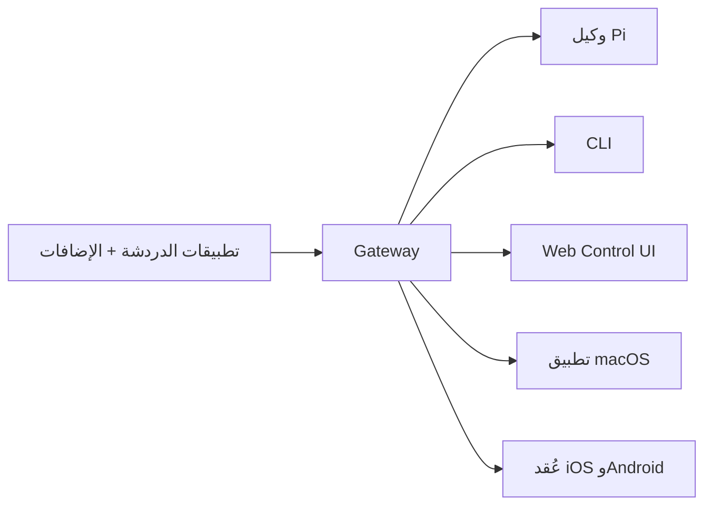

---
read_when:
  - عند تقديم OpenClaw للمستخدمين الجدد
summary: OpenClaw هو gateway متعدد القنوات لوكلاء الذكاء الاصطناعي يعمل على أي نظام تشغيل.
title: OpenClaw
x-i18n:
  generated_at: "2026-02-08T17:15:47Z"
  model: claude-opus-4-5
  provider: pi
  source_hash: fc8babf7885ef91d526795051376d928599c4cf8aff75400138a0d7d9fa3b75f
  source_path: index.md
  workflow: 15
---

# OpenClaw 🦞

<p align="center">
    </img>
    </img>
</p>

> _«EXFOLIATE! EXFOLIATE!»_ — ربما جراد البحر الفضائي

<p align="center"><strong>بوابة gateway لوكلاء الذكاء الاصطناعي تعمل على أي نظام تشغيل، وتدعم WhatsApp وTelegram وDiscord وiMessage وغيرها.</strong><br />
  أرسل رسالة وتلقَّ رد الوكيل من جيبك. يمكنك إضافة Mattermost وغيره عبر الإضافات.</p>

<Columns>
  <Card title="はじめに" href="/start/getting-started" icon="rocket">
    ثبّت OpenClaw وشغّل Gateway خلال دقائق.
  
</Card>
  <Card title="ウィザードを実行" href="/start/wizard" icon="sparkles">
    إعداد موجه باستخدام `openclaw onboard` وتدفق الإقران.
  
</Card>
  <Card title="Control UIを開く" href="/web/control-ui" icon="layout-dashboard">
    يشغّل لوحة تحكم في المتصفح للدردشة والإعدادات والجلسات.
  
</Card>
</Columns>

يربط OpenClaw تطبيقات الدردشة بوكيل برمجي مثل Pi من خلال عملية Gateway واحدة. يشغّل مساعد OpenClaw ويدعم الإعدادات المحلية أو البعيدة.

## آلية العمل



يُعد Gateway المصدر الموثوق الوحيد للجلسات والتوجيه واتصالات القنوات.

## الميزات الرئيسية

<Columns>
  <Card title="マルチチャネルgateway" icon="network">
    يدعم WhatsApp وTelegram وDiscord وiMessage عبر عملية Gateway واحدة.
  
</Card>
  <Card title="プラグインチャネル" icon="plug">
    أضف Mattermost وغيره عبر حزم التوسعة.
  
</Card>
  <Card title="マルチエージェントルーティング" icon="route">
    جلسات معزولة حسب الوكيل ومساحة العمل والمرسل.
  
</Card>
  <Card title="メディアサポート" icon="image">
    إرسال واستقبال الصور والصوت والمستندات.
  
</Card>
  <Card title="Web Control UI" icon="monitor">
    لوحة تحكم في المتصفح للدردشة والإعدادات والجلسات والعُقد.
  
</Card>
  <Card title="モバイルノード" icon="smartphone">
    إقران عُقد iOS وAndroid المتوافقة مع Canvas.
  
</Card>
</Columns>

## البدء السريع

<Steps>
  <Step title="OpenClawをインストール">    ```bash
    npm install -g openclaw@latest
    ```
</Step>
  <Step title="オンボーディングとサービスのインストール">
    ```bash
    openclaw onboard --install-daemon
    ```
  
</Step>
  <Step title="WhatsAppをペアリングしてGatewayを起動">```bash
openclaw channels login
openclaw gateway --port 18789
```
</Step>
</Steps>

هل تحتاج إلى تثبيت كامل وإعداد بيئة التطوير؟ راجع [クイックスタート](/start/quickstart).

## لوحة التحكم

بعد تشغيل Gateway، افتح Control UI في المتصفح.

- الافتراضي المحلي: [http://127.0.0.1:18789/](http://127.0.0.1:18789/)
- الوصول عن بُعد: [Webサーフェス](/web) و[Tailscale](/gateway/tailscale)

<p align="center">
  </img>
</p>

## الإعدادات (اختياري)

توجد الإعدادات في `~/.openclaw/openclaw.json`.

- **إذا لم تقم بأي إجراء**، سيستخدم OpenClaw ملف Pi الثنائي المضمَّن في وضع RPC، وينشئ جلسة لكل مُرسِل.
- إذا كنت ترغب في فرض قيود، فابدأ بـ `channels.whatsapp.allowFrom` و(في حالة المجموعات) قواعد الإشارة.

مثال:

```json5
{
  channels: {
    whatsapp: {
      allowFrom: ["+15555550123"],
      groups: { "*": { requireMention: true } },
    },
  },
  messages: { groupChat: { mentionPatterns: ["@openclaw"] } },
}
```

## ابدأ من هنا

<Columns>
  <Card title="ドキュメントハブ" href="/start/hubs" icon="book-open">جميع الوثائق والأدلة مرتبة حسب حالات الاستخدام.
</Card>
  <Card title="設定" href="/gateway/configuration" icon="settings">إعدادات Gateway الأساسية، والرموز المميِّزة، وإعدادات المزوّد.
</Card>
  <Card title="リモートアクセス" href="/gateway/remote" icon="globe">أنماط الوصول عبر SSH وtailnet.
</Card>
  <Card title="チャネル" href="/channels/telegram" icon="message-square">إعدادات خاصة بالقنوات مثل WhatsApp وTelegram وDiscord وغيرها.
</Card>
  <Card title="ノード" href="/nodes" icon="smartphone">عُقد iOS وAndroid مع دعم الاقتران وCanvas.
</Card>
  <Card title="ヘルプ" href="/help" icon="life-buoy">نقطة انطلاق للإصلاحات الشائعة واستكشاف الأخطاء وإصلاحها.
</Card>
</Columns>

## التفاصيل

<Columns>
  <Card title="全機能リスト" href="/concepts/features" icon="list">قائمة كاملة بالقنوات، والتوجيه، وميزات الوسائط.
</Card>
  <Card title="マルチエージェントルーティング" href="/concepts/multi-agent" icon="route">عزل مساحات العمل وجلسات لكل وكيل.
</Card>
  <Card title="セキュリティ" href="/gateway/security" icon="shield">الرموز المميِّزة، قوائم السماح، وضوابط الأمان.
</Card>
  <Card title="トラブルシューティング" href="/gateway/troubleshooting" icon="wrench">تشخيص Gateway والأخطاء الشائعة.
</Card>
  <Card title="概要とクレジット" href="/reference/credits" icon="info">أصل المشروع، المساهمون، والترخيص.
</Card>
</Columns>
