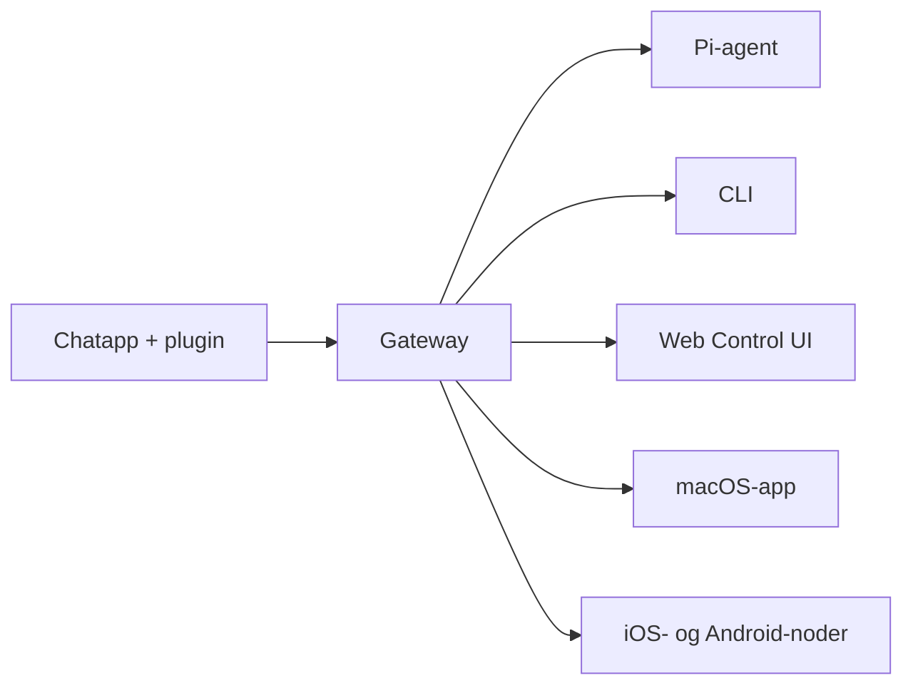

---
read_when:
  - Når du introducerer OpenClaw til nye brugere
summary: OpenClaw er en multikanal-gateway til AI-agenter, der kører på alle operativsystemer.
title: OpenClaw
x-i18n:
  generated_at: "2026-02-08T17:15:47Z"
  model: claude-opus-4-5
  provider: pi
  source_hash: fc8babf7885ef91d526795051376d928599c4cf8aff75400138a0d7d9fa3b75f
  source_path: index.md
  workflow: 15
---

# OpenClaw 🦞

<p align="center">
    </img>
    </img>
</p>

> _“EXFOLIATE! EXFOLIATE!”_ — sandsynligvis en rumhummer

<p align="center"><strong>En AI-agent-gateway til alle operativsystemer med understøttelse af WhatsApp, Telegram, Discord, iMessage og mere.</strong><br />
  Send en besked, og modtag agentens svar direkte fra din lomme. Tilføj Mattermost og mere via plugins.
</p>

<Columns>
  <Card title="はじめに" href="/start/getting-started" icon="rocket"> 
    Installer OpenClaw og start Gateway på få minutter.
  
</Card>
  <Card title="ウィザードを実行" href="/start/wizard" icon="sparkles"> 
    Guidet opsætning med `openclaw onboard` og parringsflow.
  
</Card>
  <Card title="Control UIを開く" href="/web/control-ui" icon="layout-dashboard"> 
    Starter et browser-dashboard til chat, indstillinger og sessioner.
  
</Card>
</Columns>

OpenClaw forbinder chatapps til kodeagenter som Pi gennem en enkelt Gateway-proces. Driver OpenClaw-assistenten og understøtter lokale eller fjernopsætninger.

## Sådan fungerer det



Gateway er den eneste pålidelige kilde til sandhed for sessioner, routing og kanalforbindelser.

## Nøglefunktioner

<Columns>
  <Card title="マルチチャネルgateway" icon="network">
    Understøtter WhatsApp, Telegram, Discord og iMessage i én enkelt Gateway-proces.
  
</Card>
  <Card title="プラグインチャネル" icon="plug">
    Tilføj Mattermost m.fl. via udvidelsespakker.
  
</Card>
  <Card title="マルチエージェントルーティング" icon="route">
    Isolerede sessioner pr. agent, workspace og afsender.
  
</Card>
  <Card title="メディアサポート" icon="image">
    Send og modtag billeder, lyd og dokumenter.
  
</Card>
  <Card title="Web Control UI" icon="monitor">
    Browserdashboard til chats, indstillinger, sessioner og noder.
  
</Card>
  <Card title="モバイルノード" icon="smartphone">
    Par Canvas-kompatible iOS- og Android-noder.
  
</Card>
</Columns>

## Hurtig start

<Steps>
  <Step title="OpenClawをインストール">
    ```bash
    npm install -g openclaw@latest
    ```
  
</Step>
  <Step title="オンボーディングとサービスのインストール">
    ```bash
    openclaw onboard --install-daemon
    ```
  
</Step>
  <Step title="WhatsAppをペアリングしてGatewayを起動">
    ```bash
    openclaw channels login
    openclaw gateway --port 18789
    ```
  
</Step>
</Steps>

Har du brug for fuld installation og udviklingsopsætning? Se [Hurtig start](/start/quickstart).

## Dashboard

Når Gateway er startet, skal du åbne Control UI i din browser.

- Lokal standard: [http://127.0.0.1:18789/](http://127.0.0.1:18789/)
- Fjernadgang: [Web Surface](/web) og [Tailscale](/gateway/tailscale)

<p align="center">
  </img>
</p>

## Konfiguration (valgfrit)

Konfigurationen findes i `~/.openclaw/openclaw.json`.

- **Hvis du ikke gør noget**, bruger OpenClaw den medfølgende Pi-binær i RPC-tilstand og opretter sessioner pr. afsender.
- Hvis du vil begrænse adgangen, så start med `channels.whatsapp.allowFrom` og (for grupper) regler for omtale.

Eksempel:

```json5
{
  channels: {
    whatsapp: {
      allowFrom: ["+15555550123"],
      groups: { "*": { requireMention: true } },
    },
  },
  messages: { groupChat: { mentionPatterns: ["@openclaw"] } },
}
```

## Start her

<Columns>
  <Card title="ドキュメントハブ" href="/start/hubs" icon="book-open">
    Al dokumentation og alle vejledninger organiseret efter use case.
  
</Card>
  <Card title="設定" href="/gateway/configuration" icon="settings">
    Gateway kernekonfiguration, tokens og provider-indstillinger.
  
</Card>
  <Card title="リモートアクセス" href="/gateway/remote" icon="globe">
    SSH- og tailnet-adgangsmønstre.
  
</Card>
  <Card title="チャネル" href="/channels/telegram" icon="message-square">
    Kanalspecifik opsætning for WhatsApp, Telegram, Discord m.fl.
  
</Card>
  <Card title="ノード" href="/nodes" icon="smartphone">
    Parring og Canvas-kompatible iOS- og Android-noder.
  
</Card>
  <Card title="ヘルプ" href="/help" icon="life-buoy">
    Almindelige rettelser og indgangspunkter til fejlfinding.
  
</Card>
</Columns>

## Detaljer

<Columns>
  <Card title="全機能リスト" href="/concepts/features" icon="list">
    Fuld oversigt over kanaler, routing og mediefunktioner.
  
</Card>
  <Card title="マルチエージェントルーティング" href="/concepts/multi-agent" icon="route">
    Workspace-isolering og sessioner pr. agent.
  
</Card>
  <Card title="セキュリティ" href="/gateway/security" icon="shield">
    Tokens, allowlists og sikkerhedskontrol.
  
</Card>
  <Card title="トラブルシューティング" href="/gateway/troubleshooting" icon="wrench">
    Gateway-diagnostik og almindelige fejl.
  
</Card>
  <Card title="概要とクレジット" href="/reference/credits" icon="info">
    Projektets oprindelse, bidragydere og licens.
  
</Card>
</Columns>
