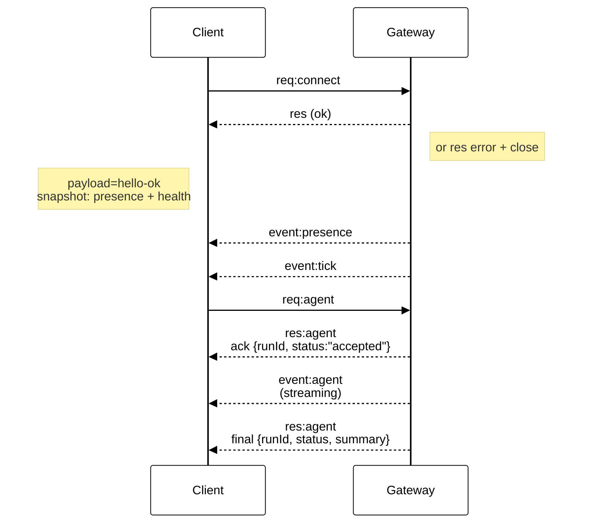

# Gateway-Architektur

Zuletzt aktualisiert: 2026-01-22

## Überblick

- Ein einzelnes, langlebiges **Gateway** besitzt alle Messaging-Oberflächen (WhatsApp über
  Baileys, Telegram über grammY, Slack, Discord, Signal, iMessage, WebChat).
- Control-Plane-Clients (macOS-App, CLI, Web-UI, Automatisierungen) verbinden sich mit dem
  Gateway über **WebSocket** auf dem konfigurierten Bind-Host (Standard
  `127.0.0.1:18789`).
- **Nodes** (macOS/iOS/Android/headless) verbinden sich ebenfalls über **WebSocket**, deklarieren jedoch
  `role: node` mit expliziten Caps/Commands.
- Ein Gateway pro Host; es ist der einzige Ort, der eine WhatsApp-Sitzung öffnet.
- Ein **Canvas-Host** (Standard `18793`) stellt agentenbearbeitbares HTML und A2UI bereit.

## Komponenten und Flows

### Gateway (Daemon)

- Hält Verbindungen zu Anbietern aufrecht.
- Stellt eine typisierte WS-API bereit (Requests, Responses, Server-Push-Events).
- Validiert eingehende Frames gegen JSON Schema.
- Emittiert Events wie `agent`, `chat`, `presence`, `health`, `heartbeat`, `cron`.

### Clients (macOS-App / CLI / Web-Admin)

- Eine WS-Verbindung pro Client.
- Senden Requests (`health`, `status`, `send`, `agent`, `system-presence`).
- Abonnieren Events (`tick`, `agent`, `presence`, `shutdown`).

### Nodes (macOS / iOS / Android / headless)

- Verbinden sich mit **demselben WS-Server** mit `role: node`.
- Stellen eine Geräteidentität in `connect` bereit; das Pairing ist **gerätebasiert** (Rolle `node`) und
  die Freigabe liegt im Geräte-Pairing-Speicher.
- Stellen Commands wie `canvas.*`, `camera.*`, `screen.record`, `location.get` bereit.

Protokolldetails:

- [Gateway-Protokoll](/gateway/protocol)

### WebChat

- Statische UI, die die Gateway-WS-API für Chatverlauf und Senden nutzt.
- In Remote-Setups verbindet sich WebChat über denselben SSH-/Tailscale-Tunnel wie andere
  Clients.

## Verbindungslebenszyklus (einzelner Client)



## Wire-Protokoll (Zusammenfassung)

- Transport: WebSocket, Text-Frames mit JSON-Payloads.
- Der erste Frame **muss** `connect` sein.
- Nach dem Handshake:
  - Requests: `{type:"req", id, method, params}` → `{type:"res", id, ok, payload|error}`
  - Events: `{type:"event", event, payload, seq?, stateVersion?}`
- Wenn `OPENCLAW_GATEWAY_TOKEN` (oder `--token`) gesetzt ist, `connect.params.auth.token`
  muss übereinstimmen, andernfalls wird der Socket geschlossen.
- Idempotenzschlüssel sind für Methoden mit Seiteneffekten (`send`, `agent`) erforderlich, um
  sichere Wiederholungen zu ermöglichen; der Server hält einen kurzlebigen Deduplizierungs-Cache vor.
- Nodes müssen `role: "node"` sowie Caps/Commands/Berechtigungen in `connect` einschließen.

## Pairing + lokales Vertrauen

- Alle WS-Clients (Operatoren + Nodes) enthalten eine **Geräteidentität** in `connect`.
- Neue Geräte-IDs erfordern eine Pairing-Freigabe; das Gateway stellt ein **Gerätetoken**
  für nachfolgende Verbindungen aus.
- **Lokale** Verbindungen (Loopback oder die eigene Tailnet-Adresse des Gateway-Hosts) können
  automatisch freigegeben werden, um eine reibungslose UX auf demselben Host zu gewährleisten.
- **Nicht-lokale** Verbindungen müssen den `connect.challenge`-Nonce signieren und erfordern
  eine explizite Freigabe.
- Gateway-Auth (`gateway.auth.*`) gilt weiterhin für **alle** Verbindungen, lokal oder
  remote.

Details: [Gateway-Protokoll](/gateway/protocol), [Pairing](/channels/pairing),
[Sicherheit](/gateway/security).

## Protokoll-Typisierung und Codegen

- TypeBox-Schemas definieren das Protokoll.
- JSON Schema wird aus diesen Schemas generiert.
- Swift-Modelle werden aus dem JSON Schema generiert.

## Remote-Zugriff

- Bevorzugt: Tailscale oder VPN.

- Alternative: SSH-Tunnel

  ```bash
  ssh -N -L 18789:127.0.0.1:18789 user@host
  ```

- Derselbe Handshake + Auth-Token gelten auch über den Tunnel.

- TLS + optionales Pinning können für WS in Remote-Setups aktiviert werden.

## Betriebsübersicht

- Start: `openclaw gateway` (Vordergrund, Logs nach stdout).
- Health: `health` über WS (auch enthalten in `hello-ok`).
- Überwachung: launchd/systemd für automatischen Neustart.

## Invarianten

- Genau ein Gateway steuert eine einzelne Baileys-Sitzung pro Host.
- Der Handshake ist verpflichtend; jeder nicht-JSON- oder nicht-Connect-Erstframe führt zu einem harten Close.
- Events werden nicht erneut abgespielt; Clients müssen bei Lücken aktualisieren.

