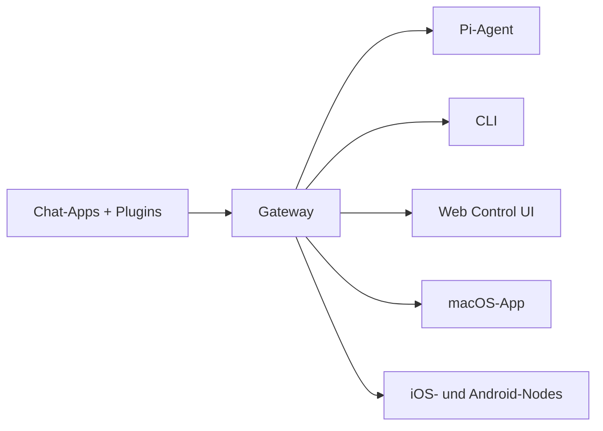

---
read_when:
  - 新規ユーザーにOpenClawを紹介するとき
summary: OpenClawは、あらゆるOSで動作するAIエージェント向けのマルチチャネルgatewayです。
title: OpenClaw
x-i18n:
  generated_at: "2026-02-08T17:15:47Z"
  model: claude-opus-4-5
  provider: pi
  source_hash: fc8babf7885ef91d526795051376d928599c4cf8aff75400138a0d7d9fa3b75f
  source_path: index.md
  workflow: 15
---

# OpenClaw 🦞

<p align="center">
    </img>
    </img>
</p>

> _「EXFOLIATE!EXFOLIATE!」_ — たぶん宇宙ロブスター EXFOLIATE!」_ — たぶん宇宙ロブスター

<p align="center"><strong>Ein AI-Agent-Gateway für alle Betriebssysteme mit Unterstützung für WhatsApp、Telegram、Discord、iMessage und mehr.</strong><br />
  Senden Sie eine Nachricht und erhalten Sie die Antwort des Agenten direkt aus Ihrer Tasche. Über Plugins können Sie Mattermost und weitere Dienste hinzufügen.</p>

<Columns>
  <Card title="はじめに" href="/start/getting-started" icon="rocket">
    Installieren Sie OpenClaw und starten Sie Gateway in wenigen Minuten.
  
</Card>
  <Card title="ウィザードを実行" href="/start/wizard" icon="sparkles">
    Geführte Einrichtung mit `openclaw onboard` und Pairing-Flow.
  
</Card>
  <Card title="Control UIを開く" href="/web/control-ui" icon="layout-dashboard">
    Startet ein Browser-Dashboard für Chat, Einstellungen und Sitzungen.
  
</Card>
</Columns>

OpenClaw verbindet Chat-Apps über einen einzigen Gateway-Prozess mit Coding-Agenten wie Pi. Es betreibt den OpenClaw-Assistenten und unterstützt lokale sowie Remote-Setups.

## Funktionsweise



Gateway ist die einzige verlässliche Quelle für Sitzungen, Routing und Kanalverbindungen.

## Hauptfunktionen

<Columns>
  <Card title="マルチチャネルgateway" icon="network">
    Unterstützung für WhatsApp、Telegram、Discord、iMessage über einen einzigen Gateway-Prozess.
  
</Card>
  <Card title="プラグインチャネル" icon="plug">
    Hinzufügen von Mattermost und weiteren Diensten über Erweiterungspakete.
  
</Card>
  <Card title="マルチエージェントルーティング" icon="route">
    Isolierte Sitzungen pro Agent, Workspace und Absender.
  
</Card>
  <Card title="メディアサポート" icon="image">
    Senden und Empfangen von Bildern, Audio und Dokumenten.
  
</Card>
  <Card title="Web Control UI" icon="monitor">
    Browser-Dashboard für Chat, Einstellungen, Sitzungen und Nodes.
  
</Card>
  <Card title="モバイルノード" icon="smartphone">
    Pairing von Canvas-fähigen iOS- und Android-Nodes.
  
</Card>
</Columns>

## Schnellstart

<Steps>
  <Step title="OpenClawをインストール">
    ```bash
    npm install -g openclaw@latest
    ```
  
</Step>
  <Step title="オンボーディングとサービスのインストール">
    ```bash
    openclaw onboard --install-daemon
    ```
  
</Step>
  <Step title="WhatsAppをペアリングしてGatewayを起動">
    ```bash
    openclaw channels login
    openclaw gateway --port 18789
    ```
  
</Step>
</Steps>

Benötigen Sie eine vollständige Installations- und Entwicklungsumgebung? Siehe [Schnellstart](/start/quickstart).

## Dashboard

Öffnen Sie nach dem Start von Gateway die Control UI im Browser.

- Lokaler Standard: [http://127.0.0.1:18789/](http://127.0.0.1:18789/)
- Remote-Zugriff: [Web Surface](/web) und [Tailscale](/gateway/tailscale)

<p align="center">
  </img>
</p>

## Konfiguration (optional)

Die Konfiguration befindet sich unter `~/.openclaw/openclaw.json`.

- **Wenn Sie nichts ändern**, verwendet OpenClaw die mitgelieferte Pi-Binärdatei im RPC-Modus und erstellt Sitzungen pro Absender.
- Wenn Sie Einschränkungen festlegen möchten, beginnen Sie mit `channels.whatsapp.allowFrom` und (für Gruppen) den Erwähnungsregeln.

Beispiel:

```json5
{
  channels: {
    whatsapp: {
      allowFrom: ["+15555550123"],
      groups: { "*": { requireMention: true } },
    },
  },
  messages: { groupChat: { mentionPatterns: ["@openclaw"] } },
}
```

## Hier beginnen

<Columns>
  <Card title="ドキュメントハブ" href="/start/hubs" icon="book-open">
    Alle Dokumentationen und Leitfäden, nach Anwendungsfällen organisiert.
  
</Card>
  <Card title="設定" href="/gateway/configuration" icon="settings">
    Kernkonfiguration von Gateway, Tokens und Provider-Einstellungen.
  
</Card>
  <Card title="リモートアクセス" href="/gateway/remote" icon="globe">
    SSH- und Tailnet-Zugriffsmuster.
  
</Card>
  <Card title="チャネル" href="/channels/telegram" icon="message-square">
    Kanalspezifische Einrichtung für WhatsApp、Telegram、Discord und mehr.
  
</Card>
  <Card title="ノード" href="/nodes" icon="smartphone">
    Pairing und Canvas-fähige iOS- und Android-Nodes.
  
</Card>
  <Card title="ヘルプ" href="/help" icon="life-buoy">
    Allgemeine Fixes und Einstiegspunkte zur Fehlerbehebung.
  
</Card>
</Columns>

## Details

<Columns>
  <Card title="全機能リスト" href="/concepts/features" icon="list">
    Vollständige Liste der Kanal-, Routing- und Medienfunktionen.
  
</Card>
  <Card title="マルチエージェントルーティング" href="/concepts/multi-agent" icon="route">
    Workspace-Isolierung und agentenspezifische Sitzungen.
  
</Card>
  <Card title="セキュリティ" href="/gateway/security" icon="shield">    Token, Zulassungsliste, Sicherheitskontrollen。
</Card>
  <Card title="トラブルシューティング" href="/gateway/troubleshooting" icon="wrench">    Diagnose des Gateway und allgemeine Fehler。
</Card>
  <Card title="概要とクレジット" href="/reference/credits" icon="info">    Ursprung des Projekts, Mitwirkende und Lizenz。
</Card>
</Columns>
