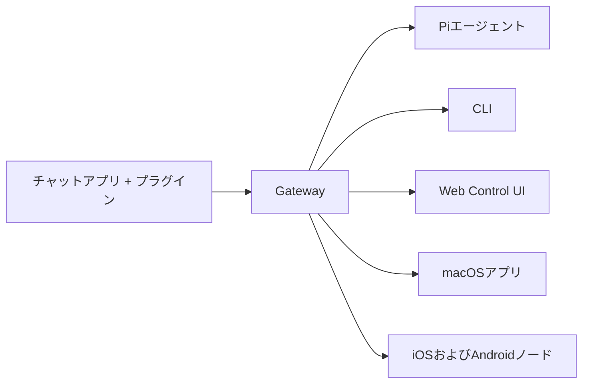

---
read_when:
  - Al presentar OpenClaw a nuevos usuarios
summary: OpenClaw es un gateway multicanal para agentes de IA que funciona en cualquier sistema operativo.
title: OpenClaw
x-i18n:
  generated_at: "2026-02-08T17:15:47Z"
  model: claude-opus-4-5
  provider: pi
  source_hash: fc8babf7885ef91d526795051376d928599c4cf8aff75400138a0d7d9fa3b75f
  source_path: index.md
  workflow: 15
---

# OpenClaw 🦞

<p align="center">
    </img>
    </img>
</p>

> _«¡EXFOLIA!
> ¡EXFOLIA!»_ — probablemente una langosta espacial

<p align="center"><strong>Un gateway de agentes de IA para cualquier sistema operativo, compatible con WhatsApp, Telegram, Discord, iMessage y más.</strong><br />
  Envía un mensaje y recibe la respuesta de un agente en tu bolsillo. Puedes añadir Mattermost y más mediante plugins.
</p>

<Columns>
  <Card title="はじめに" href="/start/getting-started" icon="rocket">
    Instala OpenClaw e inicia el Gateway en cuestión de minutos.
  
</Card>
  <Card title="ウィザードを実行" href="/start/wizard" icon="sparkles">
    Configuración guiada con `openclaw onboard` y flujo de emparejamiento.
  
</Card>
  <Card title="Control UIを開く" href="/web/control-ui" icon="layout-dashboard">
    Inicia un panel web para chat, configuración y sesiones.
  
</Card>
</Columns>

OpenClaw conecta aplicaciones de chat con agentes de programación como Pi a través de un único proceso Gateway. Impulsa el asistente OpenClaw y es compatible con configuraciones locales o remotas.

## Funcionamiento



Gateway es la única fuente de información fiable para sesiones, enrutamiento y conexiones de canales.

## Funciones principales

<Columns>
  <Card title="マルチチャネルgateway" icon="network">
    Un único proceso de Gateway compatible con WhatsApp, Telegram, Discord e iMessage.
  
</Card>
  <Card title="プラグインチャネル" icon="plug">
    Añade Mattermost y otros mediante paquetes de extensión.
  
</Card>
  <Card title="マルチエージェントルーティング" icon="route">
    Sesiones aisladas por agente, espacio de trabajo y remitente.
  
</Card>
  <Card title="メディアサポート" icon="image">
    Envío y recepción de imágenes, audio y documentos.
  
</Card>
  <Card title="Web Control UI" icon="monitor">
    Panel en el navegador para chats, configuración, sesiones y nodos.
  
</Card>
  <Card title="モバイルノード" icon="smartphone">
    Emparejamiento con nodos iOS y Android compatibles con Canvas.
  
</Card>
</Columns>

## Inicio rápido

<Steps>
  <Step title="OpenClawをインストール">
    ```bash
    npm install -g openclaw@latest
    ```
  
</Step>
  <Step title="オンボーディングとサービスのインストール">
    ```bash
    openclaw onboard --install-daemon
    ```
  
</Step>
  <Step title="WhatsAppをペアリングしてGatewayを起動">
    ```bash
    openclaw channels login
    openclaw gateway --port 18789
    ```
  
</Step>
</Steps>

¿Necesitas la instalación completa y la configuración de desarrollo? Consulta [Inicio rápido](/start/quickstart).

## Panel de control

Después de iniciar Gateway, abre la Control UI en tu navegador.

- Predeterminado local: [http://127.0.0.1:18789/](http://127.0.0.1:18789/)
- Acceso remoto: [Web Surface](/web) y [Tailscale](/gateway/tailscale)

<p align="center">
  </img>
</p>

## Configuración (opcional)

La configuración se encuentra en `~/.openclaw/openclaw.json`.

- **Si no haces nada**, OpenClaw utilizará el binario Pi incluido en modo RPC y creará sesiones por remitente.
- Si deseas establecer restricciones, empieza con `channels.whatsapp.allowFrom` y (para grupos) las reglas de menciones.

Ejemplo:

```json5
{
  channels: {
    whatsapp: {
      allowFrom: ["+15555550123"],
      groups: { "*": { requireMention: true } },
    },
  },
  messages: { groupChat: { mentionPatterns: ["@openclaw"] } },
}
```

## Empieza aquí

<Columns>
  <Card title="ドキュメントハブ" href="/start/hubs" icon="book-open">
    Toda la documentación y guías organizadas por caso de uso.
  
</Card>
  <Card title="設定" href="/gateway/configuration" icon="settings">
    Configuración principal de Gateway, tokens y ajustes de proveedores.
  
</Card>
  <Card title="リモートアクセス" href="/gateway/remote" icon="globe">
    Patrones de acceso mediante SSH y tailnet.
  
</Card>
  <Card title="チャネル" href="/channels/telegram" icon="message-square">
    Configuración específica de canales como WhatsApp, Telegram y Discord.
  
</Card>
  <Card title="ノード" href="/nodes" icon="smartphone">
    Emparejamiento y nodos iOS y Android compatibles con Canvas.
  
</Card>
  <Card title="ヘルプ" href="/help" icon="life-buoy">
    Puntos de entrada para correcciones comunes y resolución de problemas.
  
</Card>
</Columns>

## Detalles

<Columns>
  <Card title="全機能リスト" href="/concepts/features" icon="list">
    Lista completa de canales, enrutamiento y funciones multimedia.
  
</Card>
  <Card title="マルチエージェントルーティング" href="/concepts/multi-agent" icon="route">
    Aislamiento de espacios de trabajo y sesiones por agente.
  
</Card>
  <Card title="セキュリティ" href="/gateway/security" icon="shield">
    Tokens, listas de permitidos y controles de seguridad.
  
</Card>
  <Card title="トラブルシューティング" href="/gateway/troubleshooting" icon="wrench">
    Diagnóstico de Gateway y errores comunes.
  
</Card>
  <Card title="概要とクレジット" href="/reference/credits" icon="info">
    Origen del proyecto, colaboradores y licencia.
  
</Card>
</Columns>
