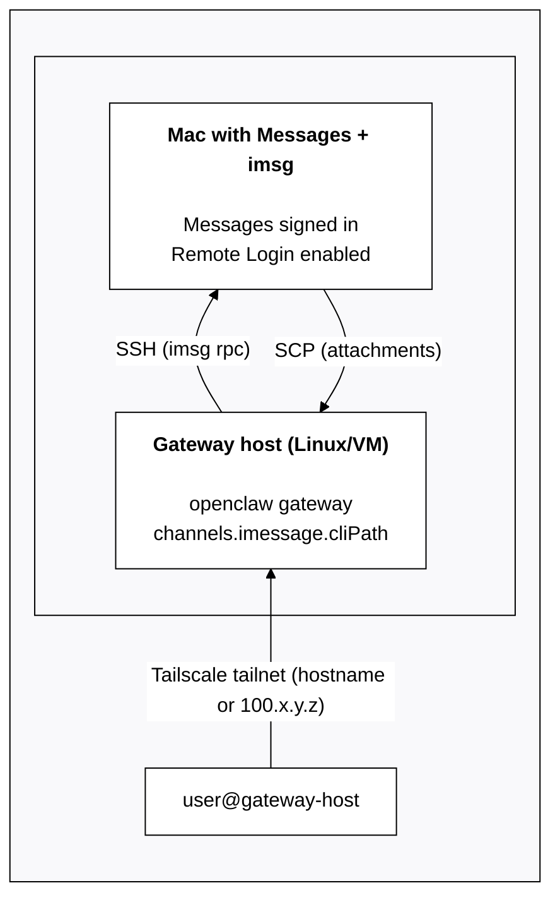

# iMessage (legacy : imsg)

> **Recommandé :** Utilisez [BlueBubbles](/channels/bluebubbles) pour les nouvelles configurations iMessage.
>
> Le canal `imsg` est une intégration CLI externe legacy et peut être supprimé dans une version future.

Statut : intégration CLI externe legacy. La Gateway (passerelle) lance `imsg rpc` (JSON-RPC sur stdio).

## Demarrage rapide (debutant)

1. Assurez-vous que Messages est connecté sur ce Mac.
2. Installez `imsg` :
   - `brew install steipete/tap/imsg`
3. Configurez OpenClaw avec `channels.imessage.cliPath` et `channels.imessage.dbPath`.
4. Démarrez la passerelle et approuvez toutes les invites macOS (Automatisation + Accès complet au disque).

Configuration minimale :

```json5
{
  channels: {
    imessage: {
      enabled: true,
      cliPath: "/usr/local/bin/imsg",
      dbPath: "/Users/<you>/Library/Messages/chat.db",
    },
  },
}
```

## Qu’est-ce que c’est

- Canal iMessage adossé à `imsg` sur macOS.
- Routage déterministe : les réponses reviennent toujours vers iMessage.
- Les Messages prives partagent la session principale de l’agent ; les groupes sont isolés (`agent:<agentId>:imessage:group:<chat_id>`).
- Si un fil à plusieurs participants arrive avec `is_group=false`, vous pouvez quand même l’isoler en `chat_id` à l’aide de `channels.imessage.groups` (voir « Fils de type groupe » ci-dessous).

## Écritures de configuration

Par défaut, iMessage est autorisé à écrire des mises à jour de configuration déclenchées par `/config set|unset` (nécessite `commands.config: true`).

Désactiver avec :

```json5
{
  channels: { imessage: { configWrites: false } },
}
```

## Exigences

- macOS avec Messages connecté.
- Accès complet au disque pour OpenClaw + `imsg` (accès à la base de données Messages).
- Autorisation d’automatisation lors de l’envoi.
- `channels.imessage.cliPath` peut pointer vers toute commande qui proxifie stdin/stdout (par exemple, un script wrapper qui se connecte en SSH à un autre Mac et exécute `imsg rpc`).

## Dépannage de la confidentialité et de la sécurité macOS TCC

Si l'envoi/la réception échoue (par exemple, `imsg rpc` quitte non-zéro, les temps écoulés, ou la passerelle semble se suspendre), une cause courante est une invite de permission macOS qui n'a jamais été approuvée.

macOS accorde les permissions TCC par contexte application/processus. Approuver les invites dans le même contexte que `imsg` (par exemple, Terminal/iTerm, une session LaunchAgent ou un processus lancé par SSH).

Checklist:

- **Full Disk Access** : autorise l'accès pour le processus qui exécute OpenClaw (et n'importe quel wrapper shell/SSH qui exécute `imsg`). Ceci est nécessaire pour lire la base de données des messages (`chat.db`).
- **Automatisation → Messages** : permet au processus utilisant OpenClaw (et/ou votre terminal) de contrôler **Messages.app** pour les envois sortants.
- **`imsg` CLI health**: vérifiez que `imsg` est installé et prend en charge RPC (`imsg rpc --help`).

Astuce : si OpenClaw fonctionne sans tête (LaunchAgent/systemd/SSH), l'invite macOS peut être facile à manquer. Exécutez une commande interactive à usage unique dans un terminal GUI pour forcer l'invite de commande, puis recommencez :

```bash
imsg chats --limit 1
# ou
imsg envoyer <handle> "test"
```

Permissions de dossier macOS connexes (Desktop/Documents/Downloads): [/platforms/mac/permissions](/platforms/mac/permissions).

## Configuration (chemin rapide)

1. Assurez-vous que Messages est connecté sur ce Mac.
2. Configurez iMessage et démarrez la passerelle.

### Utilisateur macOS de bot dédié (pour une identité isolée)

Si vous voulez que le bot envoie depuis une **identité iMessage distincte** (et garder vos Messages personnels propres), utilisez un identifiant Apple dédié + un utilisateur macOS dédié.

1. Créez un identifiant Apple dédié (exemple : `my-cool-bot@icloud.com`).
   - Apple peut exiger un numéro de téléphone pour la vérification / 2FA.
2. Créez un utilisateur macOS (exemple : `openclawhome`) et connectez-vous avec.
3. Ouvrez Messages dans cet utilisateur macOS et connectez-vous à iMessage avec l’identifiant Apple du bot.
4. Activez la connexion à distance (Réglages Système → Général → Partage → Connexion à distance).
5. Installez `imsg` :
   - `brew install steipete/tap/imsg`
6. Configurez SSH pour que `ssh <bot-macos-user>@localhost true` fonctionne sans mot de passe.
7. Faites pointer `channels.imessage.accounts.bot.cliPath` vers un wrapper SSH qui exécute `imsg` en tant qu’utilisateur bot.

Note au premier lancement : l’envoi/la réception peuvent nécessiter des autorisations GUI (Automatisation + Accès complet au disque) dans l’_utilisateur macOS du bot_. Si `imsg rpc` semble bloqué ou s’arrête, connectez-vous à cet utilisateur (le partage d’écran aide), lancez une fois `imsg chats --limit 1` / `imsg send ...`, approuvez les invites, puis réessayez. Voir [Dépannage macOS Privacy and Security TCC](#troubleshooting-macos-privacy-and-security-tcc).

Exemple de wrapper (`chmod +x`). Remplacez `<bot-macos-user>` par votre nom d’utilisateur macOS réel :

```bash
#!/usr/bin/env bash
set -euo pipefail

# Run an interactive SSH once first to accept host keys:
#   ssh <bot-macos-user>@localhost true
exec /usr/bin/ssh -o BatchMode=yes -o ConnectTimeout=5 -T <bot-macos-user>@localhost \
  "/usr/local/bin/imsg" "$@"
```

Exemple de configuration :

```json5
{
  channels: {
    imessage: {
      enabled: true,
      accounts: {
        bot: {
          name: "Bot",
          enabled: true,
          cliPath: "/path/to/imsg-bot",
          dbPath: "/Users/<bot-macos-user>/Library/Messages/chat.db",
        },
      },
    },
  },
}
```

Pour les configurations à compte unique, utilisez des options à plat (`channels.imessage.cliPath`, `channels.imessage.dbPath`) au lieu de la map `accounts`.

### Variante distante/SSH (optionnelle)

Si vous voulez iMessage sur un autre Mac, définissez `channels.imessage.cliPath` vers un wrapper qui exécute `imsg` sur l’hôte macOS distant via SSH. OpenClaw n’a besoin que de stdio.

Exemple de wrapper :

```bash
#!/usr/bin/env bash
exec ssh -T gateway-host imsg "$@"
```

**Pièces jointes distantes :** Lorsque `cliPath` pointe vers un hôte distant via SSH, les chemins des pièces jointes dans la base de données Messages référencent des fichiers sur la machine distante. OpenClaw peut les récupérer automatiquement via SCP en définissant `channels.imessage.remoteHost` :

```json5
{
  channels: {
    imessage: {
      cliPath: "~/imsg-ssh", // SSH wrapper to remote Mac
      remoteHost: "user@gateway-host", // for SCP file transfer
      includeAttachments: true,
    },
  },
}
```

Si `remoteHost` n’est pas défini, OpenClaw tente de l’auto-détecter en analysant la commande SSH dans votre script wrapper. Une configuration explicite est recommandée pour la fiabilité.

#### Mac distant via Tailscale (exemple)

Si la Gateway (passerelle) s’exécute sur un hôte/VM Linux mais qu’iMessage doit s’exécuter sur un Mac, Tailscale est le pont le plus simple : la passerelle communique avec le Mac via le tailnet, exécute `imsg` via SSH et récupère les pièces jointes via SCP.

Architecture :



Exemple concret de configuration (nom d’hôte Tailscale) :

```json5
{
  channels: {
    imessage: {
      enabled: true,
      cliPath: "~/.openclaw/scripts/imsg-ssh",
      remoteHost: "bot@mac-mini.tailnet-1234.ts.net",
      includeAttachments: true,
      dbPath: "/Users/bot/Library/Messages/chat.db",
    },
  },
}
```

Exemple de wrapper (`~/.openclaw/scripts/imsg-ssh`) :

```bash
#!/usr/bin/env bash
exec ssh -T bot@mac-mini.tailnet-1234.ts.net imsg "$@"
```

Remarques :

- Assurez-vous que le Mac est connecté à Messages et que la connexion à distance est activée.
- Utilisez des clés SSH pour que `ssh bot@mac-mini.tailnet-1234.ts.net` fonctionne sans invites.
- `remoteHost` doit correspondre à la cible SSH afin que SCP puisse récupérer les pièces jointes.

Prise en charge multi-comptes : utilisez `channels.imessage.accounts` avec une configuration par compte et `name` optionnel. Voir [`gateway/configuration`](/gateway/configuration#telegramaccounts--discordaccounts--slackaccounts--signalaccounts--imessageaccounts) pour le modèle partagé. Ne committez pas `~/.openclaw/openclaw.json` (il contient souvent des jetons).

## Contrôle d’accès (Messages prives + groupes)

DMs:

- Par défaut : `channels.imessage.dmPolicy = "pairing"`.
- Les expéditeurs inconnus reçoivent un code d’appairage ; les messages sont ignorés jusqu’à approbation (les codes expirent après 1 heure).
- Approuver via :
  - `openclaw pairing list imessage`
  - `openclaw pairing approve imessage <CODE>`
- L’appairage est l’échange de jetons par défaut pour les Messages prives iMessage. Détails : [Appairage](/start/pairing)

Groupes :

- `channels.imessage.groupPolicy = open | allowlist | disabled`.
- `channels.imessage.groupAllowFrom` contrôle qui peut déclencher dans les groupes lorsque `allowlist` est défini.
- Le filtrage par mention utilise `agents.list[].groupChat.mentionPatterns` (ou `messages.groupChat.mentionPatterns`) car iMessage n’a pas de métadonnées de mention natives.
- Surcharge multi-agents : définissez des motifs par agent sur `agents.list[].groupChat.mentionPatterns`.

## Comment ça marche (comportement)

- `imsg` diffuse les événements de messages ; la passerelle les normalise dans l’enveloppe de canal partagée.
- Les réponses reviennent toujours vers le même identifiant de discussion ou handle.

## Fils de type groupe (`is_group=false`)

Certains fils iMessage peuvent avoir plusieurs participants mais arriver quand même avec `is_group=false` selon la manière dont Messages stocke l’identifiant de discussion.

Si vous configurez explicitement un `chat_id` sous `channels.imessage.groups`, OpenClaw traite ce fil comme un « groupe » pour :

- l’isolation de session (clé de session `agent:<agentId>:imessage:group:<chat_id>` distincte)
- les comportements de liste d’autorisation de groupe / filtrage par mention

Exemple :

```json5
{
  channels: {
    imessage: {
      groupPolicy: "allowlist",
      groupAllowFrom: ["+15555550123"],
      groups: {
        "42": { requireMention: false },
      },
    },
  },
}
```

C’est utile lorsque vous souhaitez une personnalité/un modele isolé pour un fil spécifique (voir [Routage multi-agents](/concepts/multi-agent)). Pour l’isolation du système de fichiers, voir [Sandboxing](/gateway/sandboxing).

## Médias + limites

- Ingestion optionnelle des pièces jointes via `channels.imessage.includeAttachments`.
- Plafond média via `channels.imessage.mediaMaxMb`.

## Limites

- Le texte sortant est découpé à `channels.imessage.textChunkLimit` (par défaut 4000).
- Découpage optionnel par nouvelle ligne : définissez `channels.imessage.chunkMode="newline"` pour découper sur les lignes vides (frontières de paragraphes) avant le découpage par longueur.
- Les envois de médias sont plafonnés par `channels.imessage.mediaMaxMb` (par défaut 16).

## Adressage / cibles de livraison

Préférez `chat_id` pour un routage stable :

- `chat_id:123` (préféré)
- `chat_guid:...`
- `chat_identifier:...`
- handles directs : `imessage:+1555` / `sms:+1555` / `user@example.com`

Lister les discussions :

```
imsg chats --limit 20
```

## Référence de configuration (iMessage)

Configuration complète : [Configuration](/gateway/configuration)

Options du fournisseur :

- `channels.imessage.enabled` : activer/désactiver le démarrage du canal.
- `channels.imessage.cliPath` : chemin vers `imsg`.
- `channels.imessage.dbPath` : chemin de la base de données Messages.
- `channels.imessage.remoteHost` : hôte SSH pour le transfert SCP des pièces jointes lorsque `cliPath` pointe vers un Mac distant (par ex., `user@gateway-host`). Auto-détecté depuis le wrapper SSH s’il n’est pas défini.
- `channels.imessage.service` : `imessage | sms | auto`.
- `channels.imessage.region` : région SMS.
- `channels.imessage.dmPolicy` : `pairing | allowlist | open | disabled` (par défaut : appairage).
- `channels.imessage.allowFrom` : liste d’autorisation des Messages prives (handles, e-mails, numéros E.164 ou `chat_id:*`). `open` nécessite `"*"`. iMessage n’a pas de noms d’utilisateur ; utilisez des handles ou des cibles de discussion.
- `channels.imessage.groupPolicy` : `open | allowlist | disabled` (par défaut : allowlist).
- `channels.imessage.groupAllowFrom` : liste d’autorisation des expéditeurs de groupe.
- `channels.imessage.historyLimit` / `channels.imessage.accounts.*.historyLimit` : nombre maximal de messages de groupe à inclure comme contexte (0 désactive).
- `channels.imessage.dmHistoryLimit` : limite d’historique DM en tours utilisateur. Surcharges par utilisateur : `channels.imessage.dms["<handle>"].historyLimit`.
- `channels.imessage.groups` : valeurs par défaut par groupe + allowlist (utilisez `"*"` pour les valeurs globales).
- `channels.imessage.includeAttachments` : ingérer les pièces jointes dans le contexte.
- `channels.imessage.mediaMaxMb` : plafond média entrant/sortant (Mo).
- `channels.imessage.textChunkLimit` : taille des segments sortants (caractères).
- `channels.imessage.chunkMode` : `length` (par défaut) ou `newline` pour découper sur les lignes vides (frontières de paragraphes) avant le découpage par longueur.

Options globales associées :

- `agents.list[].groupChat.mentionPatterns` (ou `messages.groupChat.mentionPatterns`).
- `messages.responsePrefix`.
