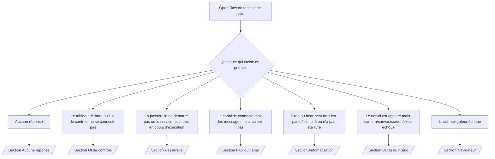

# Problemes courants

Si vous n'avez que 2 minutes, utilisez cette page comme porte d'entrée de triage.

## Les 60 premieres secondes

Exécutez cette séquence exacte dans l’ordre :

```bash
openclaw status
openclaw status --all
openclaw gateway probe
openclaw gateway status
openclaw doctor
openclaw channels status --probe
openclaw logs --follow
```

Bonne sortie en une seule ligne :

- `openclaw status` → affiche les canaux configurés et aucune erreur d'authentification évidente.
- `openclaw status --all` → le rapport complet est présent et partageable.
- `openclaw gateway probe` → la cible de passerelle attendue est joignable.
- `openclaw gateway status` → `Runtime: running` et `RPC probe: ok`.
- `openclaw doctor` → aucune erreur bloquante de config/service.
- `openclaw channels status --probe` → les canaux indiquent `connected` ou `ready`.
- `openclaw logs --follow` → activité régulière, sans erreurs fatales répétées.

## Arbre de décision



<AccordionGroup>
  <Accordion title="Aucune réponse">
    ```bash
    openclaw status
    openclaw gateway status
    openclaw channels status --probe
    openclaw pairing list <channel>
    openclaw logs --follow
    ```

    Une bonne sortie ressemble à :

    - `Runtime: running`
    - `RPC probe: ok`
    - Votre canal apparaît `connected`/`ready` dans `channels status --probe`
    - L’expéditeur apparaît approuvé (ou la politique DM est ouverte/allowlist)

    Signatures de logs courantes :

    - `drop guild message (mention required` → le filtrage par mention a bloqué le message dans Discord.
    - `pairing request` → l’expéditeur n’est pas approuvé et attend l’approbation d’appairage en DM.
    - `blocked` / `allowlist` dans les logs du canal → l’expéditeur, la salle ou le groupe est filtré.

    Pages approfondies :

    - [/gateway/troubleshooting#no-replies](/gateway/troubleshooting#no-replies)
    - [/channels/troubleshooting](/channels/troubleshooting)
    - [/channels/pairing](/channels/pairing)

  </Accordion>

  <Accordion title="Le tableau de bord ou l’UI de contrôle ne se connecte pas">
    ```bash
    openclaw status
    openclaw gateway status
    openclaw logs --follow
    openclaw doctor
    openclaw channels status --probe
    ```

    Une bonne sortie ressemble à :

    - `Dashboard: http://...` est affiché dans `openclaw gateway status`
    - `RPC probe: ok`
    - Aucune boucle d’authentification dans les logs

    Signatures de logs courantes :

    - `device identity required` → HTTP/contexte non sécurisé ne peut pas compléter l’authentification de l’appareil.
    - `unauthorized` / reconnect loop → token/mot de passe incorrect ou mode d’authentification incompatible.
    - `gateway connect failed:` → l’UI cible la mauvaise URL/port ou la passerelle est injoignable.

    Pages approfondies :

    - [/gateway/troubleshooting#dashboard-control-ui-connectivity](/gateway/troubleshooting#dashboard-control-ui-connectivity)
    - [/web/control-ui](/web/control-ui)
    - [/gateway/authentication](/gateway/authentication)

  </Accordion>

  <Accordion title="La passerelle ne démarre pas ou le service est installé mais non lancé">
    ```bash
    openclaw status
    openclaw gateway status
    openclaw logs --follow
    openclaw doctor
    openclaw channels status --probe
    ```

    Une bonne sortie ressemble à :

    - `Service: ... (loaded)`
    - `Runtime: running`
    - `RPC probe: ok`

    Signatures de logs courantes :

    - `Gateway start blocked: set gateway.mode=local` → le mode gateway est unset/remote.
    - `refusing to bind gateway ... without auth` → bind non-loopback sans token/mot de passe.
    - `another gateway instance is already listening` ou `EADDRINUSE` → port déjà utilisé.

    Pages approfondies :

    - [/gateway/troubleshooting#gateway-service-not-running](/gateway/troubleshooting#gateway-service-not-running)
    - [/gateway/background-process](/gateway/background-process)
    - [/gateway/configuration](/gateway/configuration)

  </Accordion>

  <Accordion title="Le canal se connecte mais les messages ne circulent pas">
    ```bash
    openclaw status
    openclaw gateway status
    openclaw logs --follow
    openclaw doctor
    openclaw channels status --probe
    ```

    Une bonne sortie ressemble à :

    - Le transport du canal est connecté.
    - Les vérifications d’appairage/allowlist passent.
    - Les mentions sont détectées lorsque requis.

    Signatures de logs courantes :

    - `mention required` → le filtrage par mention de groupe a bloqué le traitement.
    - `pairing` / `pending` → l’expéditeur DM n’est pas encore approuvé.
    - `not_in_channel`, `missing_scope`, `Forbidden`, `401/403` → problème de token/permissions du canal.

    Pages approfondies :

    - [/gateway/troubleshooting#channel-connected-messages-not-flowing](/gateway/troubleshooting#channel-connected-messages-not-flowing)
    - [/channels/troubleshooting](/channels/troubleshooting)

  </Accordion>

  <Accordion title="Cron ou heartbeat ne s’est pas déclenché ou n’a pas été livré">
    ```bash
    openclaw status
    openclaw gateway status
    openclaw cron status
    openclaw cron list
    openclaw cron runs --id <jobId> --limit 20
    openclaw logs --follow
    ```

    Une bonne sortie ressemble à :

    - `cron.status` indique activé avec un prochain réveil.
    - `cron runs` affiche des entrées récentes `ok`.
    - Le heartbeat est activé et pas en dehors des heures actives.

    Signatures de logs courantes :

    - `cron: scheduler disabled; jobs will not run automatically` → cron est désactivé.
    - `heartbeat skipped` avec `reason=quiet-hours` → en dehors des heures actives configurées.
    - `requests-in-flight` → voie principale occupée ; le réveil du heartbeat a été différé.
    - `unknown accountId` → le compte cible du heartbeat n’existe pas.

    Pages approfondies :

    - [/gateway/troubleshooting#cron-and-heartbeat-delivery](/gateway/troubleshooting#cron-and-heartbeat-delivery)
    - [/automation/troubleshooting](/automation/troubleshooting)
    - [/gateway/heartbeat](/gateway/heartbeat)

  </Accordion>

  <Accordion title="Le nœud est appairé mais un outil camera/canvas/screen/exec échoue">
    ```bash
    openclaw status
    openclaw gateway status
    openclaw nodes status
    openclaw nodes describe --node <idOrNameOrIp>
    openclaw logs --follow
    ```

    Une bonne sortie ressemble à :

    - Le nœud est listé comme connecté et appairé pour le rôle `node`.
    - La capacité existe pour la commande invoquée.
    - L’état de permission est accordé pour l’outil.

    Signatures de logs courantes :

    - `NODE_BACKGROUND_UNAVAILABLE` → mettre l’application du nœud au premier plan.
    - `*_PERMISSION_REQUIRED` → permission OS refusée/manquante.
    - `SYSTEM_RUN_DENIED: approval required` → approbation exec en attente.
    - `SYSTEM_RUN_DENIED: allowlist miss` → commande non présente dans l’allowlist exec.

    Pages approfondies :

    - [/gateway/troubleshooting#node-paired-tool-fails](/gateway/troubleshooting#node-paired-tool-fails)
    - [/nodes/troubleshooting](/nodes/troubleshooting)
    - [/tools/exec-approvals](/tools/exec-approvals)

  </Accordion>

  <Accordion title="L’outil navigateur échoue">
    ```bash
    openclaw status
    openclaw gateway status
    openclaw browser status
    openclaw logs --follow
    openclaw doctor
    ```

    Une bonne sortie ressemble à :

    - Le statut du navigateur affiche `running: true` et un navigateur/profil sélectionné.
    - Le profil `openclaw` démarre ou le relais `chrome` a un onglet attaché.

    Signatures de logs courantes :

    - `Failed to start Chrome CDP on port` → échec du lancement du navigateur local.
    - `browser.executablePath not found` → chemin binaire configuré incorrect.
    - `Chrome extension relay is running, but no tab is connected` → extension non attachée.
    - `Browser attachOnly is enabled ... not reachable` → profil attach-only sans cible CDP active.

    Pages approfondies :

    - [/gateway/troubleshooting#browser-tool-fails](/gateway/troubleshooting#browser-tool-fails)
    - [/tools/browser-linux-troubleshooting](/tools/browser-linux-troubleshooting)
    - [/tools/chrome-extension](/tools/chrome-extension)

  </Accordion>
</AccordionGroup>
