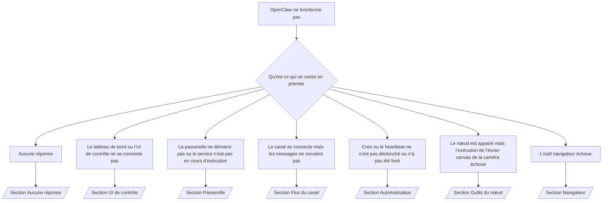

# Problemes courants

Si vous n'avez que 2 minutes, utilisez cette page comme porte d'entrée triage.

## Les 60 premieres secondes

Exécuter cette échelle exacte dans l'ordre :

```bash
openclaw status
openclaw status --all
openclaw gateway probe
openclaw logs --follow
openclaw doctor
```

Bonne sortie en une seule ligne:

- `openclaw status` → affiche les canaux configurés et aucune erreur d'authentification évidente.
- `openclaw status --all` → le rapport complet est présent et partageable.
- `openclaw gateway probe` → la cible de passerelle attendue est joignable.
- `openclaw gateway status` → `Runtime: running` et `sonde RPC : ok`.
- `openclaw doctor` → aucune erreur de config/service de blocage.
- `openclaw channels status --probe` → channels report `connected` or `ready`.
- `openclaw logs --follow` → activité régulière, sans erreurs fatales répétées.

## Arbre de décision



<AccordionGroup>
  <Accordion title="No replies">curl -fsSL https://openclaw.ai/install.sh | bash -s -- --beta --verbose<channel>
    logs openclaw --follow
```

    ````
    ```
    Un bon résultat ressemble à�:
    
    - `Runtime: running`
    - `RPC probe: ok`
    - Votre canal apparaît connecté/prêt dans `channels status --probe`
    - L’expéditeur apparaît approuvé (ou la politique de DM est ouverte/liste d’autorisations)
    
    Signatures de journaux courantes�:
    
    - `drop guild message (mention required` �→ le filtrage par mention a bloqué le message dans Discord.
    - `pairing request` �→ l’expéditeur n’est pas approuvé et attend l’approbation d’appairage en DM.
    - `blocked` / `allowlist` dans les journaux du canal �→ l’expéditeur, la salle ou le groupe est filtré.
    
    Pages approfondies�:
    
    - [/gateway/troubleshooting#no-replies](/gateway/troubleshooting#no-replies)
    - [/channels/troubleshooting](/channels/troubleshooting)
    - [/channels/pairing](/channels/pairing)
    ```
    ````

  
</Accordion>

  <Accordion title="Dashboard or Control UI will not connect">openclaw status --all

    ````
    ```
    Une bonne sortie ressemble à
    
    - `Tableau de bord: http://... est affiché dans `openclaw gateway status`
    - `RPC probe: ok`
    - Pas de boucle d'authentification dans les logs
    
    Signatures courantes du log :
    
    - `device identity required` → HTTP/contexte non sécurisé ne peut pas compléter l'authentification du périphérique.
    - `unauthorized` / reconnect loop → wrong token/password or auth mode mismatch.
    - `la connexion de la passerelle a échoué:` → L'interface cible le mauvais URL/port ou la passerelle injoignable.
    
    Pages profondes :
    
    - [/gateway/troubleshooting#dashboard-control-ui-connectivity](/gateway/troubleshooting#dashboard-control-ui-connectivity)
    - [/web/control-ui](/web/control-ui)
    - [/gateway/authentication](/gateway/authentication)
    ```
    ````

  
</Accordion>

  <Accordion title="Gateway will not start or service installed but not running">openclaw status --deep

    ````
    ```
    Une bonne sortie ressemble à
    
    - `Service: ... (chargé)`
    - `Runtime: running`
    - `sonde RPC : ok`
    
    Signatures:
    
    - `Gateway start blocked: set gateway. Le mode ode=local` → gateway est unset/remote.
    - `refusant de lier la passerelle ... sans auth` → non-loopback bind sans jeton/mot de passe.
    - `une autre instance de passerelle est déjà en train d'écouter` ou `EADDRINUSE` → port déjà pris.
    
    Pages profondes :
    
    - [/gateway/troubleshooting#gateway-service-not-running](/gateway/troubleshooting#gateway-service-not-running)
    - [/gateway/background-process](/gateway/background-process)
    - [/gateway/configuration](/gateway/configuration)
    ```
    ````

  
</Accordion>

  <Accordion title="Channel connects but messages do not flow">Si possible, incluez la fin des journaux pertinents depuis `openclaw logs --follow`.

    ````
    ```
    Une bonne sortie ressemble à :
    
    - Le transport de canaux est connecté.
    - L'appairage / la liste d'autorisations passe .
    - Les mentions sont détectées lorsque nécessaire.
    
    Signatures courantes du journal :
    
    - `mention requis` → la porte de mention du groupe bloquée le traitement.
    - `appairage` / `pending` → l'expéditeur du DM n'est pas encore approuvé.
    - `not_in_channel`, `missing_scope`, `Forbidden`, `401/403` → problème de jeton de permission de canal.
    
    Pages propres:
    
    - [/gateway/troubleshooting#channel-connected-messages-not-flowing](/gateway/troubleshooting#channel-connected-messages-not-flowing)
    - [/channels/troubleshooting](/channels/troubleshooting)
    ```
    ````

  
</Accordion>

  <Accordion title="Cron or heartbeat did not fire or did not deliver">curl -fsSL https://openclaw.ai/install.sh | bash -s -- --verbose<jobId> --limit 20
    openclaw logs --follow
```

    ```
    
        ```
        Une bonne sortie ressemble à:
        
        - `cron.status` montre activé avec un prochain réveil.
        - `cron runs` montre les entrées récentes `ok`.
        - Heartbeat est activé et non en dehors des heures actives.
        
        Signatures communes du log :
        
        - `cron: scheduler désactivé; les jobs ne s'exécuteront pas automatiquement` → cron est désactivé.
        - `heartbeat skipped` avec `reason=quiet-hours` → en dehors des heures actives configurées.
        - `requests-in-flight` → main lane occupée ; le réveil du rythme cardiaque a été différé.
        - `unknown accountId` → le compte cible du cœur n'existe pas.
        
        Pages profondes :
        
        - [/gateway/troubleshooting#cron-and-heartbeat-delivery](/gateway/troubleshooting#cron-and-heartbeat-delivery)
        - [/automation/troubleshooting](/automation/troubleshooting)
        - [/gateway/heartbeat](/gateway/heartbeat)
        ```
    
      
</Accordion>
    
      <Accordion title="Node is paired but tool fails camera canvas screen exec">`openclaw: command not found`<idOrNameOrIp>
        logs openclaw --follow
    ```

  
</Accordion>

  <Accordion title="Node is paired but tool fails camera canvas screen exec">`openclaw: command not found`<idOrNameOrIp>
    logs openclaw --follow
```

    ````
    ```
    Une bonne sortie ressemble à
    
    - Le noeud est listé comme connecté et appairé pour le rôle `node`. Rformat@@1 - La capacité existe pour la commande que vous invoquez.
    - L'état d'autorisation est accordé pour l'outil.
    
    Signatures courantes du journal :
    
    - `NODE_BACKGROUND_UNAVAILABLE` → mettre l'application du noeud au premier plan.
    - `*_PERMISSION_REQUIRED` → L'autorisation de l'OS a été refusée/manquante.
    - `SYSTEM_RUN_DENIED: approbation requise` → approbation exec est en attente.
    - `SYSTEM_RUN_DENIED: allowlist miss` → commande non sur exec allowlist.
    
    Pages profondes :
    
    - [/gateway/troubleshooting#node-paired-tool-fails](/gateway/troubleshooting#node-paired-tool-fails)
    - [/nodes/troubleshooting](/nodes/troubleshooting)
    - [/tools/exec-approvals](/tools/exec-approvals)
    ```
    ````

  
</Accordion>

  <Accordion title="Browser tool fails">`docs.openclaw.ai` affiche une erreur SSL (Comcast/Xfinity)

    ````
    ```
    Une bonne sortie ressemble à
    
    - Le statut du navigateur affiche `en cours d'exécution: true` et un navigateur/profil choisi.
    - Le profil `openclaw` commence ou le relais `chrome` a un onglet attaché.
    
    Signatures du journal commun :
    
    - `Impossible de démarrer Chrome CDP sur le port` → lancement du navigateur local a échoué.
    - `browser.executablePath not found` → le chemin binaire configuré est incorrect.
    - `Le relais d'extension Chrome est en cours d'exécution, mais aucun onglet n'est connecté` → extension non attachée.
    - `Le navigateur attachOnly est activé ... non joignable` → le profil en pièce seule n'a pas de cible CDP en direct.
    
    Pages propres:
    
    - [/gateway/troubleshooting#browser-tool-fails](/gateway/troubleshooting#browser-tool-fails)
    - [/tools/browser-linux-troubleshooting](/tools/browser-linux-troubleshooting)
    - [/tools/chrome-extension](/tools/chrome-extension)
    ```
    ````

  
</Accordion>
</AccordionGroup>

