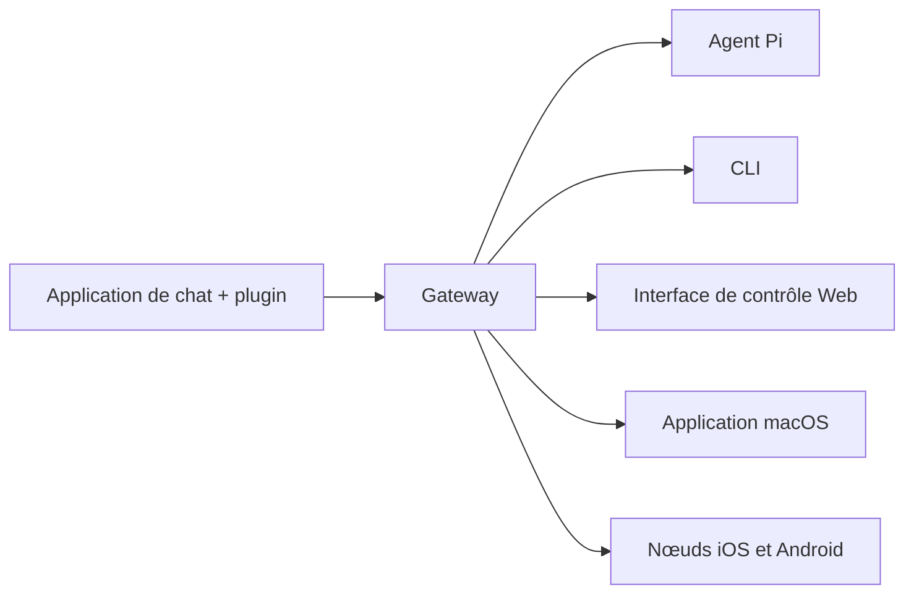

---
read_when:
  - Lors de la présentation d’OpenClaw à de nouveaux utilisateurs
summary: OpenClaw est une gateway multicanale pour agents IA fonctionnant sur tous les OS.
title: OpenClaw
x-i18n:
  generated_at: "2026-02-08T17:15:47Z"
  model: claude-opus-4-5
  provider: pi
  source_hash: fc8babf7885ef91d526795051376d928599c4cf8aff75400138a0d7d9fa3b75f
  source_path: index.md
  workflow: 15
---

# OpenClaw 🦞

<p align="center">
    </img>
    </img>
</p>

> _「EXFOLIATE! EXFOLIATE!」_ — probablement un homard spatial

<p align="center"><strong>Une gateway d’agent IA pour tous les OS, compatible avec WhatsApp, Telegram, Discord, iMessage et plus encore.</strong><br />
  Envoyez un message et recevez la réponse de l’agent directement dans votre poche. Ajoutez Mattermost et d’autres services via des plugins.</p>

<Columns>
  <Card title="はじめに" href="/start/getting-started" icon="rocket">
    Installez OpenClaw et lancez le Gateway en quelques minutes.
   
</Card>
  <Card title="ウィザードを実行" href="/start/wizard" icon="sparkles">`openclaw onboard` et configuration guidée avec flux d’appairage.
</Card>
  <Card title="Control UIを開く" href="/web/control-ui" icon="layout-dashboard">Lance un tableau de bord navigateur pour le chat, les paramètres et les sessions.
</Card>
</Columns>

OpenClaw connecte les applications de chat à des agents de codage comme Pi via un unique processus Gateway. Il alimente l’assistant OpenClaw et prend en charge les configurations locales ou distantes.

## Fonctionnement



Gateway est l’unique source fiable pour les sessions, le routage et les connexions aux canaux.

## Fonctionnalités principales

<Columns>
  <Card title="マルチチャネルgateway" icon="network">Prend en charge WhatsApp, Telegram, Discord et iMessage avec un seul processus Gateway.
</Card>
  <Card title="プラグインチャネル" icon="plug">Ajoutez Mattermost et d’autres services via des packages d’extension.
</Card>
  <Card title="マルチエージェントルーティング" icon="route">Sessions isolées par agent, espace de travail et expéditeur.
</Card>
  <Card title="メディアサポート" icon="image">Envoi et réception d’images, d’audio et de documents.
</Card>
  <Card title="Web Control UI" icon="monitor">Tableau de bord navigateur pour le chat, les paramètres, les sessions et les nœuds.
</Card>
  <Card title="モバイルノード" icon="smartphone">Appairage de nœuds iOS et Android compatibles Canvas.
</Card>
</Columns>

## Démarrage rapide

<Steps>
  <Step title="OpenClawをインストール">```bash
npm install -g openclaw@latest
```
</Step>
  <Step title="オンボーディングとサービスのインストール">```bash
openclaw onboard --install-daemon
```
</Step>
  <Step title="WhatsAppをペアリングしてGatewayを起動">```bash
openclaw channels login
openclaw gateway --port 18789
```
</Step>
</Steps>

Besoin d’une installation complète et d’un environnement de développement ? Consultez le [Démarrage rapide](/start/quickstart).

## Tableau de bord

Après avoir démarré Gateway, ouvrez l’interface de contrôle dans votre navigateur.

- Par défaut en local : [http://127.0.0.1:18789/](http://127.0.0.1:18789/)
- Accès à distance : [Surface Web](/web) et [Tailscale](/gateway/tailscale)

<p align="center">
  </img>
</p>

## Configuration (optionnel)

La configuration se trouve dans `~/.openclaw/openclaw.json`.

- **Si vous ne faites rien**, OpenClaw utilise le binaire Pi fourni en mode RPC et crée des sessions par expéditeur.
- Si vous souhaitez définir des restrictions, commencez par `channels.whatsapp.allowFrom` et (pour les groupes) les règles de mention.

Exemple :

```json5
{
  channels: {
    whatsapp: {
      allowFrom: ["+15555550123"],
      groups: { "*": { requireMention: true } },
    },
  },
  messages: { groupChat: { mentionPatterns: ["@openclaw"] } },
}
```

## Commencer ici

<Columns>
  <Card title="ドキュメントハブ" href="/start/hubs" icon="book-open">Toute la documentation et les guides organisés par cas d’usage.
</Card>
  <Card title="設定" href="/gateway/configuration" icon="settings">Configuration principale de Gateway, tokens et paramètres des fournisseurs.
</Card>
  <Card title="リモートアクセス" href="/gateway/remote" icon="globe">Modèles d’accès SSH et tailnet.
</Card>
  <Card title="チャネル" href="/channels/telegram" icon="message-square">Configuration spécifique aux canaux comme WhatsApp, Telegram, Discord, etc.
</Card>
  <Card title="ノード" href="/nodes" icon="smartphone">Appairage et nœuds iOS et Android compatibles Canvas.
</Card>
  <Card title="ヘルプ" href="/help" icon="life-buoy">Points d’entrée pour les correctifs courants et le dépannage.
</Card>
</Columns>

## En détail

<Columns>
  <Card title="全機能リスト" href="/concepts/features" icon="list">Liste complète des canaux, du routage et des fonctionnalités multimédia.
</Card>
  <Card title="マルチエージェントルーティング" href="/concepts/multi-agent" icon="route">Isolation des espaces de travail et sessions par agent.
</Card>
  <Card title="セキュリティ" href="/gateway/security" icon="shield">Tokens, listes d’autorisation et contrôles de sécurité.
</Card>
  <Card title="トラブルシューティング" href="/gateway/troubleshooting" icon="wrench">Diagnostics Gateway et erreurs courantes.
</Card>
  <Card title="概要とクレジット" href="/reference/credits" icon="info">    Origine du projet, contributeurs, licence.
  
</Card>
</Columns>
