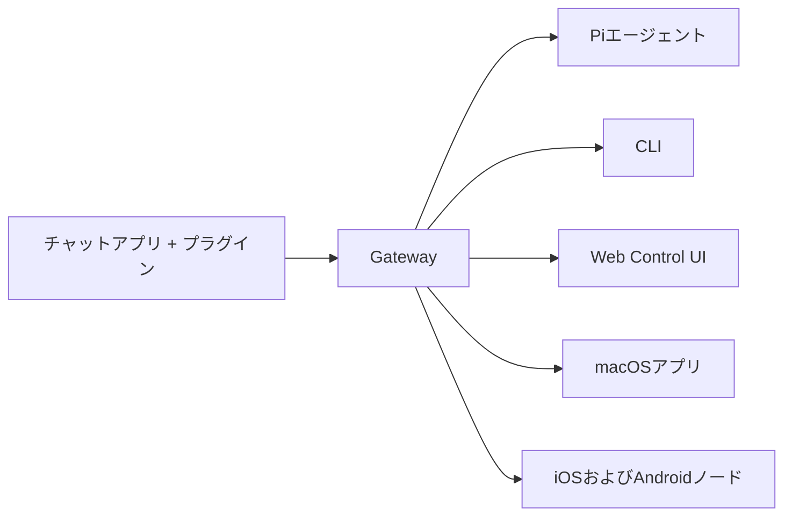

---
read_when:
  - 新規ユーザーにOpenClawを紹介するとき
summary: OpenClawは、あらゆるOSで動作するAIエージェント向けのマルチチャネルgatewayです。
title: OpenClaw
x-i18n:
  generated_at: "2026-02-08T17:15:47Z"
  model: claude-opus-4-5
  provider: pi
  source_hash: fc8babf7885ef91d526795051376d928599c4cf8aff75400138a0d7d9fa3b75f
  source_path: index.md
  workflow: 15
---

# OpenClaw 🦞

<p align="center">
    </img>
    </img>
</p>

> _「EXFOLIATE! EXFOLIATE!」_ — たぶん宇宙ロブスター

<p align="center"><strong>WhatsApp、Telegram、Discord、iMessageなどに対応した、あらゆるOS向けのAIエージェントgateway。</strong><br />
  メッセージを送信すれば、ポケットからエージェントの応答を受け取れます。プラグインでMattermostなどを追加できます。
</p>

<Columns>
  <Card title="はじめに" href="/start/getting-started" icon="rocket">
    OpenClawをインストールし、数分でGatewayを起動できます。
  
</Card>
  <Card title="ウィザードを実行" href="/start/wizard" icon="sparkles">
    `openclaw onboard`とペアリングフローによるガイド付きセットアップ。
  
</Card>
  <Card title="Control UIを開く" href="/web/control-ui" icon="layout-dashboard">
    チャット、設定、セッション用のブラウザダッシュボードを起動します。
  
</Card>
</Columns>

OpenClawは、単一のGatewayプロセスを通じてチャットアプリをPiのようなコーディングエージェントに接続します。OpenClawアシスタントを駆動し、ローカルまたはリモートのセットアップをサポートします。

## 仕組み



Gatewayは、セッション、ルーティング、チャネル接続の信頼できる唯一の情報源です。

## मुख्य विशेषताएँ

<Columns>
  <Card title="マルチチャネルgateway" icon="network">
    एकल Gateway प्रक्रिया के साथ WhatsApp, Telegram, Discord, iMessage का समर्थन।
  
</Card>
  <Card title="プラグインチャネル" icon="plug">
    एक्सटेंशन पैकेज के माध्यम से Mattermost आदि जोड़ें。
  
</Card>
  <Card title="マルチエージェントルーティング" icon="route">एजेंट, वर्कस्पेस और प्रेषक के अनुसार अलग किए गए सेशन।
</Card>
  <Card title="メディアサポート" icon="image">छवियों, ऑडियो और दस्तावेज़ों का भेजना और प्राप्त करना।
</Card>
  <Card title="Web Control UI" icon="monitor">चैट, सेटिंग्स, सेशन और नोड्स के लिए ब्राउज़र डैशबोर्ड।
</Card>
  <Card title="モバイルノード" icon="smartphone">Canvas-सपोर्टेड iOS और Android नोड्स को पेयर करना।
</Card>
</Columns>

## क्विक स्टार्ट

<Steps>
  <Step title="OpenClawをインストール">```bash
npm install -g openclaw@latest
```
</Step>
  <Step title="オンボーディングとサービスのインストール">```bash
openclaw onboard --install-daemon
```
</Step>
  <Step title="WhatsAppをペアリングしてGatewayを起動">```bash
openclaw channels login
openclaw gateway --port 18789
```
</Step>
</Steps>

क्या आपको पूर्ण इंस्टॉलेशन और डेवलपमेंट सेटअप की आवश्यकता है? [क्विक स्टार्ट](/start/quickstart) देखें।

## डैशबोर्ड

Gateway शुरू करने के बाद, ब्राउज़र में Control UI खोलें।

- लोकल डिफ़ॉल्ट: [http://127.0.0.1:18789/](http://127.0.0.1:18789/)
- रिमोट एक्सेस: [Webサーフェス](/web) और [Tailscale](/gateway/tailscale)

<p align="center">
  </img>
</p>

## सेटिंग्स (वैकल्पिक)

सेटिंग्स `~/.openclaw/openclaw.json` में स्थित हैं।

- **यदि आप कुछ नहीं करते हैं**, तो OpenClaw बंडल किए गए Pi बाइनरी को RPC मोड में उपयोग करेगा और प्रत्येक प्रेषक के लिए सेशन बनाएगा।
- यदि आप प्रतिबंध लगाना चाहते हैं, तो `channels.whatsapp.allowFrom` और (ग्रुप के मामले में) मेंशन नियमों से शुरुआत करें।

उदाहरण:

```json5
{
  channels: {
    whatsapp: {
      allowFrom: ["+15555550123"],
      groups: { "*": { requireMention: true } },
    },
  },
  messages: { groupChat: { mentionPatterns: ["@openclaw"] } },
}
```

## यहाँ से शुरू करें

<Columns>
  <Card title="ドキュメントハブ" href="/start/hubs" icon="book-open">उपयोग मामलों के अनुसार व्यवस्थित सभी दस्तावेज़ और गाइड।
</Card>
  <Card title="設定" href="/gateway/configuration" icon="settings">Gateway की मुख्य सेटिंग्स, टोकन और प्रोवाइडर कॉन्फ़िगरेशन।
</Card>
  <Card title="リモートアクセス" href="/gateway/remote" icon="globe">SSH और tailnet एक्सेस पैटर्न।
</Card>
  <Card title="チャネル" href="/channels/telegram" icon="message-square">WhatsApp, Telegram, Discord जैसे चैनलों के लिए विशिष्ट सेटअप।
</Card>
  <Card title="ノード" href="/nodes" icon="smartphone">पेयरिंग और Canvas-सपोर्टेड iOS तथा Android नोड्स।
</Card>
  <Card title="ヘルプ" href="/help" icon="life-buoy">सामान्य सुधार और ट्रबलशूटिंग के प्रवेश बिंदु।
</Card>
</Columns>

## विस्तार से

<Columns>
  <Card title="全機能リスト" href="/concepts/features" icon="list">चैनल, रूटिंग और मीडिया क्षमताओं की पूर्ण सूची।
</Card>
  <Card title="マルチエージェントルーティング" href="/concepts/multi-agent" icon="route">वर्कस्पेस आइसोलेशन और एजेंट-आधारित सेशन।
</Card>
  <Card title="セキュリティ" href="/gateway/security" icon="shield">टोकन, अनुमति सूची और सुरक्षा नियंत्रण।
</Card>
  <Card title="トラブルシューティング" href="/gateway/troubleshooting" icon="wrench">Gateway डायग्नोस्टिक्स और सामान्य त्रुटियाँ।
</Card>
  <Card title="概要とクレジット" href="/reference/credits" icon="info">प्रोजेक्ट की उत्पत्ति, योगदानकर्ता और लाइसेंस।
</Card>
</Columns>
