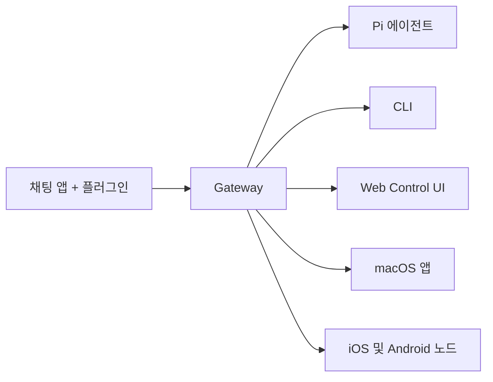

---
read_when:
  - 신규 사용자에게 OpenClaw를 소개할 때
summary: OpenClaw는 모든 OS에서 동작하는 AI 에이전트를 위한 멀티채널 gateway입니다.
title: OpenClaw
x-i18n:
  generated_at: "2026-02-08T17:15:47Z"
  model: claude-opus-4-5
  provider: pi
  source_hash: fc8babf7885ef91d526795051376d928599c4cf8aff75400138a0d7d9fa3b75f
  source_path: index.md
  workflow: 15
---

# OpenClaw 🦞

<p align="center">
    </img>
    </img>
</p>

> _「EXFOLIATE! EXFOLIATE!」_ — 아마도 우주 바닷가재

<p align="center"><strong>WhatsApp, Telegram, Discord, iMessage 등을 지원하는, 모든 OS용 AI 에이전트 gateway.</strong><br />
  메시지를 보내면 주머니 속에서 에이전트의 응답을 받을 수 있습니다. 플러그인을 통해 Mattermost 등도 추가할 수 있습니다.</p>

<Columns>
  <Card title="はじめに" href="/start/getting-started" icon="rocket">OpenClaw를 설치하고 몇 분 만에 Gateway를 시작할 수 있습니다.
</Card>
  <Card title="ウィザードを実行" href="/start/wizard" icon="sparkles">`openclaw onboard`와 페어링 흐름을 통한 가이드형 설정.
</Card>
  <Card title="Control UIを開く" href="/web/control-ui" icon="layout-dashboard">채팅, 설정, 세션을 위한 브라우저 대시보드를 실행합니다.
</Card>
</Columns>

OpenClaw는 단일 Gateway 프로세스를 통해 채팅 앱을 Pi와 같은 코딩 에이전트에 연결합니다. OpenClaw 어시스턴트를 구동하며, 로컬 또는 원격 설정을 지원합니다.

## 작동 방식



Gateway는 세션, 라우팅, 채널 연결에 대한 신뢰할 수 있는 단일 정보 소스입니다.

## 주요 기능

<Columns>
  <Card title="マルチチャネルgateway" icon="network">
    단일 Gateway 프로세스로 WhatsApp, Telegram, Discord, iMessage를 지원합니다.
  
</Card>
  <Card title="プラグインチャネル" icon="plug">
    확장 패키지로 Mattermost 등을 추가할 수 있습니다.
  
</Card>
  <Card title="マルチエージェントルーティング" icon="route">
    에이전트, 워크스페이스, 발신자별로 격리된 세션.
  
</Card>
  <Card title="メディアサポート" icon="image">
    이미지, 음성, 문서 송수신.
  
</Card>
  <Card title="Web Control UI" icon="monitor">
    채팅, 설정, 세션, 노드를 위한 브라우저 대시보드.
  
</Card>
  <Card title="モバイルノード" icon="smartphone">
    Canvas를 지원하는 iOS 및 Android 노드 페어링.
  
</Card>
</Columns>

## 빠른 시작

<Steps>
  <Step title="OpenClawをインストール">
    ```bash
    npm install -g openclaw@latest
    ```
  
</Step>
  <Step title="オンボーディングとサービスのインストール">
    ```bash
    openclaw onboard --install-daemon
    ```
  
</Step>
  <Step title="WhatsAppをペアリングしてGatewayを起動">
    ```bash
    openclaw channels login
    openclaw gateway --port 18789
    ```
  
</Step>
</Steps>

전체 설치 및 개발 환경 설정이 필요하신가요? [빠른 시작](/start/quickstart)을 참조하세요.

## 대시보드

Gateway를 시작한 후 브라우저에서 Control UI를 여세요.

- 로컬 기본값: [http://127.0.0.1:18789/](http://127.0.0.1:18789/)
- 원격 접속: [Webサーフェス](/web) 및 [Tailscale](/gateway/tailscale)

<p align="center">
  </img>
</p>

## 설정(선택 사항)

설정은 `~/.openclaw/openclaw.json`에 있습니다.

- **아무것도 설정하지 않으면**, OpenClaw는 번들된 Pi 바이너리를 RPC 모드로 사용하고 발신자별 세션을 생성합니다.
- 제한을 설정하려면 `channels.whatsapp.allowFrom`과 (그룹의 경우) 멘션 규칙부터 시작하세요.

예시:

```json5
{
  channels: {
    whatsapp: {
      allowFrom: ["+15555550123"],
      groups: { "*": { requireMention: true } },
    },
  },
  messages: { groupChat: { mentionPatterns: ["@openclaw"] } },
}
```

## 여기서 시작하기

<Columns>
  <Card title="ドキュメントハブ" href="/start/hubs" icon="book-open">
    유스케이스별로 정리된 모든 문서 및 가이드.
  
</Card>
  <Card title="設定" href="/gateway/configuration" icon="settings">
    Gateway 핵심 설정, 토큰, 프로바이더 설정.
  
</Card>
  <Card title="リモートアクセス" href="/gateway/remote" icon="globe">
    SSH 및 tailnet 액세스 패턴.
  
</Card>
  <Card title="チャネル" href="/channels/telegram" icon="message-square">
    WhatsApp, Telegram, Discord 등 채널별 설정.
  
</Card>
  <Card title="ノード" href="/nodes" icon="smartphone">
    Canvas를 지원하는 iOS 및 Android 노드 페어링.
  
</Card>
  <Card title="ヘルプ" href="/help" icon="life-buoy">
    일반적인 수정 사항 및 문제 해결 시작점.
  
</Card>
</Columns>

## 자세히 보기

<Columns>
  <Card title="全機能リスト" href="/concepts/features" icon="list">
    채널, 라우팅, 미디어 기능의 전체 목록.
  
</Card>
  <Card title="マルチエージェントルーティング" href="/concepts/multi-agent" icon="route">
    워크스페이스 격리 및 에이전트별 세션.
  
</Card>
  <Card title="セキュリティ" href="/gateway/security" icon="shield">
    토큰, 허용 목록, 보안 제어.
  
</Card>
  <Card title="トラブルシューティング" href="/gateway/troubleshooting" icon="wrench">
    Gateway 진단 및 일반적인 오류.
  
</Card>
  <Card title="概要とクレジット" href="/reference/credits" icon="info">
    프로젝트의 기원, 기여자, 라이선스.
  
</Card>
</Columns>
