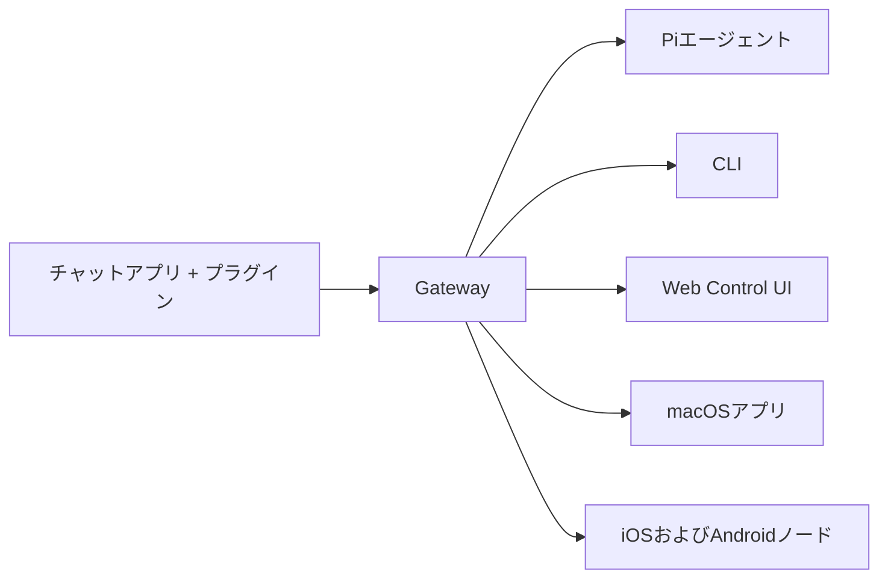

---
read_when:
  - OpenClaw ကို အသုံးပြုသူအသစ်များအား မိတ်ဆက်သည့်အခါ
summary: OpenClaw သည် OS မျိုးစုံပေါ်တွင် လည်ပတ်နိုင်သော AI အေးဂျင့်များအတွက် multi-channel gateway ဖြစ်သည်။
title: OpenClaw
x-i18n:
  generated_at: "2026-02-08T17:15:47Z"
  model: claude-opus-4-5
  provider: pi
  source_hash: fc8babf7885ef91d526795051376d928599c4cf8aff75400138a0d7d9fa3b75f
  source_path: index.md
  workflow: 15
---

# OpenClaw 🦞

<p align="center">
    </img>
    </img>
</p>

> _「EXFOLIATE! EXFOLIATE!」_ — たぶん宇宙ロブスター

<p align="center"><strong>WhatsApp၊ Telegram၊ Discord၊ iMessage စသည်တို့ကို ထောက်ပံ့ပြီး OS အားလုံးတွင် အသုံးပြုနိုင်သော AI အေးဂျင့် gateway ဖြစ်သည်။</strong><br />
  မက်ဆေ့ချ်တစ်စောင် ပို့လိုက်ရုံဖြင့် သင့်အိတ်ကပ်ထဲမှ အေးဂျင့်၏ တုံ့ပြန်ချက်ကို လက်ခံရရှိနိုင်သည်။ ပလပ်ဂင်များမှတဆင့် Mattermost စသည်တို့ကိုလည်း ထပ်မံထည့်သွင်းနိုင်သည်။</p>

<Columns>
  <Card title="はじめに" href="/start/getting-started" icon="rocket">    OpenClaw ကို ထည့်သွင်းပြီး မိနစ်အနည်းငယ်အတွင်း Gateway ကို စတင်နိုင်သည်。
  
</Card>
  <Card title="ウィザードを実行" href="/start/wizard" icon="sparkles">    `openclaw onboard` နှင့် pairing flow ကို အသုံးပြုသည့် လမ်းညွှန်ပါသော setup。
  
</Card>
  <Card title="Control UIを開く" href="/web/control-ui" icon="layout-dashboard">    ချတ်၊ ဆက်တင်များနှင့် session များအတွက် browser dashboard ကို စတင်ဖွင့်ပါသည်。
  
</Card>
</Columns>

OpenClaw သည် တစ်ခုတည်းသော Gateway process မှတဆင့် chat app များကို Pi ကဲ့သို့သော coding အေးဂျင့်များနှင့် ချိတ်ဆက်ပေးသည်။ OpenClaw assistant ကို လည်ပတ်စေပြီး local သို့မဟုတ် remote setup များကို ထောက်ပံ့ပေးသည်။

## အလုပ်လုပ်ပုံ



Gateway သည် session များ၊ routing နှင့် channel ချိတ်ဆက်မှုများအတွက် ယုံကြည်စိတ်ချရသော တစ်ခုတည်းသော အချက်အလက်အရင်းအမြစ် ဖြစ်သည်။

## အဓိက အင်္ဂါရပ်များ

<Columns>
  <Card title="マルチチャネルgateway" icon="network">    တစ်ခုတည်းသော Gateway process ဖြင့် WhatsApp၊ Telegram၊ Discord၊ iMessage ကို ထောက်ပံ့သည်。
  
</Card>
  <Card title="プラグインチャネル" icon="plug">    Extension package များဖြင့် Mattermost စသည်တို့ကို ထပ်မံထည့်သွင်းနိုင်သည်。
  
</Card>
  <Card title="マルチエージェントルーティング" icon="route">    အေးဂျင့်၊ workspace နှင့် ပေးပို့သူအလိုက် ခွဲခြားထားသော session များ。
  
</Card>
  <Card title="メディアサポート" icon="image">    ပုံများ၊ အသံဖိုင်များနှင့် စာရွက်စာတမ်းများကို ပို့ခြင်းနှင့် လက်ခံခြင်း。
  
</Card>
  <Card title="Web Control UI" icon="monitor">    ချတ်၊ ဆက်တင်များ၊ session များနှင့် node များအတွက် browser dashboard。
  
</Card>
  <Card title="モバイルノード" icon="smartphone">    Canvas ကို ထောက်ပံ့သော iOS နှင့် Android node များကို pairing ပြုလုပ်နိုင်သည်。
  
</Card>
</Columns>

## အမြန် စတင်ရန်

<Steps>
  <Step title="OpenClawをインストール">    ```bash
    npm install -g openclaw@latest
    ```
  
</Step>
  <Step title="オンボーディングとサービスのインストール">    ```bash
    openclaw onboard --install-daemon
    ```
  
</Step>
  <Step title="WhatsAppをペアリングしてGatewayを起動">    ```bash
    openclaw channels login
    openclaw gateway --port 18789
    ```
  
</Step>
</Steps>

အပြည့်အစုံ install နှင့် development setup လိုအပ်ပါသလား? [クイックスタート](/start/quickstart) ကို ကြည့်ပါ။

## Dashboard

Gateway ကို စတင်ပြီးနောက်၊ browser တွင် Control UI ကို ဖွင့်ပါ။

- Local မူလတန်ဖိုး: [http://127.0.0.1:18789/](http://127.0.0.1:18789/)
- Remote access: [Webサーフェス](/web) နှင့် [Tailscale](/gateway/tailscale)

<p align="center">
  </img>
</p>

## ဆက်တင်များ (ရွေးချယ်နိုင်သည်)

ဆက်တင်များကို `~/.openclaw/openclaw.json` တွင် သိမ်းဆည်းထားသည်။

- **ဘာမှ မပြုလုပ်ပါက**၊ OpenClaw သည် bundle လုပ်ထားသော Pi binary ကို RPC mode ဖြင့် အသုံးပြုပြီး ပေးပို့သူတစ်ဦးချင်းစီအလိုက် session များ ဖန်တီးပေးသည်။
- ကန့်သတ်ချက်များ သတ်မှတ်လိုပါက `channels.whatsapp.allowFrom` နှင့် (group များအတွက်) mention စည်းမျဉ်းများမှ စတင်ပါ။

ဥပမာ:

```json5
{
  channels: {
    whatsapp: {
      allowFrom: ["+15555550123"],
      groups: { "*": { requireMention: true } },
    },
  },
  messages: { groupChat: { mentionPatterns: ["@openclaw"] } },
}
```

## ဤနေရာမှ စတင်ပါ

<Columns>
  <Card title="ドキュメントハブ" href="/start/hubs" icon="book-open">    အသုံးပြုမှုအလိုက် စုစည်းထားသော စာတမ်းများနှင့် လမ်းညွှန်များအားလုံး。
  
</Card>
  <Card title="設定" href="/gateway/configuration" icon="settings">    Gateway ၏ အဓိက ဆက်တင်များ၊ token များနှင့် provider ဆက်တင်များ。
  
</Card>
  <Card title="リモートアクセス" href="/gateway/remote" icon="globe">    SSH နှင့် tailnet access pattern များ。
  
</Card>
  <Card title="チャネル" href="/channels/telegram" icon="message-square">    WhatsApp၊ Telegram၊ Discord စသည်တို့အတွက် channel သီးသန့် setup များ。
  
</Card>
  <Card title="ノード" href="/nodes" icon="smartphone">    Canvas ထောက်ပံ့သော iOS နှင့် Android node များကို pairing ပြုလုပ်ခြင်း。
  
</Card>
  <Card title="ヘルプ" href="/help" icon="life-buoy">    ပုံမှန် ပြဿနာဖြေရှင်းမှုများနှင့် troubleshooting အတွက် စတင်လမ်းကြောင်းများ。
  
</Card>
</Columns>

## အသေးစိတ်

<Columns>
  <Card title="全機能リスト" href="/concepts/features" icon="list">
    チャネル、ルーティング、メディア機能の完全な一覧。
  
</Card>
  <Card title="マルチエージェントルーティング" href="/concepts/multi-agent" icon="route">
    ワークスペースの分離とエージェントごとのセッション。
  
</Card>
  <Card title="セキュリティ" href="/gateway/security" icon="shield">
    トークン、許可リスト、安全制御。
  
</Card>
  <Card title="トラブルシューティング" href="/gateway/troubleshooting" icon="wrench">
    Gatewayの診断と一般的なエラー。
  
</Card>
  <Card title="概要とクレジット" href="/reference/credits" icon="info">
    プロジェクトの起源、貢献者、ライセンス。
  
</Card>
</Columns>
