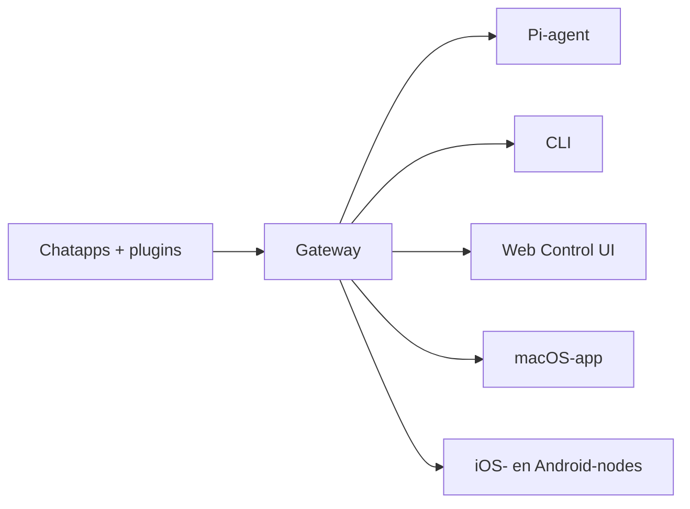

---
read_when:
  - Wanneer je OpenClaw aan nieuwe gebruikers introduceert
summary: OpenClaw is een multichannel gateway voor AI-agenten die op elk besturingssysteem werkt.
title: OpenClaw
x-i18n:
  generated_at: "2026-02-08T17:15:47Z"
  model: claude-opus-4-5
  provider: pi
  source_hash: fc8babf7885ef91d526795051376d928599c4cf8aff75400138a0d7d9fa3b75f
  source_path: index.md
  workflow: 15
---

# OpenClaw 🦞

<p align="center">
    </img>
    </img>
</p>

> _"EXFOLIATE! EXFOLIATE!"_ — waarschijnlijk een kosmische kreeft

<p align="center"><strong>Een AI-agentgateway voor elk besturingssysteem, met ondersteuning voor WhatsApp, Telegram, Discord, iMessage en meer.</strong><br />
  Stuur een bericht en ontvang een antwoord van je agent, rechtstreeks uit je broekzak. Voeg Mattermost en meer toe met plugins.</p>

<Columns>
  <Card title="はじめに" href="/start/getting-started" icon="rocket">
    Installeer OpenClaw en start de Gateway binnen enkele minuten.
  
</Card>
  <Card title="ウィザードを実行" href="/start/wizard" icon="sparkles">
    Begeleide installatie met `openclaw onboard` en een koppelingsflow.
  
</Card>
  <Card title="Control UIを開く" href="/web/control-ui" icon="layout-dashboard">
    Start een browserdashboard voor chat, instellingen en sessies.
  
</Card>
</Columns>

OpenClaw verbindt chatapps met coding-agenten zoals Pi via één enkel Gateway-proces. Het stuurt de OpenClaw-assistent aan en ondersteunt zowel lokale als externe setups.

## Hoe het werkt



De Gateway is de enige betrouwbare bron voor sessies, routering en kanaalverbindingen.

## Belangrijkste functies

<Columns>
  <Card title="マルチチャネルgateway" icon="network">
    Ondersteunt WhatsApp, Telegram, Discord en iMessage via één enkel Gateway-proces.
   
</Card>
  <Card title="プラグインチャネル" icon="plug">    Voeg Mattermost en meer toe met uitbreidingspakketten.
  
</Card>
  <Card title="マルチエージェントルーティング" icon="route">    Sessies gescheiden per agent, workspace en afzender.
  
</Card>
  <Card title="メディアサポート" icon="image">    Verzenden en ontvangen van afbeeldingen, audio en documenten.
  
</Card>
  <Card title="Web Control UI" icon="monitor">    Browserdashboard voor chat, instellingen, sessies en nodes.
  
</Card>
  <Card title="モバイルノード" icon="smartphone">    Koppel Canvas-compatibele iOS- en Android-nodes.
  
</Card>
</Columns>

## Quickstart

<Steps>
  <Step title="OpenClawをインストール">    ```bash
    npm install -g openclaw@latest
    ```
  
</Step>
  <Step title="オンボーディングとサービスのインストール">    ```bash
    openclaw onboard --install-daemon
    ```
  
</Step>
  <Step title="WhatsAppをペアリングしてGatewayを起動">    ```bash
    openclaw channels login
    openclaw gateway --port 18789
    ```
  
</Step>
</Steps>

Heb je een volledige installatie en ontwikkelsetup nodig? Bekijk de [Quickstart](/start/quickstart).

## Dashboard

Open na het starten van de Gateway de Control UI in je browser.

- Lokale standaard: [http://127.0.0.1:18789/](http://127.0.0.1:18789/)
- Externe toegang: [Web Surface](/web) en [Tailscale](/gateway/tailscale)

<p align="center">
  </img>
</p>

## Configuratie (optioneel)

De configuratie staat in `~/.openclaw/openclaw.json`.

- **Als je niets doet**, gebruikt OpenClaw de meegeleverde Pi-binary in RPC-modus en maakt het sessies per afzender aan.
- Wil je beperkingen instellen, begin dan met `channels.whatsapp.allowFrom` en (voor groepen) de vermeldingsregels.

Voorbeeld:

```json5
{
  channels: {
    whatsapp: {
      allowFrom: ["+15555550123"],
      groups: { "*": { requireMention: true } },
    },
  },
  messages: { groupChat: { mentionPatterns: ["@openclaw"] } },
}
```

## Begin hier

<Columns>
  <Card title="ドキュメントハブ" href="/start/hubs" icon="book-open">    Alle documentatie en handleidingen, geordend per use case.
  
</Card>
  <Card title="設定" href="/gateway/configuration" icon="settings">    Kernconfiguratie van de Gateway, tokens en providerinstellingen.
  
</Card>
  <Card title="リモートアクセス" href="/gateway/remote" icon="globe">    SSH- en tailnet-toegangspatronen.
  
</Card>
  <Card title="チャネル" href="/channels/telegram" icon="message-square">    Kanaalspecifieke setup voor WhatsApp, Telegram, Discord en meer.
  
</Card>
  <Card title="ノード" href="/nodes" icon="smartphone">    Koppeling en Canvas-compatibele iOS- en Android-nodes.
  
</Card>
  <Card title="ヘルプ" href="/help" icon="life-buoy">    Algemene oplossingen en startpunten voor probleemoplossing.
  
</Card>
</Columns>

## Details

<Columns>
  <Card title="全機能リスト" href="/concepts/features" icon="list">    Volledig overzicht van kanalen, routering en mediacapaciteiten.
  
</Card>
  <Card title="マルチエージェントルーティング" href="/concepts/multi-agent" icon="route">    Workspace-isolatie en sessies per agent.
  
</Card>
  <Card title="セキュリティ" href="/gateway/security" icon="shield">    Tokens, allowlists en beveiligingscontroles.
  
</Card>
  <Card title="トラブルシューティング" href="/gateway/troubleshooting" icon="wrench">    Gateway-diagnostiek en veelvoorkomende fouten.
  
</Card>
  <Card title="概要とクレジット" href="/reference/credits" icon="info">    Oorsprong van het project, bijdragers en licentie.
  
</Card>
</Columns>
