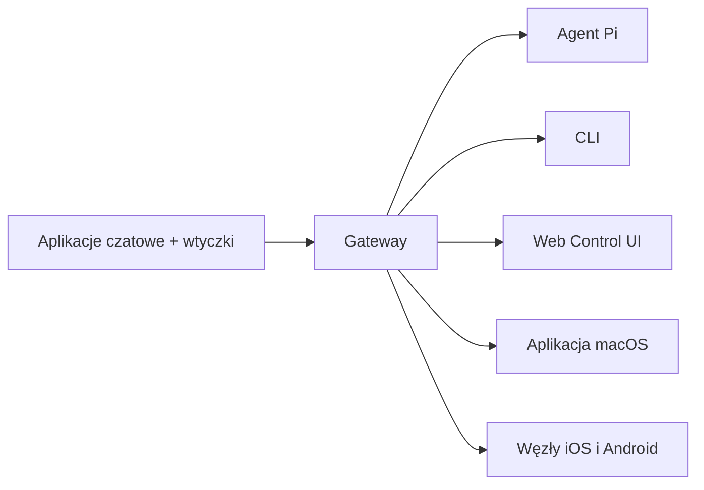

---
read_when:
  - Podczas przedstawiania OpenClaw nowym użytkownikom
summary: OpenClaw to wielokanałowy gateway dla agentów AI, działający na każdym systemie operacyjnym.
title: OpenClaw
x-i18n:
  generated_at: "2026-02-08T17:15:47Z"
  model: claude-opus-4-5
  provider: pi
  source_hash: fc8babf7885ef91d526795051376d928599c4cf8aff75400138a0d7d9fa3b75f
  source_path: index.md
  workflow: 15
---

# OpenClaw 🦞

<p align="center">
    </img>
    </img>
</p>

> _„ZŁUSZCZAJ! ZŁUSZCZAJ!”_ — prawdopodobnie kosmiczny homar

<p align="center"><strong>Gateway agenta AI dla dowolnego systemu operacyjnego, obsługujący WhatsApp, Telegram, Discord, iMessage i inne.</strong><br />
  Wyślij wiadomość i otrzymuj odpowiedzi agenta prosto do kieszeni. Dodawaj Mattermost i inne za pomocą wtyczek.</p>

<Columns>
  <Card title="はじめに" href="/start/getting-started" icon="rocket">
    Zainstaluj OpenClaw i uruchom Gateway w kilka minut.
  
</Card>
  <Card title="ウィザードを実行" href="/start/wizard" icon="sparkles">
    Prowadzona konfiguracja z `openclaw onboard` i procesem parowania.
  
</Card>
  <Card title="Control UIを開く" href="/web/control-ui" icon="layout-dashboard">
    Uruchamia przeglądarkowy panel do czatu, ustawień i sesji.
  
</Card>
</Columns>

OpenClaw łączy aplikacje czatowe z agentami kodującymi takimi jak Pi za pośrednictwem jednego procesu Gateway. Zasila asystenta OpenClaw i obsługuje konfiguracje lokalne oraz zdalne.

## Jak to działa



Gateway jest jedynym, wiarygodnym źródłem informacji o sesjach, routingu i połączeniach kanałów.

## Najważniejsze funkcje

<Columns>
  <Card title="マルチチャネルgateway" icon="network">
    Obsługa WhatsApp, Telegram, Discord i iMessage w ramach jednego procesu Gateway.
  
</Card>
  <Card title="プラグインチャネル" icon="plug">
    Dodawanie Mattermost i innych poprzez pakiety rozszerzeń.
  
</Card>
  <Card title="マルチエージェントルーティング" icon="route">
    Izolowane sesje dla każdego agenta, obszaru roboczego i nadawcy.
  
</Card>
  <Card title="メディアサポート" icon="image">
    Wysyłanie i odbieranie obrazów, audio oraz dokumentów.
  
</Card>
  <Card title="Web Control UI" icon="monitor">
    Przeglądarkowy panel dla czatu, ustawień, sesji i węzłów.
  
</Card>
  <Card title="モバイルノード" icon="smartphone">
    Parowanie węzłów iOS i Android z obsługą Canvas.
  
</Card>
</Columns>

## Szybki start

<Steps>
  <Step title="OpenClawをインストール">
    ```bash
    npm install -g openclaw@latest
    ```
  
</Step>
  <Step title="オンボーディングとサービスのインストール">
    ```bash
    openclaw onboard --install-daemon
    ```
  
</Step>
  <Step title="WhatsAppをペアリングしてGatewayを起動">
    ```bash
    openclaw channels login
    openclaw gateway --port 18789
    ```
  
</Step>
</Steps>

Potrzebujesz pełnej instalacji i środowiska deweloperskiego? Zobacz [Szybki start](/start/quickstart).

## Panel

Po uruchomieniu Gateway otwórz Control UI w przeglądarce.

- Domyślnie lokalnie: [http://127.0.0.1:18789/](http://127.0.0.1:18789/)
- Dostęp zdalny: [Web Surface](/web) oraz [Tailscale](/gateway/tailscale)

<p align="center">
  </img>
</p>

## Konfiguracja (opcjonalnie)

Konfiguracja znajduje się w `~/.openclaw/openclaw.json`.

- **Jeśli nic nie zmienisz**, OpenClaw użyje dołączonego binarnego pliku Pi w trybie RPC i utworzy sesje dla każdego nadawcy.
- Jeśli chcesz wprowadzić ograniczenia, zacznij od `channels.whatsapp.allowFrom` oraz (w przypadku grup) zasad wzmianek.

Przykład:

```json5
{
  channels: {
    whatsapp: {
      allowFrom: ["+15555550123"],
      groups: { "*": { requireMention: true } },
    },
  },
  messages: { groupChat: { mentionPatterns: ["@openclaw"] } },
}
```

## Zacznij tutaj

<Columns>
  <Card title="ドキュメントハブ" href="/start/hubs" icon="book-open">
    Cała dokumentacja i przewodniki uporządkowane według przypadków użycia.
  
</Card>
  <Card title="設定" href="/gateway/configuration" icon="settings">
    Podstawowa konfiguracja Gateway, tokeny i ustawienia dostawców.
  
</Card>
  <Card title="リモートアクセス" href="/gateway/remote" icon="globe">
    Wzorce dostępu SSH oraz tailnet.
  
</Card>
  <Card title="チャネル" href="/channels/telegram" icon="message-square">
    Konfiguracja specyficzna dla kanałów, takich jak WhatsApp, Telegram, Discord i inne.
  
</Card>
  <Card title="ノード" href="/nodes" icon="smartphone">
    Parowanie oraz węzły iOS i Android z obsługą Canvas.
  
</Card>
  <Card title="ヘルプ" href="/help" icon="life-buoy">
    Typowe poprawki i punkt wyjścia do rozwiązywania problemów.
  
</Card>
</Columns>

## Szczegóły

<Columns>
  <Card title="全機能リスト" href="/concepts/features" icon="list">
    Pełna lista kanałów, routingu i funkcji multimedialnych.
  
</Card>
  <Card title="マルチエージェントルーティング" href="/concepts/multi-agent" icon="route">
    Izolacja przestrzeni roboczych i sesje dla poszczególnych agentów.
  
</Card>
  <Card title="セキュリティ" href="/gateway/security" icon="shield">
    Tokeny, listy dozwolonych adresów i mechanizmy kontroli bezpieczeństwa.
  
</Card>
  <Card title="トラブルシューティング" href="/gateway/troubleshooting" icon="wrench">
    Diagnostyka Gateway i typowe błędy.
  
</Card>
  <Card title="概要とクレジット" href="/reference/credits" icon="info">
    Pochodzenie projektu, współtwórcy i licencja.
  
</Card>
</Columns>
