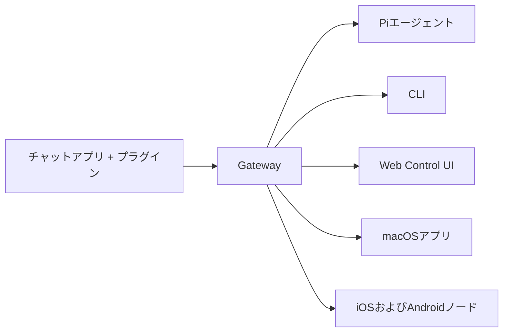

---
read_when:
  - 新規ユーザーにOpenClawを紹介するとき
summary: OpenClawは、あらゆるOSで動作するAIエージェント向けのマルチチャネルgatewayです。
title: OpenClaw
x-i18n:
  generated_at: "2026-02-08T17:15:47Z"
  model: claude-opus-4-5
  provider: pi
  source_hash: fc8babf7885ef91d526795051376d928599c4cf8aff75400138a0d7d9fa3b75f
  source_path: index.md
  workflow: 15
---

# OpenClaw 🦞

<p align="center">
    </img>
    </img>
</p>

> _「EXFOLIATE!
> EXFOLIATE!」_ — たぶん宇宙ロブスター

<p align="center"><strong>WhatsApp、Telegram、Discord、iMessageなどに対応した、あらゆるOS向けのAIエージェントgateway。</strong><br />
  メッセージを送信すれば、ポケットからエージェントの応答を受け取れます。プラグインでMattermostなどを追加できます。
</p>

<Columns>
  <Card title="はじめに" href="/start/getting-started" icon="rocket">
    OpenClawをインストールし、数分でGatewayを起動できます。
  
</Card>
  <Card title="ウィザードを実行" href="/start/wizard" icon="sparkles">
    `openclaw onboard`とペアリングフローによるガイド付きセットアップ。
  
</Card>
  <Card title="Control UIを開く" href="/web/control-ui" icon="layout-dashboard">
    チャット、設定、セッション用のブラウザダッシュボードを起動します。
  
</Card>
</Columns>

OpenClawは、単一のGatewayプロセスを通じてチャットアプリをPiのようなコーディングエージェントに接続します。OpenClawアシスタントを駆動し、ローカルまたはリモートのセットアップをサポートします。

## 仕組み



Gatewayは、セッション、ルーティング、チャネル接続の信頼できる唯一の情報源です。

## 主な機能

<Columns>
  <Card title="マルチチャネルgateway" icon="network">
    単一のGatewayプロセスでWhatsApp、Telegram、Discord、iMessageに対応。
   
</Card>
  <Card title="プラグインチャネル" icon="plug">    Adicione Mattermost e outros por meio de pacotes de extensão.
  
</Card>
  <Card title="マルチエージェントルーティング" icon="route">    Sessões isoladas por agente, workspace e remetente.
  
</Card>
  <Card title="メディアサポート" icon="image">    Envio e recebimento de imagens, áudio e documentos.
  
</Card>
  <Card title="Web Control UI" icon="monitor">    Painel no navegador para chat, configurações, sessões e nós.
  
</Card>
  <Card title="モバイルノード" icon="smartphone">    Emparelhe nós iOS e Android com suporte a Canvas.
  
</Card>
</Columns>

## Início rápido

<Steps>
  <Step title="OpenClawをインストール">    ```bash
    npm install -g openclaw@latest
    ```
  
</Step>
  <Step title="オンボーディングとサービスのインストール">    ```bash
    openclaw onboard --install-daemon
    ```
  
</Step>
  <Step title="WhatsAppをペアリングしてGatewayを起動">    ```bash
    openclaw channels login
    openclaw gateway --port 18789
    ```
  
</Step>
</Steps>

Precisa da instalação completa e do setup de desenvolvimento? Consulte o [Início rápido](/start/quickstart).

## Painel

Após iniciar o Gateway, abra a Control UI no navegador.

- Padrão local: [http://127.0.0.1:18789/](http://127.0.0.1:18789/)
- Acesso remoto: [Web Surface](/web) e [Tailscale](/gateway/tailscale)

<p align="center">
  </img>
</p>

## Configuração (opcional)

A configuração está em `~/.openclaw/openclaw.json`.

- **Se você não fizer nada**, o OpenClaw usará o binário Pi incluído no modo RPC e criará sessões por remetente.
- Se quiser impor restrições, comece com `channels.whatsapp.allowFrom` e (para grupos) as regras de menção.

Exemplo:

```json5
{
  channels: {
    whatsapp: {
      allowFrom: ["+15555550123"],
      groups: { "*": { requireMention: true } },
    },
  },
  messages: { groupChat: { mentionPatterns: ["@openclaw"] } },
}
```

## Comece aqui

<Columns>
  <Card title="ドキュメントハブ" href="/start/hubs" icon="book-open">    Toda a documentação e guias organizados por caso de uso.
  
</Card>
  <Card title="設定" href="/gateway/configuration" icon="settings">    Configurações principais do Gateway, tokens e definições de provedores.
  
</Card>
  <Card title="リモートアクセス" href="/gateway/remote" icon="globe">    Padrões de acesso via SSH e tailnet.
  
</Card>
  <Card title="チャネル" href="/channels/telegram" icon="message-square">    Configuração específica de canais como WhatsApp, Telegram, Discord e outros.
  
</Card>
  <Card title="ノード" href="/nodes" icon="smartphone">    Emparelhamento e nós iOS e Android com suporte a Canvas.
  
</Card>
  <Card title="ヘルプ" href="/help" icon="life-buoy">    Principais correções e ponto de partida para solução de problemas.
  
</Card>
</Columns>

## Detalhes

<Columns>
  <Card title="全機能リスト" href="/concepts/features" icon="list">    Lista completa de canais, roteamento e recursos de mídia.
  
</Card>
  <Card title="マルチエージェントルーティング" href="/concepts/multi-agent" icon="route">    Isolamento de workspace e sessões por agente.
  
</Card>
  <Card title="セキュリティ" href="/gateway/security" icon="shield">    Tokens, listas de permissão e controles de segurança.
  
</Card>
  <Card title="トラブルシューティング" href="/gateway/troubleshooting" icon="wrench">    Diagnósticos do Gateway e erros comuns.
  
</Card>
  <Card title="概要とクレジット" href="/reference/credits" icon="info">    Origem do projeto, contribuidores e licença.
  
</Card>
</Columns>
