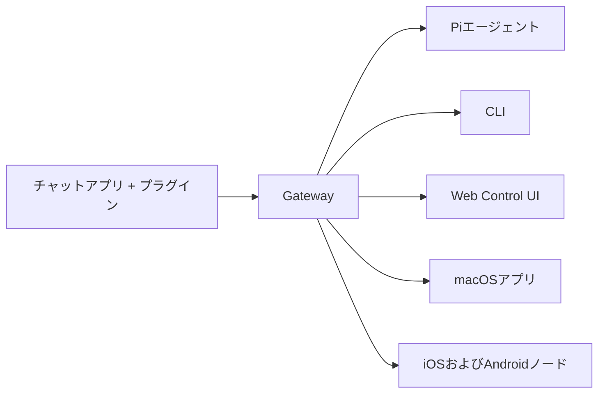

---
read_when:
  - При представлении OpenClaw новым пользователям
summary: OpenClaw — это мультиканальный gateway для AI-агентов, работающий на любой OS.
title: OpenClaw
x-i18n:
  generated_at: "2026-02-08T17:15:47Z"
  model: claude-opus-4-5
  provider: pi
  source_hash: fc8babf7885ef91d526795051376d928599c4cf8aff75400138a0d7d9fa3b75f
  source_path: index.md
  workflow: 15
---

# OpenClaw 🦞

<p align="center">
    </img>
    </img>
</p>

> _«EXFOLIATE! EXFOLIATE!»_ — возможно, космический лобстер

<p align="center"><strong>AI-агент gateway для любой OS с поддержкой WhatsApp, Telegram, Discord, iMessage и других.</strong><br />
  Отправьте сообщение — и получите ответ агента прямо из кармана. Можно добавить Mattermost и другие сервисы с помощью плагинов.</p>

<Columns>
  <Card title="はじめに" href="/start/getting-started" icon="rocket">
    Установите OpenClaw и запустите Gateway за несколько минут.
  
</Card>
  <Card title="ウィザードを実行" href="/start/wizard" icon="sparkles">
    Пошаговая настройка с помощью `openclaw onboard` и процесса сопряжения.
  
</Card>
  <Card title="Control UIを開く" href="/web/control-ui" icon="layout-dashboard">
    Запускает браузерную панель управления для чатов, настроек и сессий.
  
</Card>
</Columns>

OpenClaw подключает чат-приложения к таким кодирующим агентам, как Pi, через единый процесс Gateway. Обеспечивает работу ассистента OpenClaw и поддерживает локальные и удалённые конфигурации.

## Как это работает



Gateway — это единый надёжный источник данных о сессиях, маршрутизации и подключениях каналов.

## Основные возможности

<Columns>
  <Card title="マルチチャネルgateway" icon="network">
    Поддержка WhatsApp, Telegram, Discord и iMessage через единый процесс Gateway.
  
</Card>
  <Card title="プラグインチャネル" icon="plug">
    Добавление Mattermost и других сервисов с помощью пакетов расширений.
  
</Card>
  <Card title="マルチエージェントルーティング" icon="route">
    Изолированные сессии для каждого агента, рабочего пространства и отправителя.
  
</Card>
  <Card title="メディアサポート" icon="image">
    Отправка и получение изображений, аудио и документов.
  
</Card>
  <Card title="Web Control UI" icon="monitor">
    Браузерная панель управления для чатов, настроек, сессий и узлов.
  
</Card>
  <Card title="モバイルノード" icon="smartphone">
    Сопряжение iOS и Android узлов с поддержкой Canvas.
  
</Card>
</Columns>

## Быстрый старт

<Steps>
  <Step title="OpenClawをインストール">
    ```bash
    npm install -g openclaw@latest
    ```
  
</Step>
  <Step title="オンボーディングとサービスのインストール">
    ```bash
    openclaw onboard --install-daemon
    ```
  
</Step>
  <Step title="WhatsAppをペアリングしてGatewayを起動">
    ```bash
    openclaw channels login
    openclaw gateway --port 18789
    ```
  
</Step>
</Steps>

Нужна полная установка и среда разработки? См. [Быстрый старт](/start/quickstart).

## Панель управления

После запуска Gateway откройте Control UI в браузере.

- По умолчанию (локально): [http://127.0.0.1:18789/](http://127.0.0.1:18789/)
- Удалённый доступ: [Webサーフェス](/web) и [Tailscale](/gateway/tailscale)

<p align="center">
  </img>
</p>

## Настройка (необязательно)

Настройки находятся в `~/.openclaw/openclaw.json`.

- **Если ничего не настраивать**, OpenClaw будет использовать встроенный бинарный файл Pi в режиме RPC и создавать сессии для каждого отправителя.
- Если нужно ограничить доступ, начните с `channels.whatsapp.allowFrom` и правил упоминаний (для групп).

Пример:

```json5
{
  channels: {
    whatsapp: {
      allowFrom: ["+15555550123"],
      groups: { "*": { requireMention: true } },
    },
  },
  messages: { groupChat: { mentionPatterns: ["@openclaw"] } },
}
```

## Начните здесь

<Columns>
  <Card title="ドキュメントハブ" href="/start/hubs" icon="book-open">
    Вся документация и руководства, организованные по сценариям использования.
  
</Card>
  <Card title="設定" href="/gateway/configuration" icon="settings">
    Базовая конфигурация Gateway, токены и настройки провайдеров.
  
</Card>
  <Card title="リモートアクセス" href="/gateway/remote" icon="globe">
    Шаблоны доступа через SSH и tailnet.
  
</Card>
  <Card title="チャネル" href="/channels/telegram" icon="message-square">
    Настройка, специфичная для каналов: WhatsApp, Telegram, Discord и других.
  
</Card>
  <Card title="ノード" href="/nodes" icon="smartphone">
    Узлы iOS и Android с поддержкой парирования и Canvas.
  
</Card>
  <Card title="ヘルプ" href="/help" icon="life-buoy">
    Основные способы исправления проблем и отправные точки для устранения неполадок.
  
</Card>
</Columns>

## Подробнее

<Columns>
  <Card title="全機能リスト" href="/concepts/features" icon="list">
    Полный список каналов, маршрутизации и медиа‑возможностей.
  
</Card>
  <Card title="マルチエージェントルーティング" href="/concepts/multi-agent" icon="route">
    Изоляция рабочих пространств и сессии для каждого агента.
  
</Card>
  <Card title="セキュリティ" href="/gateway/security" icon="shield">
    Токены, списки разрешённых адресов и механизмы безопасности.
  
</Card>
  <Card title="トラブルシューティング" href="/gateway/troubleshooting" icon="wrench">
    Диагностика Gateway и распространённые ошибки.
  
</Card>
  <Card title="概要とクレジット" href="/reference/credits" icon="info">
    Происхождение проекта, участники и лицензия.
  
</Card>
</Columns>
