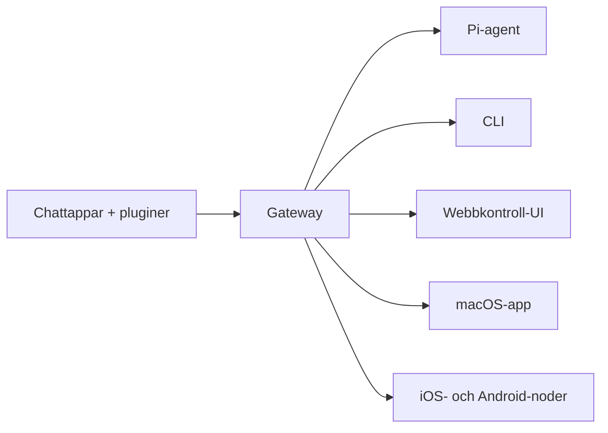

---
read_when:
  - När du introducerar OpenClaw för nya användare
summary: OpenClaw är en multikanalsgateway för AI-agenter som körs på alla operativsystem.
title: OpenClaw
x-i18n:
  generated_at: "2026-02-08T17:15:47Z"
  model: claude-opus-4-5
  provider: pi
  source_hash: fc8babf7885ef91d526795051376d928599c4cf8aff75400138a0d7d9fa3b75f
  source_path: index.md
  workflow: 15
---

# OpenClaw 🦞

<p align="center">
    </img>
    </img>
</p>

> _「EXFOLIATE! EXFOLIATE!」_ — förmodligen en rymdhummer

<p align="center"><strong>En AI-agentgateway för alla operativsystem, med stöd för WhatsApp, Telegram, Discord, iMessage med flera.</strong><br />
  Skicka ett meddelande och få agentens svar direkt i fickan. Lägg till Mattermost och mer via pluginer.
</p>

<Columns>
  <Card title="はじめに" href="/start/getting-started" icon="rocket"> 
    Installera OpenClaw och starta Gateway på några minuter.
  
</Card>
  <Card title="ウィザードを実行" href="/start/wizard" icon="sparkles"> 
    Guidad installation med `openclaw onboard` och parkopplingsflödet.
  
</Card>
  <Card title="Control UIを開く" href="/web/control-ui" icon="layout-dashboard"> 
    Startar en webbdashboard för chatt, inställningar och sessioner.
  
</Card>
</Columns>

OpenClaw kopplar chattappar till kodningsagenter som Pi via en enda Gateway-process. Den driver OpenClaw-assistenten och stöder lokala eller fjärrbaserade installationer.

## Hur det fungerar



Gateway är den enda tillförlitliga informationskällan för sessioner, routning och kanalanslutningar.

## Huvudfunktioner

<Columns>
  <Card title="マルチチャネルgateway" icon="network">
    Stöd för WhatsApp, Telegram, Discord och iMessage i en enda Gateway-process.
  
</Card>
  <Card title="プラグインチャネル" icon="plug">
    Lägg till Mattermost med flera via tilläggspaket.
  
</Card>
  <Card title="マルチエージェントルーティング" icon="route">
    Separata sessioner per agent, arbetsyta och avsändare.
  
</Card>
  <Card title="メディアサポート" icon="image">
    Skicka och ta emot bilder, ljud och dokument.
  
</Card>
  <Card title="Web Control UI" icon="monitor">
    Webbaserad dashboard för chattar, inställningar, sessioner och noder.
  
</Card>
  <Card title="モバイルノード" icon="smartphone">
    Para ihop Canvas‑aktiverade iOS- och Android-noder.
  
</Card>
</Columns>

## Snabbstart

<Steps>
  <Step title="OpenClawをインストール">
    ```bash
    npm install -g openclaw@latest
    ```
  
</Step>
  <Step title="オンボーディングとサービスのインストール">
    ```bash
    openclaw onboard --install-daemon
    ```
  
</Step>
  <Step title="WhatsAppをペアリングしてGatewayを起動">
    ```bash
    openclaw channels login
    openclaw gateway --port 18789
    ```
  
</Step>
</Steps>

Behöver du en fullständig installation och utvecklingsmiljö? Se [Snabbstart](/start/quickstart).

## Dashboard

Efter att Gateway har startats, öppna Control UI i din webbläsare.

- Lokal standard: [http://127.0.0.1:18789/](http://127.0.0.1:18789/)
- Fjärråtkomst: [Webbyta](/web) och [Tailscale](/gateway/tailscale)

<p align="center">
  </img>
</p>

## Konfiguration (valfritt)

Konfigurationen finns i `~/.openclaw/openclaw.json`.

- **Om du inte gör något** använder OpenClaw den medföljande Pi-binären i RPC-läge och skapar sessioner per avsändare.
- Om du vill införa begränsningar, börja med `channels.whatsapp.allowFrom` och (för grupper) regler för omnämnanden.

Exempel:

```json5
{
  channels: {
    whatsapp: {
      allowFrom: ["+15555550123"],
      groups: { "*": { requireMention: true } },
    },
  },
  messages: { groupChat: { mentionPatterns: ["@openclaw"] } },
}
```

## Börja här

<Columns>
  <Card title="ドキュメントハブ" href="/start/hubs" icon="book-open">
    All dokumentation och guider, organiserade efter användningsfall.
  
</Card>
  <Card title="設定" href="/gateway/configuration" icon="settings">
    Grundläggande Gateway-konfiguration, tokens och leverantörsinställningar.
  
</Card>
  <Card title="リモートアクセス" href="/gateway/remote" icon="globe">
    SSH- och tailnet-åtkomstmönster.
  
</Card>
  <Card title="チャネル" href="/channels/telegram" icon="message-square">
    Kanalspecifik installation för WhatsApp, Telegram, Discord med flera.
  
</Card>
  <Card title="ノード" href="/nodes" icon="smartphone">
    Ihopparning och Canvas‑aktiverade iOS- och Android-noder.
  
</Card>
  <Card title="ヘルプ" href="/help" icon="life-buoy">
    Vanliga lösningar och startpunkter för felsökning.
  
</Card>
</Columns>

## Detaljer

<Columns>
  <Card title="全機能リスト" href="/concepts/features" icon="list">
    Fullständig lista över kanaler, routing och mediefunktioner.
  
</Card>
  <Card title="マルチエージェントルーティング" href="/concepts/multi-agent" icon="route">
    Isolering av arbetsytor och sessioner per agent.
  
</Card>
  <Card title="セキュリティ" href="/gateway/security" icon="shield">
    Tokens, tillåtelselistor och säkerhetskontroller.
  
</Card>
  <Card title="トラブルシューティング" href="/gateway/troubleshooting" icon="wrench">
    Gateway-diagnostik och vanliga fel.
  
</Card>
  <Card title="概要とクレジット" href="/reference/credits" icon="info">
    Projektets ursprung, bidragsgivare och licens.
  
</Card>
</Columns>
