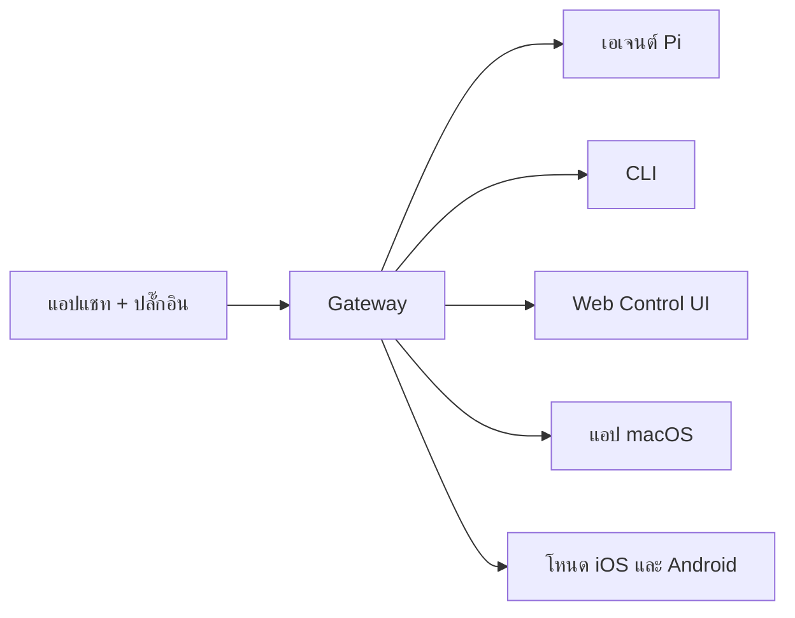

---
read_when:
  - เมื่อต้องการแนะนำ OpenClaw ให้กับผู้ใช้ใหม่
summary: OpenClaw คือ gateway แบบมัลติแชนเนลสำหรับเอเจนต์ AI ที่ทำงานได้บนทุกระบบปฏิบัติการ
title: OpenClaw
x-i18n:
  generated_at: "2026-02-08T17:15:47Z"
  model: claude-opus-4-5
  provider: pi
  source_hash: fc8babf7885ef91d526795051376d928599c4cf8aff75400138a0d7d9fa3b75f
  source_path: index.md
  workflow: 15
---

# OpenClaw 🦞

<p align="center">
    </img>
    </img>
</p>

> _"EXFOLIATE! EXFOLIATE!"_ — อาจจะเป็นล็อบสเตอร์จากอวกาศ

<p align="center"><strong>AI エージェントgateway สำหรับทุกระบบปฏิบัติการ รองรับ WhatsApp, Telegram, Discord, iMessage และอื่น ๆ</strong><br />
  เพียงส่งข้อความ คุณก็จะได้รับการตอบกลับจากเอเจนต์ได้จากในกระเป๋าของคุณ สามารถเพิ่ม Mattermost และอื่น ๆ ได้ผ่านปลั๊กอิน。</p>

<Columns>
  <Card title="はじめに" href="/start/getting-started" icon="rocket">
    ติดตั้ง OpenClaw และเริ่มต้น Gateway ได้ภายในไม่กี่นาที。
  
</Card>
  <Card title="ウィザードを実行" href="/start/wizard" icon="sparkles">
    ตั้งค่าแบบมีคำแนะนำด้วย `openclaw onboard` และขั้นตอนการจับคู่ (pairing flow)
  
</Card>
  <Card title="Control UIを開く" href="/web/control-ui" icon="layout-dashboard">
    เปิดแดชบอร์ดบนเบราว์เซอร์สำหรับแชท การตั้งค่า และเซสชัน
  
</Card>
</Columns>

OpenClaw เชื่อมต่อแอปแชทเข้ากับเอเจนต์เขียนโค้ดอย่าง Pi ผ่านกระบวนการ Gateway เดียว ขับเคลื่อน OpenClaw Assistant และรองรับทั้งการติดตั้งแบบโลคัลและรีโมต

## การทำงาน



Gateway คือแหล่งข้อมูลที่เชื่อถือได้เพียงหนึ่งเดียวสำหรับเซสชัน การกำหนดเส้นทาง และการเชื่อมต่อช่องทาง

## ความสามารถหลัก

<Columns>
  <Card title="マルチチャネルgateway" icon="network">
    รองรับ WhatsApp, Telegram, Discord และ iMessage ด้วยกระบวนการ Gateway เดียว
  
</Card>
  <Card title="プラグインチャネル" icon="plug">
    เพิ่ม Mattermost และอื่น ๆ ได้ผ่านแพ็กเกจส่วนขยาย
  
</Card>
  <Card title="マルチエージェントルーティング" icon="route">
    แยกเซสชันตามเอเจนต์ เวิร์กสเปซ และผู้ส่ง
  
</Card>
  <Card title="メディアサポート" icon="image">
    ส่งและรับรูปภาพ เสียง และเอกสาร
  
</Card>
  <Card title="Web Control UI" icon="monitor">
    แดชบอร์ดบนเบราว์เซอร์สำหรับแชท การตั้งค่า เซสชัน และโหนด
  
</Card>
  <Card title="モバイルノード" icon="smartphone">
    จับคู่โหนด iOS และ Android ที่รองรับ Canvas
  
</Card>
</Columns>

## เริ่มต้นอย่างรวดเร็ว

<Steps>
  <Step title="OpenClawをインストール">
    ```bash
    npm install -g openclaw@latest
    ```
  
</Step>
  <Step title="オンボーディングとサービスのインストール">
    ```bash
    openclaw onboard --install-daemon
    ```
  
</Step>
  <Step title="WhatsAppをペアリングしてGatewayを起動">
    ```bash
    openclaw channels login
    openclaw gateway --port 18789
    ```
  
</Step>
</Steps>

ต้องการการติดตั้งแบบสมบูรณ์และสภาพแวดล้อมสำหรับการพัฒนาหรือไม่? ดูที่ [クイックスタート](/start/quickstart)

## แดชบอร์ด

หลังจากเริ่มต้น Gateway แล้ว ให้เปิด Control UI ในเบราว์เซอร์

- ค่าเริ่มต้นแบบโลคัล: [http://127.0.0.1:18789/](http://127.0.0.1:18789/)
- การเข้าถึงแบบรีโมต: [Webサーフェス](/web) และ [Tailscale](/gateway/tailscale)

<p align="center">
  </img>
</p>

## การตั้งค่า (ไม่บังคับ)

การตั้งค่าอยู่ที่ `~/.openclaw/openclaw.json`

- **หากไม่กำหนดค่าใด ๆ** OpenClaw จะใช้ Pi ไบนารีที่มาพร้อมกันในโหมด RPC และสร้างเซสชันแยกตามผู้ส่ง
- หากต้องการกำหนดข้อจำกัด ให้เริ่มจาก `channels.whatsapp.allowFrom` และ (สำหรับกลุ่ม) กฎการเมนชัน

ตัวอย่าง:

```json5
{
  channels: {
    whatsapp: {
      allowFrom: ["+15555550123"],
      groups: { "*": { requireMention: true } },
    },
  },
  messages: { groupChat: { mentionPatterns: ["@openclaw"] } },
}
```

## เริ่มต้นที่นี่

<Columns>
  <Card title="ドキュメントハブ" href="/start/hubs" icon="book-open">
    เอกสารและคู่มือทั้งหมดที่จัดเรียงตามกรณีการใช้งาน
  
</Card>
  <Card title="設定" href="/gateway/configuration" icon="settings">
    การตั้งค่าหลักของ Gateway, โทเค็น และการตั้งค่าผู้ให้บริการ
  
</Card>
  <Card title="リモートアクセス" href="/gateway/remote" icon="globe">
    รูปแบบการเข้าถึง SSH และ tailnet
  
</Card>
  <Card title="チャネル" href="/channels/telegram" icon="message-square">
    การตั้งค่าเฉพาะของแต่ละช่องทาง เช่น WhatsApp, Telegram, Discord
  
</Card>
  <Card title="ノード" href="/nodes" icon="smartphone">
    โหนด iOS และ Android ที่รองรับการจับคู่และ Canvas
  
</Card>
  <Card title="ヘルプ" href="/help" icon="life-buoy">
    จุดเริ่มต้นสำหรับการแก้ไขปัญหาและการแก้ไขทั่วไป
  
</Card>
</Columns>

## รายละเอียด

<Columns>
  <Card title="全機能リスト" href="/concepts/features" icon="list">
    รายการทั้งหมดของช่องทาง การกำหนดเส้นทาง และความสามารถด้านสื่อ
  
</Card>
  <Card title="マルチエージェントルーティング" href="/concepts/multi-agent" icon="route">
    การแยกเวิร์กสเปซและเซสชันต่อเอเจนต์
  
</Card>
  <Card title="セキュリティ" href="/gateway/security" icon="shield">
    โทเค็น รายการอนุญาต และการควบคุมความปลอดภัย
  
</Card>
  <Card title="トラブルシューティング" href="/gateway/troubleshooting" icon="wrench">
    การวินิจฉัย Gateway และข้อผิดพลาดที่พบบ่อย
  
</Card>
  <Card title="概要とクレジット" href="/reference/credits" icon="info">
    ที่มาของโครงการ ผู้มีส่วนร่วม และสัญญาอนุญาต
  
</Card>
</Columns>
