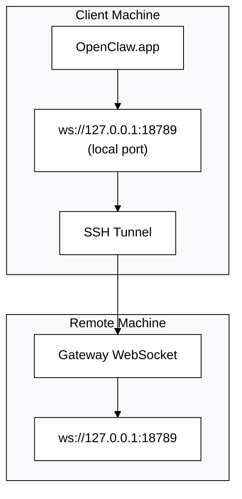

# Pagpapatakbo ng OpenClaw.app gamit ang Remote Gateway

Gumagamit ang OpenClaw.app ng SSH tunneling upang kumonekta sa isang remote na Gateway. Ipinapakita ng gabay na ito kung paano ito i-set up.

## Pangkalahatang-ideya



## Mabilis na Setup

### Hakbang 1: Magdagdag ng SSH Config

I-edit ang `~/.ssh/config` at idagdag ang:

```ssh
Host remote-gateway
    HostName <REMOTE_IP>          # e.g., 172.27.187.184
    User <REMOTE_USER>            # e.g., jefferson
    LocalForward 18789 127.0.0.1:18789
    IdentityFile ~/.ssh/id_rsa
```

Palitan ang `<REMOTE_IP>` at `<REMOTE_USER>` ng sarili mong mga value.

### Hakbang 2: Kopyahin ang SSH Key

Kopyahin ang iyong public key papunta sa remote machine (ilagay ang password nang isang beses):

```bash
ssh-copy-id -i ~/.ssh/id_rsa <REMOTE_USER>@<REMOTE_IP>
```

### Hakbang 3: Itakda ang Gateway Token

```bash
launchctl setenv OPENCLAW_GATEWAY_TOKEN "<your-token>"
```

### Hakbang 4: Simulan ang SSH Tunnel

```bash
ssh -N remote-gateway &
```

### Hakbang 5: I-restart ang OpenClaw.app

```bash
# Quit OpenClaw.app (⌘Q), then reopen:
open /path/to/OpenClaw.app
```

Kokonek na ngayon ang app sa remote gateway sa pamamagitan ng SSH tunnel.

---

## Auto-Start ng Tunnel sa Login

Para awtomatikong magsimula ang SSH tunnel kapag nag-log in ka, gumawa ng isang Launch Agent.

### Gumawa ng PLIST file

I-save ito bilang `~/Library/LaunchAgents/bot.molt.ssh-tunnel.plist`:

```xml
<?xml version="1.0" encoding="UTF-8"?>
<!DOCTYPE plist PUBLIC "-//Apple//DTD PLIST 1.0//EN" "http://www.apple.com/DTDs/PropertyList-1.0.dtd">
<plist version="1.0">
<dict>
    <key>Label</key>
    <string>bot.molt.ssh-tunnel</string>
    <key>ProgramArguments</key>
    <array>
        <string>/usr/bin/ssh</string>
        <string>-N</string>
        <string>remote-gateway</string>
    </array>
    <key>KeepAlive</key>
    <true/>
    <key>RunAtLoad</key>
    <true/>
</dict>
</plist>
```

### I-load ang Launch Agent

```bash
launchctl bootstrap gui/$UID ~/Library/LaunchAgents/bot.molt.ssh-tunnel.plist
```

Ang tunnel ay ngayon:

- Awtomatikong magsisimula kapag nag-log in ka
- Magre-restart kung mag-crash
- Mananatiling tumatakbo sa background

Legacy note: alisin ang anumang natitirang `com.openclaw.ssh-tunnel` LaunchAgent kung mayroon.

---

## Pag-troubleshoot

**Suriin kung tumatakbo ang tunnel:**

```bash
ps aux | grep "ssh -N remote-gateway" | grep -v grep
lsof -i :18789
```

**I-restart ang tunnel:**

```bash
launchctl kickstart -k gui/$UID/bot.molt.ssh-tunnel
```

**Itigil ang tunnel:**

```bash
launchctl bootout gui/$UID/bot.molt.ssh-tunnel
```

---

## Paano Ito Gumagana

| Bahagi                            | Ano ang Ginagawa                                                                        |
| ------------------------------------ | --------------------------------------------------------------------------------------- |
| `LocalForward 18789 127.0.0.1:18789` | Ipinapasa ang lokal na port 18789 papunta sa remote port 18789                          |
| `ssh -N`                             | SSH nang hindi nagsasagawa ng remote commands (port forwarding lang) |
| `KeepAlive`                          | Awtomatikong nire-restart ang tunnel kung mag-crash                                     |
| `RunAtLoad`                          | Sinisimulan ang tunnel kapag nag-load ang agent                                         |

Kumokonekta ang OpenClaw.app sa `ws://127.0.0.1:18789` sa iyong client machine. Ipinapasa ng SSH tunnel ang koneksyong iyon sa port 18789 sa remote machine kung saan tumatakbo ang Gateway.
