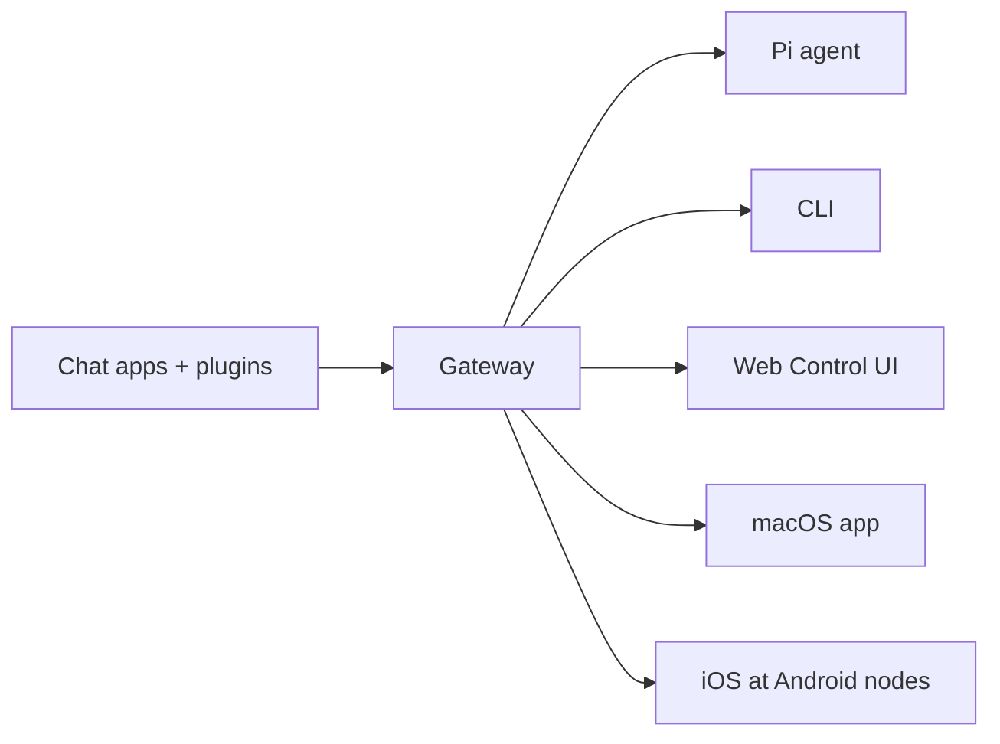

---
read_when:
  - Kapag ipinapakilala ang OpenClaw sa mga bagong user
summary: Ang OpenClaw ay isang multi-channel gateway para sa mga AI agent na gumagana sa anumang OS.
title: OpenClaw
x-i18n:
  generated_at: "2026-02-08T17:15:47Z"
  model: claude-opus-4-5
  provider: pi
  source_hash: fc8babf7885ef91d526795051376d928599c4cf8aff75400138a0d7d9fa3b75f
  source_path: index.md
  workflow: 15
---

# OpenClaw 🦞

<p align="center">
    </img>
    </img>
</p>

> _「EXFOLIATE! EXFOLIATE!」_ — marahil isang kosmikong lobster

<p align="center"><strong>Isang AI agent gateway para sa anumang OS na sumusuporta sa WhatsApp, Telegram, Discord, iMessage, at iba pa.</strong><br />
  Magpadala ng mensahe at makatanggap ng tugon ng agent mula sa iyong bulsa. Maaari kang magdagdag ng Mattermost at iba pa sa pamamagitan ng mga plugin.</p>

<Columns>
  <Card title="はじめに" href="/start/getting-started" icon="rocket">I-install ang OpenClaw at paandarin ang Gateway sa loob lamang ng ilang minuto.
</Card>
  <Card title="ウィザードを実行" href="/start/wizard" icon="sparkles">May gabay na setup gamit ang `openclaw onboard` at pairing flow.
</Card>
  <Card title="Control UIを開く" href="/web/control-ui" icon="layout-dashboard">Ilulunsad ang browser dashboard para sa chat, settings, at sessions.
</Card>
</Columns>

Ikinokonekta ng OpenClaw ang mga chat app sa mga coding agent tulad ng Pi sa pamamagitan ng iisang Gateway process. Pinapagana nito ang OpenClaw assistant at sinusuportahan ang lokal o remote na setup.

## Paano Ito Gumagana



Ang Gateway ang iisang mapagkakatiwalaang pinagmumulan ng katotohanan para sa sessions, routing, at mga koneksyon ng channel.

## Mga Pangunahing Tampok

<Columns>
  <Card title="マルチチャネルgateway" icon="network">Sinusuportahan ang WhatsApp, Telegram, Discord, at iMessage sa iisang Gateway process.
</Card>
  <Card title="プラグインチャネル" icon="plug">Magdagdag ng Mattermost at iba pa sa pamamagitan ng extension packages.
</Card>
  <Card title="マルチエージェントルーティング" icon="route">Hiwa-hiwalay na sessions bawat agent, workspace, at sender.
</Card>
  <Card title="メディアサポート" icon="image">Magpadala at tumanggap ng mga larawan, audio, at dokumento.
</Card>
  <Card title="Web Control UI" icon="monitor">Browser dashboard para sa chat, settings, sessions, at nodes.
</Card>
  <Card title="モバイルノード" icon="smartphone">Ipares ang mga iOS at Android node na may suporta sa Canvas.
</Card>
</Columns>

## Mabilis na Pagsisimula

<Steps>
  <Step title="OpenClawをインストール">```bash
npm install -g openclaw@latest
```
</Step>
  <Step title="オンボーディングとサービスのインストール">```bash
openclaw onboard --install-daemon
```
</Step>
  <Step title="WhatsAppをペアリングしてGatewayを起動">```bash
openclaw channels login
openclaw gateway --port 18789
```
</Step>
</Steps>

Kailangan mo ba ng kumpletong installation at development setup? Tingnan ang [Quickstart](/start/quickstart).

## Dashboard

Pagkatapos ilunsad ang Gateway, buksan ang Control UI sa iyong browser.

- Lokal na default: [http://127.0.0.1:18789/](http://127.0.0.1:18789/)
- Remote access: [Web surface](/web) at [Tailscale](/gateway/tailscale)

<p align="center">
  </img>
</p>

## Configuration (Opsyonal)

Matatagpuan ang configuration sa `~/.openclaw/openclaw.json`.

- **Kung walang babaguhin**, gagamit ang OpenClaw ng naka-bundle na Pi binary sa RPC mode at lilikha ng sessions bawat sender.
- Kung nais mong magtakda ng mga limitasyon, magsimula sa `channels.whatsapp.allowFrom` at (para sa mga grupo) mga patakaran sa mention.

Halimbawa:

```json5
{
  channels: {
    whatsapp: {
      allowFrom: ["+15555550123"],
      groups: { "*": { requireMention: true } },
    },
  },
  messages: { groupChat: { mentionPatterns: ["@openclaw"] } },
}
```

## Magsimula Dito

<Columns>
  <Card title="ドキュメントハブ" href="/start/hubs" icon="book-open">Lahat ng dokumentasyon at gabay na inayos ayon sa use case.
</Card>
  <Card title="設定" href="/gateway/configuration" icon="settings">Mga pangunahing setting ng Gateway, tokens, at provider configuration.
</Card>
  <Card title="リモートアクセス" href="/gateway/remote" icon="globe">Mga pattern ng access para sa SSH at tailnet.
</Card>
  <Card title="チャネル" href="/channels/telegram" icon="message-square">Channel-specific na setup para sa WhatsApp, Telegram, Discord, at iba pa.
</Card>
  <Card title="ノード" href="/nodes" icon="smartphone">Pagpapair at Canvas-supported na iOS at Android nodes.
</Card>
  <Card title="ヘルプ" href="/help" icon="life-buoy">    Isang pangkalahatang entry point para sa mga pag-aayos at pag-troubleshoot.
  
</Card>
</Columns>

## Mga Detalye

<Columns>
  <Card title="全機能リスト" href="/concepts/features" icon="list">    Kumpletong listahan ng mga channel, routing, at media features.
  
</Card>
  <Card title="マルチエージェントルーティング" href="/concepts/multi-agent" icon="route">    Paghihiwalay ng workspace at mga session bawat agent.
  
</Card>
  <Card title="セキュリティ" href="/gateway/security" icon="shield">    Mga token, allowlist, at mga kontrol sa seguridad.
  
</Card>
  <Card title="トラブルシューティング" href="/gateway/troubleshooting" icon="wrench">    Mga diagnostic ng Gateway at mga karaniwang error.
  
</Card>
  <Card title="概要とクレジット" href="/reference/credits" icon="info">    Pinagmulan ng proyekto, mga contributor, at lisensya.
  
</Card>
</Columns>
