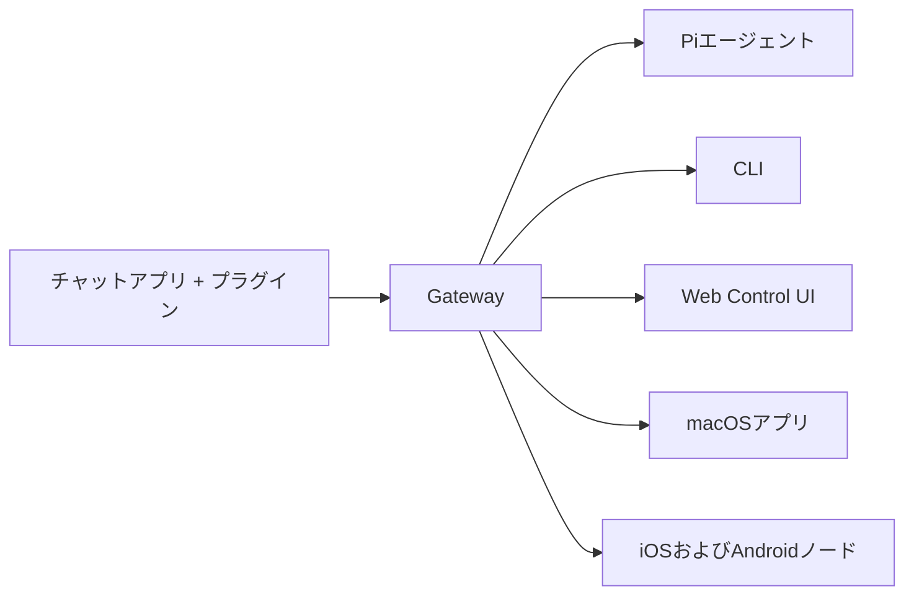

---
read_when:
  - Yeni kullanıcılara OpenClaw’ı tanıtırken
summary: OpenClaw, tüm işletim sistemlerinde çalışan AI ajanları için çok kanallı bir gateway’dir.
title: OpenClaw
x-i18n:
  generated_at: "2026-02-08T17:15:47Z"
  model: claude-opus-4-5
  provider: pi
  source_hash: fc8babf7885ef91d526795051376d928599c4cf8aff75400138a0d7d9fa3b75f
  source_path: index.md
  workflow: 15
---

# OpenClaw 🦞

<p align="center">
    </img>
    </img>
</p>

> _“EXFOLIATE! EXFOLIATE!”_ — muhtemelen bir uzay ıstakozu

<p align="center"><strong>WhatsApp, Telegram, Discord, iMessage ve daha fazlasını destekleyen, tüm işletim sistemleri için bir AI ajan gateway’i.</strong><br />
  Mesaj gönderin ve cebinizden ajan yanıtlarını alın. Eklentilerle Mattermost gibi platformları ekleyebilirsiniz.</p>

<Columns>
  <Card title="はじめに" href="/start/getting-started" icon="rocket">
    OpenClaw’ı yükleyin ve Gateway’i dakikalar içinde başlatın.
  
</Card>
  <Card title="ウィザードを実行" href="/start/wizard" icon="sparkles">
    `openclaw onboard` ve eşleştirme akışı ile rehberli kurulum.
  
</Card>
  <Card title="Control UIを開く" href="/web/control-ui" icon="layout-dashboard">
    Sohbet, ayarlar ve oturumlar için tarayıcı kontrol panelini başlatır.
  
</Card>
</Columns>

OpenClaw, tek bir Gateway süreci aracılığıyla sohbet uygulamalarını Pi gibi kodlama ajanlarına bağlar. OpenClaw asistanını çalıştırır ve yerel veya uzak kurulumları destekler.

## Nasıl çalışır



Gateway, oturumlar, yönlendirme ve kanal bağlantıları için tek güvenilir bilgi kaynağıdır.

## Öne çıkan özellikler

<Columns>
  <Card title="マルチチャネルgateway" icon="network">
    Tek bir Gateway süreciyle WhatsApp, Telegram, Discord ve iMessage desteği.
  
</Card>
  <Card title="プラグインチャネル" icon="plug">
    Mattermost gibi platformları genişletme paketleriyle ekleyin.
  
</Card>
  <Card title="マルチエージェントルーティング" icon="route">
    Ajan, çalışma alanı ve gönderici başına izole edilmiş oturumlar.
  
</Card>
  <Card title="メディアサポート" icon="image">
    Görüntü, ses ve belgelerin gönderilip alınması。
  
</Card>
  <Card title="Web Control UI" icon="monitor">
    Sohbetler, ayarlar, oturumlar ve düğümler için tarayıcı panosu。
  
</Card>
  <Card title="モバイルノード" icon="smartphone">
    Canvas destekli iOS ve Android düğümlerini eşleştirin。
  
</Card>
</Columns>

## Hızlı Başlangıç

<Steps>
  <Step title="OpenClawをインストール">
    ```bash
    npm install -g openclaw@latest
    ```
  
</Step>
  <Step title="オンボーディングとサービスのインストール">
    ```bash
    openclaw onboard --install-daemon
    ```
  
</Step>
  <Step title="WhatsAppをペアリングしてGatewayを起動">
    ```bash
    openclaw channels login
    openclaw gateway --port 18789
    ```
  
</Step>
</Steps>

Eksiksiz kurulum ve geliştirme ortamına mı ihtiyacınız var? [Hızlı Başlangıç](/start/quickstart) bölümüne göz atın。

## Pano

Gateway başlatıldıktan sonra tarayıcınızda Control UI’yi açın。

- Yerel varsayılan: [http://127.0.0.1:18789/](http://127.0.0.1:18789/)
- Uzaktan erişim: [Web Surface](/web) ve [Tailscale](/gateway/tailscale)

<p align="center">
  </img>
</p>

## Yapılandırma (isteğe bağlı)

Yapılandırma `~/.openclaw/openclaw.json` dosyasında bulunur。

- **Hiçbir şey yapmazsanız**, OpenClaw paketle birlikte gelen Pi binary’sini RPC modunda kullanır ve gönderici başına bir oturum oluşturur。
- Sınırlar koymak istiyorsanız, `channels.whatsapp.allowFrom` ile başlayın ve (gruplar için) bahsetme kurallarını ayarlayın。

Örnek:

```json5
{
  channels: {
    whatsapp: {
      allowFrom: ["+15555550123"],
      groups: { "*": { requireMention: true } },
    },
  },
  messages: { groupChat: { mentionPatterns: ["@openclaw"] } },
}
```

## Buradan başlayın

<Columns>
  <Card title="ドキュメントハブ" href="/start/hubs" icon="book-open">
    Kullanım senaryolarına göre düzenlenmiş tüm belgeler ve kılavuzlar。
  
</Card>
  <Card title="設定" href="/gateway/configuration" icon="settings">
    Gateway çekirdek yapılandırması, token’lar ve sağlayıcı ayarları。
  
</Card>
  <Card title="リモートアクセス" href="/gateway/remote" icon="globe">
    SSH ve tailnet erişim desenleri。
  
</Card>
  <Card title="チャネル" href="/channels/telegram" icon="message-square">
    WhatsApp, Telegram, Discord ve diğer kanallara özel kurulum。
  
</Card>
  <Card title="ノード" href="/nodes" icon="smartphone">
    Eşleştirme ve Canvas destekli iOS ile Android düğümleri。
  
</Card>
  <Card title="ヘルプ" href="/help" icon="life-buoy">
    Yaygın düzeltmeler ve sorun giderme için başlangıç noktaları。
  
</Card>
</Columns>

## Ayrıntılar

<Columns>
  <Card title="全機能リスト" href="/concepts/features" icon="list">
    Kanalların, yönlendirme ve medya özelliklerinin tam listesi。
  
</Card>
  <Card title="マルチエージェントルーティング" href="/concepts/multi-agent" icon="route">
    Çalışma alanı izolasyonu ve ajan başına oturumlar。
  
</Card>
  <Card title="セキュリティ" href="/gateway/security" icon="shield">
    Token’lar, izin listeleri ve güvenlik kontrolleri。
  
</Card>
  <Card title="トラブルシューティング" href="/gateway/troubleshooting" icon="wrench">
    Gateway tanılama ve yaygın hatalar。
  
</Card>
  <Card title="概要とクレジット" href="/reference/credits" icon="info">
    Projenin kökeni, katkıda bulunanlar ve lisans。
  
</Card>
</Columns>
