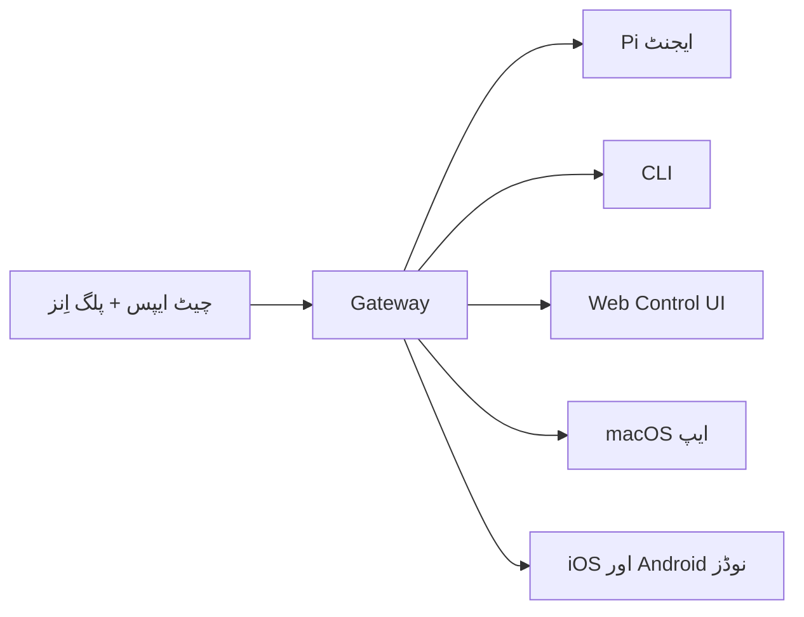

---
read_when:
  - نئے صارفین کو OpenClaw متعارف کرواتے وقت
summary: OpenClaw ایک ملٹی چینل gateway ہے جو کسی بھی OS پر چلنے والے AI ایجنٹس کے لیے بنایا گیا ہے۔
title: OpenClaw
x-i18n:
  generated_at: "2026-02-08T17:15:47Z"
  model: claude-opus-4-5
  provider: pi
  source_hash: fc8babf7885ef91d526795051376d928599c4cf8aff75400138a0d7d9fa3b75f
  source_path: index.md
  workflow: 15
---

# OpenClaw 🦞

<p align="center">
    </img>
    </img>
</p>

> _"EXFOLIATE! EXFOLIATE!"_ — شاید ایک خلائی لوبسٹر

<p align="center"><strong>کسی بھی OS کے لیے AI ایجنٹ gateway، جو WhatsApp، Telegram، Discord، iMessage وغیرہ کو سپورٹ کرتا ہے۔</strong><br />
  بس ایک پیغام بھیجیں اور اپنی جیب سے ایجنٹ کا جواب وصول کریں۔ پلگ اِن کے ذریعے Mattermost وغیرہ شامل کیے جا سکتے ہیں۔</p>

<Columns>
  <Card title="はじめに" href="/start/getting-started" icon="rocket">
    OpenClaw انسٹال کریں اور چند منٹوں میں Gateway شروع کریں۔
  
</Card>
  <Card title="ウィザードを実行" href="/start/wizard" icon="sparkles">
    `openclaw onboard` اور پیئرنگ فلو کے ساتھ رہنمائی پر مبنی سیٹ اپ۔
  
</Card>
  <Card title="Control UIを開く" href="/web/control-ui" icon="layout-dashboard">
    چیٹ، سیٹنگز اور سیشنز کے لیے براؤزر ڈیش بورڈ لانچ کرتا ہے۔
  
</Card>
</Columns>

OpenClaw ایک واحد Gateway پروسیس کے ذریعے چیٹ ایپس کو Pi جیسے کوڈنگ ایجنٹس سے جوڑتا ہے۔ یہ OpenClaw اسسٹنٹ کو طاقت دیتا ہے اور لوکل یا ریموٹ سیٹ اپ کی معاونت کرتا ہے۔

## یہ کیسے کام کرتا ہے



Gateway سیشنز، روٹنگ اور چینل کنکشنز کے لیے واحد قابلِ اعتماد ماخذ ہے۔

## اہم خصوصیات

<Columns>
  <Card title="マルチチャネルgateway" icon="network">    ایک واحد Gateway پروسیس میں WhatsApp، Telegram، Discord، iMessage کی سپورٹ۔
</Card>
  <Card title="プラグインチャネル" icon="plug">    توسیعی پیکیج کے ذریعے Mattermost وغیرہ شامل کریں۔
</Card>
  <Card title="マルチエージェントルーティング" icon="route">    ایجنٹ، ورک اسپیس اور بھیجنے والے کے حساب سے علیحدہ سیشنز۔
</Card>
  <Card title="メディアサポート" icon="image">    تصاویر، آواز اور دستاویزات کی بھیجنے اور وصول کرنے کی سہولت۔
</Card>
  <Card title="Web Control UI" icon="monitor">    چیٹ، سیٹنگز، سیشنز اور نوڈز کے لیے براؤزر ڈیش بورڈ۔
</Card>
  <Card title="モバイルノード" icon="smartphone">    Canvas سپورٹ کے ساتھ iOS اور Android نوڈز کو پیئر کریں۔
</Card>
</Columns>

## کوئیک اسٹارٹ

<Steps>
  <Step title="OpenClawをインストール">    ```bash
    npm install -g openclaw@latest
    ```
</Step>
  <Step title="オンボーディングとサービスのインストール">    ```bash
    openclaw onboard --install-daemon
    ```
</Step>
  <Step title="WhatsAppをペアリングしてGatewayを起動">    ```bash
    openclaw channels login
    openclaw gateway --port 18789
    ```
</Step>
</Steps>

کیا آپ کو مکمل انسٹالیشن اور ڈیولپمنٹ سیٹ اپ درکار ہے؟ [کوئیک اسٹارٹ](/start/quickstart) ملاحظہ کریں۔

## ڈیش بورڈ

Gateway شروع کرنے کے بعد، براؤزر میں Control UI کھولیں۔

- لوکل ڈیفالٹ: [http://127.0.0.1:18789/](http://127.0.0.1:18789/)
- ریموٹ رسائی: [Web سرفیس](/web) اور [Tailscale](/gateway/tailscale)

<p align="center">
  </img>
</p>

## سیٹنگز (اختیاری)

سیٹنگز `~/.openclaw/openclaw.json` میں موجود ہیں۔

- **اگر آپ کچھ نہ کریں** تو OpenClaw بنڈل شدہ Pi بائنری کو RPC موڈ میں استعمال کرے گا اور ہر بھیجنے والے کے لیے علیحدہ سیشن بنائے گا۔
- اگر آپ پابندیاں لگانا چاہتے ہیں تو `channels.whatsapp.allowFrom` اور (گروپس کے لیے) مینشن رولز سے آغاز کریں۔

مثال:

```json5
{
  channels: {
    whatsapp: {
      allowFrom: ["+15555550123"],
      groups: { "*": { requireMention: true } },
    },
  },
  messages: { groupChat: { mentionPatterns: ["@openclaw"] } },
}
```

## یہاں سے شروع کریں

<Columns>
  <Card title="ドキュメントハブ" href="/start/hubs" icon="book-open">    تمام دستاویزات اور گائیڈز جو استعمال کے کیسز کے مطابق منظم ہیں۔
</Card>
  <Card title="設定" href="/gateway/configuration" icon="settings">    Gateway کی بنیادی سیٹنگز، ٹوکنز اور پرووائیڈر کنفیگریشن۔
</Card>
  <Card title="リモートアクセス" href="/gateway/remote" icon="globe">    SSH اور tailnet رسائی کے پیٹرنز۔
</Card>
  <Card title="チャネル" href="/channels/telegram" icon="message-square">    WhatsApp، Telegram، Discord وغیرہ جیسے چینلز کی مخصوص سیٹ اپ۔
</Card>
  <Card title="ノード" href="/nodes" icon="smartphone">    پیئرنگ اور Canvas سپورٹ کے ساتھ iOS اور Android نوڈز۔
</Card>
  <Card title="ヘルプ" href="/help" icon="life-buoy">    عام اصلاحات اور ٹربل شوٹنگ کے لیے ابتدائی رہنمائی۔
</Card>
</Columns>

## تفصیلات

<Columns>
  <Card title="全機能リスト" href="/concepts/features" icon="list">    چینلز، روٹنگ اور میڈیا فیچرز کی مکمل فہرست۔
</Card>
  <Card title="マルチエージェントルーティング" href="/concepts/multi-agent" icon="route">    ورک اسپیس کی علیحدگی اور ہر ایجنٹ کے لیے سیشنز۔
</Card>
  <Card title="セキュリティ" href="/gateway/security" icon="shield">    ٹوکنز، اجازت فہرستیں اور سیکیورٹی کنٹرولز۔
</Card>
  <Card title="トラブルシューティング" href="/gateway/troubleshooting" icon="wrench">    Gateway کی تشخیص اور عام غلطیاں۔
</Card>
  <Card title="概要とクレジット" href="/reference/credits" icon="info">    پروجیکٹ کی ابتدا، معاونین اور لائسنس۔
</Card>
</Columns>
