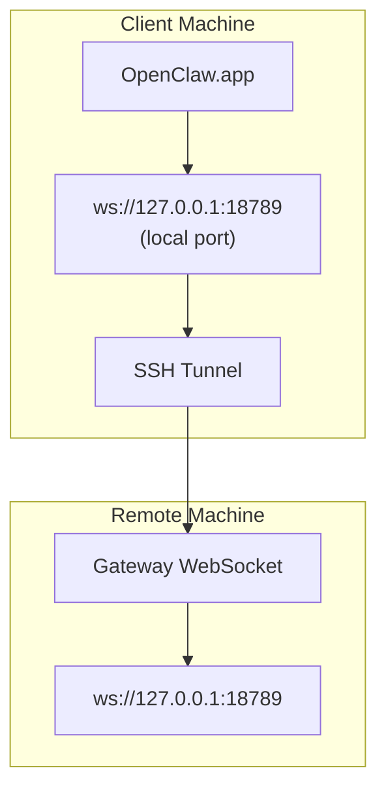

# OpenClaw.app ni Masofaviy Gateway bilan Ishga Tushirish

OpenClaw.app masofaviy gateway’ga ulanish uchun SSH tunneling’dan foydalanadi. Ushbu qo‘llanma uni qanday sozlashni ko‘rsatadi.

## Umumiy Ko‘rinish



## Tezkor Sozlash

### 1-qadam: SSH Config qo‘shish

`~/.ssh/config` faylini tahrir qiling va quyidagilarni qo‘shing:

```ssh
Host remote-gateway
    HostName <REMOTE_IP>          # masalan, 172.27.187.184
    User <REMOTE_USER>            # masalan, jefferson
    LocalForward 18789 127.0.0.1:18789
    IdentityFile ~/.ssh/id_rsa
```

`<REMOTE_IP>` va `<REMOTE_USER>` qiymatlarini o‘zingiznikiga almashtiring.

### 2-qadam: SSH kalitini nusxalash

Ochiq kalitingizni masofaviy qurilmaga nusxalang (parolni bir marta kiriting):

```bash
ssh-copy-id -i ~/.ssh/id_rsa <REMOTE_USER>@<REMOTE_IP>
```

### 3-qadam: Gateway Token sozlash

```bash
launchctl setenv OPENCLAW_GATEWAY_TOKEN "<your-token>"
```

### 4-qadam: SSH Tunnel ishga tushirish

```bash
ssh -N remote-gateway &
```

### 5-qadam: OpenClaw.app ni qayta ishga tushirish

```bash
# OpenClaw.app ni yoping (⌘Q), so‘ng qayta oching:
open /path/to/OpenClaw.app
```

Endi ilova SSH tunnel orqali masofaviy gateway’ga ulanadi.

---

## Tizimga Kirishda Tunnel’ni Avtomatik Ishga Tushirish

Agar tizimga kirganingizda SSH tunnel avtomatik ishga tushishini istasangiz, Launch Agent yarating.

### PLIST faylini yaratish

Quyidagini `~/Library/LaunchAgents/bot.molt.ssh-tunnel.plist` nomi bilan saqlang:

```xml
<?xml version="1.0" encoding="UTF-8"?>
<!DOCTYPE plist PUBLIC "-//Apple//DTD PLIST 1.0//EN" "http://www.apple.com/DTDs/PropertyList-1.0.dtd">
<plist version="1.0">
<dict>
    <key>Label</key>
    <string>bot.molt.ssh-tunnel</string>
    <key>ProgramArguments</key>
    <array>
        <string>/usr/bin/ssh</string>
        <string>-N</string>
        <string>remote-gateway</string>
    </array>
    <key>KeepAlive</key>
    <true/>
    <key>RunAtLoad</key>
    <true/>
</dict>
</plist>
```

### Launch Agent’ni yuklash

```bash
launchctl bootstrap gui/$UID ~/Library/LaunchAgents/bot.molt.ssh-tunnel.plist
```

Endi tunnel:

- Tizimga kirganingizda avtomatik ishga tushadi
- Agar nosozlik yuz bersa, qayta ishga tushadi
- Orqa fonda doimiy ishlaydi

Eslatma (legacy): agar mavjud bo‘lsa, eski `com.openclaw.ssh-tunnel` LaunchAgent faylini o‘chirib tashlang.

---

## Muammolarni Bartaraf Etish

**Tunnel ishlayotganini tekshirish:**

```bash
ps aux | grep "ssh -N remote-gateway" | grep -v grep
lsof -i :18789
```

**Tunnel’ni qayta ishga tushirish:**

```bash
launchctl kickstart -k gui/$UID/bot.molt.ssh-tunnel
```

**Tunnel’ni to‘xtatish:**

```bash
launchctl bootout gui/$UID/bot.molt.ssh-tunnel
```

---

## Qanday Ishlaydi

| Komponent                            | Vazifasi                                                     |
| ------------------------------------ | ------------------------------------------------------------ |
| `LocalForward 18789 127.0.0.1:18789` | Lokal 18789 portni masofaviy 18789 portga yo‘naltiradi      |
| `ssh -N`                             | Masofaviy buyruqlarni bajarmasdan SSH ishga tushiradi (faqat port yo‘naltirish) |
| `KeepAlive`                          | Agar tunnel to‘xtab qolsa, avtomatik qayta ishga tushiradi  |
| `RunAtLoad`                          | Agent yuklanganda tunnel’ni ishga tushiradi                 |

OpenClaw.app mijoz qurilmangizda `ws://127.0.0.1:18789` manziliga ulanadi. SSH tunnel esa ushbu ulanishni Gateway ishlayotgan masofaviy qurilmadagi 18789 portiga yo‘naltiradi.