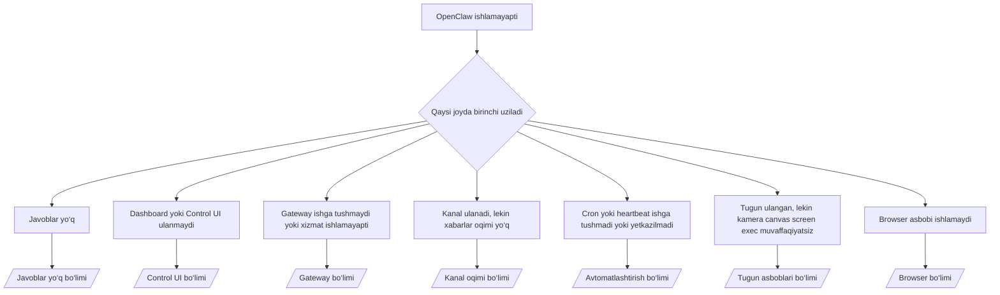

# Muammolarni bartaraf etish

Agar atigi 2 daqiqangiz bo‘lsa, ushbu sahifadan dastlabki saralash uchun kirish nuqtasi sifatida foydalaning.

## Dastlabki 60 soniya

Ushbu aniq ketma-ketlikni tartib bilan bajaring:

```bash
openclaw status
openclaw status --all
openclaw gateway probe
openclaw gateway status
openclaw doctor
openclaw channels status --probe
openclaw logs --follow
```

Bir qatordagi yaxshi chiqish:

- `openclaw status` → sozlangan kanallarni va aniq avtorizatsiya xatolarisiz holatni ko‘rsatadi.
- `openclaw status --all` → to‘liq hisobot mavjud va ulashish mumkin.
- `openclaw gateway probe` → kutilgan gateway manzili yetib boriladigan.
- `openclaw gateway status` → `Runtime: running` va `RPC probe: ok`.
- `openclaw doctor` → bloklovchi konfiguratsiya/xizmat xatolari yo‘q.
- `openclaw channels status --probe` → kanallar `connected` yoki `ready` deb hisobot beradi.
- `openclaw logs --follow` → barqaror faollik, takrorlanuvchi jiddiy xatolar yo‘q.

## Qarorlar daraxti



<AccordionGroup>
  <Accordion title="Javoblar yo‘q">
    ```bash
    openclaw status
    openclaw gateway status
    openclaw channels status --probe
    openclaw pairing list <channel>
    openclaw logs --follow
    ```

    Yaxshi chiqish quyidagicha ko‘rinadi:

    - `Runtime: running`
    - `RPC probe: ok`
    - `channels status --probe` da kanalingiz `connected`/`ready` ko‘rinadi
    - Yuboruvchi tasdiqlangan (yoki DM siyosati ochiq/allowlist)

    Keng tarqalgan log imzolari:

    - `drop guild message (mention required` → Discord’da mention cheklovi xabarni to‘sdi.
    - `pairing request` → yuboruvchi tasdiqlanmagan va DM pairing tasdig‘ini kutmoqda.
    - `blocked` / `allowlist` kanal loglarida → yuboruvchi, xona yoki guruh filtrlangan.

    Chuqur sahifalar:

    - [/gateway/troubleshooting#no-replies](/gateway/troubleshooting#no-replies)
    - [/channels/troubleshooting](/channels/troubleshooting)
    - [/channels/pairing](/channels/pairing)

  </Accordion>

  <Accordion title="Dashboard yoki Control UI ulanmaydi">
    ```bash
    openclaw status
    openclaw gateway status
    openclaw logs --follow
    openclaw doctor
    openclaw channels status --probe
    ```

    Yaxshi chiqish quyidagicha ko‘rinadi:

    - `Dashboard: http://...` `openclaw gateway status` da ko‘rsatiladi
    - `RPC probe: ok`
    - Loglarda auth loop yo‘q

    Keng tarqalgan log imzolari:

    - `device identity required` → HTTP/xavfsiz bo‘lmagan kontekst qurilma auth’ini yakunlay olmaydi.
    - `unauthorized` / reconnect loop → noto‘g‘ri token/parol yoki auth rejimi nomuvofiqligi.
    - `gateway connect failed:` → UI noto‘g‘ri URL/portni nishonga olgan yoki gateway yetib bo‘lmaydi.

    Chuqur sahifalar:

    - [/gateway/troubleshooting#dashboard-control-ui-connectivity](/gateway/troubleshooting#dashboard-control-ui-connectivity)
    - [/web/control-ui](/web/control-ui)
    - [/gateway/authentication](/gateway/authentication)

  </Accordion>

  <Accordion title="Gateway ishga tushmaydi yoki xizmat o‘rnatilgan, lekin ishlamayapti">
    ```bash
    openclaw status
    openclaw gateway status
    openclaw logs --follow
    openclaw doctor
    openclaw channels status --probe
    ```

    Yaxshi chiqish quyidagicha ko‘rinadi:

    - `Service: ... (loaded)`
    - `Runtime: running`
    - `RPC probe: ok`

    Keng tarqalgan log imzolari:

    - `Gateway start blocked: set gateway.mode=local` → gateway rejimi o‘rnatilmagan/remote.
    - `refusing to bind gateway ... without auth` → token/parolsiz non-loopback bind.
    - `another gateway instance is already listening` yoki `EADDRINUSE` → port band.

    Chuqur sahifalar:

    - [/gateway/troubleshooting#gateway-service-not-running](/gateway/troubleshooting#gateway-service-not-running)
    - [/gateway/background-process](/gateway/background-process)
    - [/gateway/configuration](/gateway/configuration)

  </Accordion>

  <Accordion title="Kanal ulanadi, lekin xabarlar oqimi yo‘q">
    ```bash
    openclaw status
    openclaw gateway status
    openclaw logs --follow
    openclaw doctor
    openclaw channels status --probe
    ```

    Yaxshi chiqish quyidagicha ko‘rinadi:

    - Kanal transporti ulangan.
    - Pairing/allowlist tekshiruvlari muvaffaqiyatli.
    - Kerak bo‘lganda mention’lar aniqlanadi.

    Keng tarqalgan log imzolari:

    - `mention required` → guruh mention cheklovi qayta ishlashni to‘sdi.
    - `pairing` / `pending` → DM yuboruvchi hali tasdiqlanmagan.
    - `not_in_channel`, `missing_scope`, `Forbidden`, `401/403` → kanal ruxsat tokeni muammosi.

    Chuqur sahifalar:

    - [/gateway/troubleshooting#channel-connected-messages-not-flowing](/gateway/troubleshooting#channel-connected-messages-not-flowing)
    - [/channels/troubleshooting](/channels/troubleshooting)

  </Accordion>

  <Accordion title="Cron yoki heartbeat ishga tushmadi yoki yetkazilmadi">
    ```bash
    openclaw status
    openclaw gateway status
    openclaw cron status
    openclaw cron list
    openclaw cron runs --id <jobId> --limit 20
    openclaw logs --follow
    ```

    Yaxshi chiqish quyidagicha ko‘rinadi:

    - `cron.status` yoqilgan va keyingi ishga tushish vaqti ko‘rsatilgan.
    - `cron runs` da yaqinda `ok` yozuvlari bor.
    - Heartbeat yoqilgan va faol soatlardan tashqarida emas.

    Keng tarqalgan log imzolari:

    - `cron: scheduler disabled; jobs will not run automatically` → cron o‘chirilgan.
    - `heartbeat skipped` with `reason=quiet-hours` → sozlangan faol soatlardan tashqarida.
    - `requests-in-flight` → asosiy yo‘lak band; heartbeat kechiktirilgan.
    - `unknown accountId` → heartbeat yetkazish uchun ko‘rsatilgan account mavjud emas.

    Chuqur sahifalar:

    - [/gateway/troubleshooting#cron-and-heartbeat-delivery](/gateway/troubleshooting#cron-and-heartbeat-delivery)
    - [/automation/troubleshooting](/automation/troubleshooting)
    - [/gateway/heartbeat](/gateway/heartbeat)

  </Accordion>

  <Accordion title="Tugun ulangan, lekin kamera/canvas/screen/exec asbobi ishlamaydi">
    ```bash
    openclaw status
    openclaw gateway status
    openclaw nodes status
    openclaw nodes describe --node <idOrNameOrIp>
    openclaw logs --follow
    ```

    Yaxshi chiqish quyidagicha ko‘rinadi:

    - Tugun `node` roli uchun ulangan va pairing qilingan.
    - Chaqarilayotgan buyruq uchun capability mavjud.
    - Asbob uchun ruxsat holati berilgan.

    Keng tarqalgan log imzolari:

    - `NODE_BACKGROUND_UNAVAILABLE` → tugun ilovasini foreground’ga olib chiqing.
    - `*_PERMISSION_REQUIRED` → OT ruxsati rad etilgan yoki mavjud emas.
    - `SYSTEM_RUN_DENIED: approval required` → exec tasdig‘i kutilmoqda.
    - `SYSTEM_RUN_DENIED: allowlist miss` → buyruq exec allowlist’da yo‘q.

    Chuqur sahifalar:

    - [/gateway/troubleshooting#node-paired-tool-fails](/gateway/troubleshooting#node-paired-tool-fails)
    - [/nodes/troubleshooting](/nodes/troubleshooting)
    - [/tools/exec-approvals](/tools/exec-approvals)

  </Accordion>

  <Accordion title="Browser asbobi ishlamaydi">
    ```bash
    openclaw status
    openclaw gateway status
    openclaw browser status
    openclaw logs --follow
    openclaw doctor
    ```

    Yaxshi chiqish quyidagicha ko‘rinadi:

    - Browser status `running: true` va tanlangan browser/profile’ni ko‘rsatadi.
    - `openclaw` profili ishga tushadi yoki `chrome` relay’da ulangan tab mavjud.

    Keng tarqalgan log imzolari:

    - `Failed to start Chrome CDP on port` → lokal browser ishga tushmadi.
    - `browser.executablePath not found` → sozlangan binary yo‘li noto‘g‘ri.
    - `Chrome extension relay is running, but no tab is connected` → extension ulanmagan.
    - `Browser attachOnly is enabled ... not reachable` → attach-only profilida faol CDP target yo‘q.

    Chuqur sahifalar:

    - [/gateway/troubleshooting#browser-tool-fails](/gateway/troubleshooting#browser-tool-fails)
    - [/tools/browser-linux-troubleshooting](/tools/browser-linux-troubleshooting)
    - [/tools/chrome-extension](/tools/chrome-extension)

  </Accordion>
</AccordionGroup>