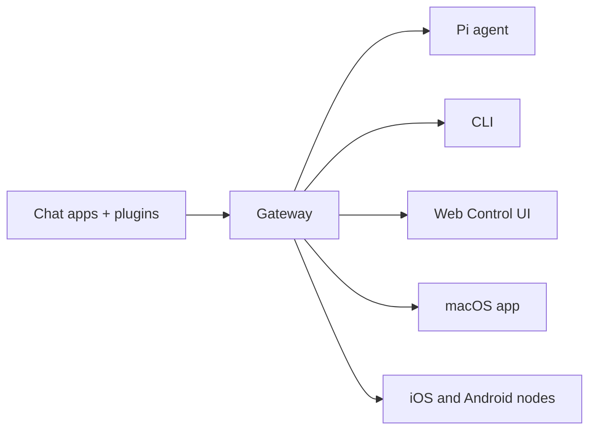

# OpenClaw 🦞

<p align="center">
    
    
</p>

> _"EXFOLIATE! EXFOLIATE!"_ — ehtimol, kosmik omar

<p align="center">
  <strong>WhatsApp, Telegram, Discord, iMessage va boshqalar bo‘ylab AI agentlari uchun har qanday OS gateway.</strong><br />
  Xabar yuboring, cho‘ntagingizdan agent javobini oling. Plaginlar Mattermost va boshqalarni qo‘shadi.
</p>

<Columns>
  <Card title="Boshlash" href="/start/getting-started" icon="rocket">
    OpenClaw’ni o‘rnating va Gateway’ni bir necha daqiqada ishga tushiring.
  </Card>
  <Card title="Sehrgarni ishga tushiring" href="/start/wizard" icon="sparkles">
    `openclaw onboard` va juftlash jarayonlari bilan boshqariladigan sozlash.
  </Card>
  <Card title="Control UI’ni oching" href="/web/control-ui" icon="layout-dashboard">
    Chat, konfiguratsiya va sessiyalar uchun brauzer boshqaruv panelini ishga tushiring.
  </Card>
</Columns>

## OpenClaw nima?

OpenClaw — sevimli chat ilovalaringizni — WhatsApp, Telegram, Discord, iMessage va boshqalarni — Pi kabi AI kodlash agentlari bilan bog‘laydigan **o‘z-o‘zini xost qilinadigan shlyuz**. Siz o‘z kompyuteringizda (yoki serverda) bitta Gateway jarayonini ishga tushirasiz va u xabar almashish ilovalaringiz bilan doimiy mavjud AI yordamchi o‘rtasidagi ko‘prikka aylanadi.

**Kimlar uchun?** Ma’lumotlari ustidan nazoratni yo‘qotmasdan yoki xostlangan xizmatlarga tayanmasdan, istalgan joydan xabar yuborib foydalaniladigan shaxsiy AI yordamchini xohlaydigan dasturchilar va ilg‘or foydalanuvchilar uchun.

**Uni nimasi bilan boshqacha?**

- **O‘z-o‘zini xost qilinadi**: sizning uskunangizda, sizning qoidalaringiz bilan ishlaydi
- **Ko‘p kanalli**: bitta Gateway bir vaqtning o‘zida WhatsApp, Telegram, Discord va boshqalarga xizmat qiladi
- **Agentga mos**: vositalardan foydalanish, sessiyalar, xotira va ko‘p agentli marshrutlashga ega kodlash agentlari uchun yaratilgan
- **Ochiq manbali**: MIT litsenziyasi, hamjamiyat tomonidan rivojlantiriladi

**Nimalar kerak?** Node 22+, API kaliti (Anthropic tavsiya etiladi) va 5 daqiqa.

## Qanday ishlaydi



Gateway sessiyalar, marshrutlash va kanal ulanishlari uchun yagona haqiqat manbaidir.

## Asosiy imkoniyatlar

<Columns>
  <Card title="Ko‘p kanalli gateway" icon="network">
    Bitta Gateway jarayoni bilan WhatsApp, Telegram, Discord va iMessage.
  </Card>
  <Card title="Plagin kanallari" icon="plug">
    Kengaytma paketlari orqali Mattermost va boshqalarni qo‘shing.
  </Card>
  <Card title="Ko‘p agentli marshrutlash" icon="route">
    Har bir agent, ish maydoni yoki jo‘natuvchi uchun alohida sessiyalar.
  </Card>
  <Card title="Media qo‘llab-quvvatlash" icon="image">
    Rasm, audio va hujjatlarni yuborish va qabul qilish.
  </Card>
  <Card title="Web Control UI" icon="monitor">
    Chat, konfiguratsiya, sessiyalar va tugunlar uchun brauzer boshqaruv paneli.
  </Card>
  <Card title="Mobil tugunlar" icon="smartphone">
    Canvas qo‘llab-quvvatlovi bilan iOS va Android tugunlarini juftlash.
  </Card>
</Columns>

## Tezkor boshlash

<Steps>
  <Step title="OpenClaw’ni o‘rnating">
    ```bash
    npm install -g openclaw@latest
    ```
  </Step>
  <Step title="Onboard qiling va xizmatni o‘rnating">
    ```bash
    openclaw onboard --install-daemon
    ```
  </Step>
  <Step title="WhatsApp’ni juftlang va Gateway’ni ishga tushiring">
    ```bash
    openclaw channels login
    openclaw gateway --port 18789
    ```
  </Step>
</Steps>

To‘liq o‘rnatish va ishlab chiqish sozlamalari kerakmi? [Quick start](/start/quickstart) ga qarang.

## Boshqaruv paneli

Gateway ishga tushgach, brauzer Control UI’ni oching.

- Mahalliy sukut bo‘yicha: [http://127.0.0.1:18789/](http://127.0.0.1:18789/)
- Masofaviy kirish: [Web surfaces](/web) va [Tailscale](/gateway/tailscale)

<p align="center">
  
</p>

## Konfiguratsiya (ixtiyoriy)

Konfiguratsiya `~/.openclaw/openclaw.json` da joylashgan.

- Agar siz **hech narsa qilmasangiz**, OpenClaw har bir jo‘natuvchi uchun sessiyalar bilan RPC rejimida o‘rnatilgan Pi binary’dan foydalanadi.
- Agar uni cheklamoqchi bo‘lsangiz, `channels.whatsapp.allowFrom` dan va (guruhlar uchun) mention qoidalaridan boshlang.

Misol:

```json5
{
  channels: {
    whatsapp: {
      allowFrom: ["+15555550123"],
      groups: { "*": { requireMention: true } },
    },
  },
  messages: { groupChat: { mentionPatterns: ["@openclaw"] } },
}
```

## Shu yerdan boshlang

<Columns>
  <Card title="Hujjatlar markazi" href="/start/hubs" icon="book-open">
    Foydalanish holatlari bo‘yicha tartiblangan barcha hujjatlar va qo‘llanmalar.
  </Card>
  <Card title="Konfiguratsiya" href="/gateway/configuration" icon="settings">
    Asosiy Gateway sozlamalari, tokenlar va provider konfiguratsiyasi.
  </Card>
  <Card title="Masofaviy kirish" href="/gateway/remote" icon="globe">
    SSH va tailnet kirish usullari.
  </Card>
  <Card title="Kanallar" href="/channels/telegram" icon="message-square">
    WhatsApp, Telegram, Discord va boshqalar uchun kanalga xos sozlash.
  </Card>
  <Card title="Tugunlar" href="/nodes" icon="smartphone">
    Juftlash va Canvas bilan iOS va Android tugunlari.
  </Card>
  <Card title="Yordam" href="/help" icon="life-buoy">
    Keng tarqalgan tuzatishlar va muammolarni bartaraf etish bo‘limi.
  </Card>
</Columns>

## Batafsil ma’lumot

<Columns>
  <Card title="To‘liq imkoniyatlar ro‘yxati" href="/concepts/features" icon="list">
    Kanal, marshrutlash va media imkoniyatlarining to‘liq tavsifi.
  </Card>
  <Card title="Ko‘p agentli marshrutlash" href="/concepts/multi-agent" icon="route">
    Workspace izolyatsiyasi va har bir agent uchun alohida sessiyalar.
  </Card>
  <Card title="Xavfsizlik" href="/gateway/security" icon="shield">
    Tokenlar, allowlist’lar va xavfsizlik boshqaruvlari.
  </Card>
  <Card title="Muammolarni bartaraf etish" href="/gateway/troubleshooting" icon="wrench">
    Gateway diagnostikasi va keng tarqalgan xatolar.
  </Card>
  <Card title="Loyiha va mualliflar" href="/reference/credits" icon="info">
    Loyiha kelib chiqishi, hissa qo‘shuvchilar va litsenziya.
  </Card>
</Columns>
