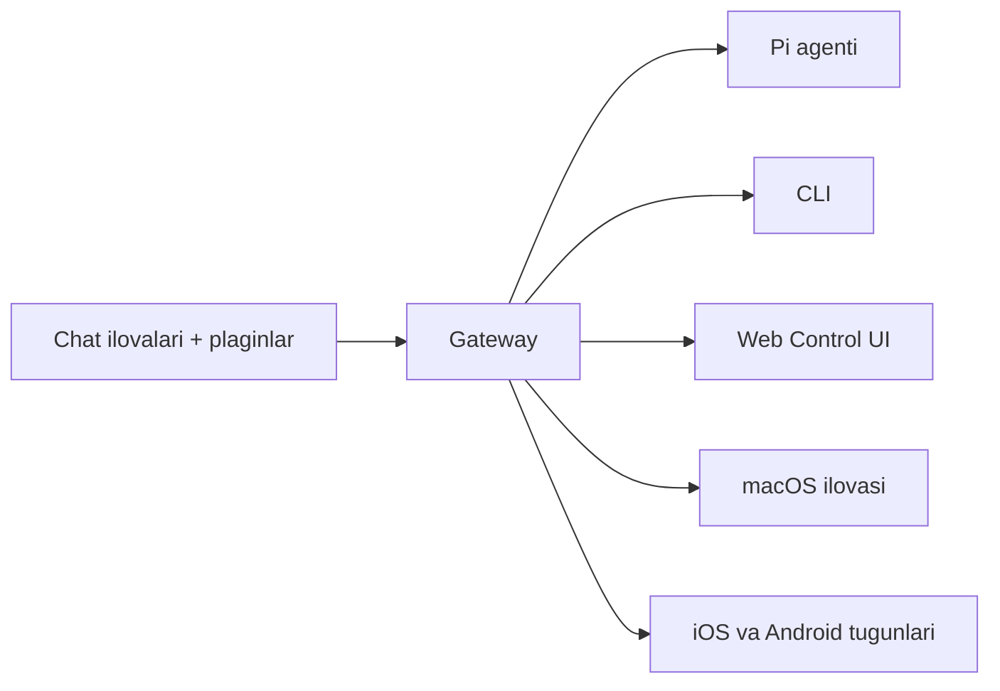

---
read_when:
  - Yangi foydalanuvchilarga OpenClaw’ni tanishtirish
summary: OpenClaw — har qanday OS’da ishlaydigan AI agentlari uchun ko‘p kanalli gateway.
title: OpenClaw
x-i18n:
  generated_at: "2026-02-08T17:15:47Z"
  model: claude-opus-4-5
  provider: pi
  source_hash: fc8babf7885ef91d526795051376d928599c4cf8aff75400138a0d7d9fa3b75f
  source_path: index.md
  workflow: 15
---

# OpenClaw 🦞

<p align="center">
    </img>
    </img>
</p>

> _“EXFOLIATE! EXFOLIATE!”_ — ehtimol kosmik omar

<p align="center"><strong>WhatsApp, Telegram, Discord, iMessage va boshqalarni qo‘llab-quvvatlaydigan, har qanday OS uchun mo‘ljallangan AI agent gateway.</strong><br />
  Xabar yuboring va agent javobini cho‘ntagingizdan oling. Plaginlar orqali Mattermost va boshqalarni qo‘shish mumkin.</p>

<Columns>
  <Card title="はじめに" href="/start/getting-started" icon="rocket">OpenClaw’ni o‘rnating va bir necha daqiqada Gateway’ni ishga tushiring.
</Card>
  <Card title="ウィザードを実行" href="/start/wizard" icon="sparkles">`openclaw onboard` va juftlash jarayoni orqali yo‘naltirilgan sozlash.
</Card>
  <Card title="Control UIを開く" href="/web/control-ui" icon="layout-dashboard">Chat, sozlamalar va sessiyalar uchun brauzer boshqaruv panelini ishga tushiradi.
</Card>
</Columns>

OpenClaw chat ilovalarini Pi kabi kod yozuvchi agentlarga yagona Gateway jarayoni orqali ulaydi. U OpenClaw assistentini boshqaradi va lokal yoki masofaviy sozlashni qo‘llab-quvvatlaydi.

## Qanday ishlaydi



Gateway — sessiyalar, marshrutlash va kanal ulanishlari uchun yagona ishonchli manba.

## Asosiy xususiyatlar

<Columns>
  <Card title="マルチチャネルgateway" icon="network">Yagona Gateway jarayoni orqali WhatsApp, Telegram, Discord, iMessage’ni qo‘llab-quvvatlaydi.
</Card>
  <Card title="プラグインチャネル" icon="plug">Kengaytma paketlari orqali Mattermost va boshqalarni qo‘shish.
</Card>
  <Card title="マルチエージェントルーティング" icon="route">Agent, ish maydoni va yuboruvchi bo‘yicha ajratilgan sessiyalar.
</Card>
  <Card title="メディアサポート" icon="image">Rasmlar, audio va hujjatlarni yuborish va qabul qilish.
</Card>
  <Card title="Web Control UI" icon="monitor">Chat, sozlamalar, sessiyalar va tugunlar uchun brauzer boshqaruv paneli.
</Card>
  <Card title="モバイルノード" icon="smartphone">Canvas qo‘llab-quvvatlanadigan iOS va Android tugunlarini juftlash.
</Card>
</Columns>

## Tezkor boshlash

<Steps>
  <Step title="OpenClawをインストール">```bash
npm install -g openclaw@latest
```
</Step>
  <Step title="オンボーディングとサービスのインストール">```bash
openclaw onboard --install-daemon
```
</Step>
  <Step title="WhatsAppをペアリングしてGatewayを起動">```bash
openclaw channels login
openclaw gateway --port 18789
```
</Step>
</Steps>

To‘liq o‘rnatish va ishlab chiqish sozlamasi kerakmi? [Tezkor boshlash](/start/quickstart) bo‘limiga qarang.

## Boshqaruv paneli

Gateway ishga tushgandan so‘ng, brauzerda Control UI’ni oching.

- Lokal standart: [http://127.0.0.1:18789/](http://127.0.0.1:18789/)
- Masofaviy kirish: [Web yuzasi](/web) va [Tailscale](/gateway/tailscale)

<p align="center">
  </img>
</p>

## Sozlamalar (ixtiyoriy)

Sozlamalar `~/.openclaw/openclaw.json` faylida joylashgan.

- **Agar hech narsa qilinmasa**，OpenClaw RPC rejimida paketga kiritilgan Pi binar faylidan foydalanadi va har bir yuboruvchi uchun sessiya yaratadi.
- Cheklov qoʻymoqchi boʻlsangiz, `channels.whatsapp.allowFrom` va (guruhlar uchun) mention qoidalaridan boshlang.

Misol:

```json5
{
  channels: {
    whatsapp: {
      allowFrom: ["+15555550123"],
      groups: { "*": { requireMention: true } },
    },
  },
  messages: { groupChat: { mentionPatterns: ["@openclaw"] } },
}
```

## Shu yerdan boshlang

<Columns>
  <Card title="ドキュメントハブ" href="/start/hubs" icon="book-open">
    Use-case bo‘yicha tartiblangan barcha hujjatlar va qo‘llanmalar.
  
</Card>
  <Card title="設定" href="/gateway/configuration" icon="settings">
    Gateway’ning asosiy sozlamalari, tokenlar va provayder sozlamalari.
  
</Card>
  <Card title="リモートアクセス" href="/gateway/remote" icon="globe">
    SSH va tailnet kirish andozalari.
  
</Card>
  <Card title="チャネル" href="/channels/telegram" icon="message-square">
    WhatsApp, Telegram, Discord va boshqa kanallar uchun maxsus sozlash.
  
</Card>
  <Card title="ノード" href="/nodes" icon="smartphone">
    Juftlash va Canvas qo‘llab-quvvatlanadigan iOS hamda Android tugunlari.
  
</Card>
  <Card title="ヘルプ" href="/help" icon="life-buoy">
    Umumiy tuzatishlar va nosozliklarni bartaraf etish uchun boshlang‘ich nuqta.
  
</Card>
</Columns>

## Batafsil

<Columns>
  <Card title="全機能リスト" href="/concepts/features" icon="list">
    Kanallar, marshrutlash va media imkoniyatlarining to‘liq ro‘yxati.
  
</Card>
  <Card title="マルチエージェントルーティング" href="/concepts/multi-agent" icon="route">
    Ish maydonini ajratish va har bir agent uchun alohida sessiyalar.
  
</Card>
  <Card title="セキュリティ" href="/gateway/security" icon="shield">
    Tokenlar, ruxsat berilganlar ro‘yxati va xavfsizlik nazorati.
  
</Card>
  <Card title="トラブルシューティング" href="/gateway/troubleshooting" icon="wrench">
    Gateway diagnostikasi va keng tarqalgan xatolar.
  
</Card>
  <Card title="概要とクレジット" href="/reference/credits" icon="info">
    Loyiha kelib chiqishi, hissa qo‘shuvchilar va litsenziya.
  
</Card>
</Columns>
