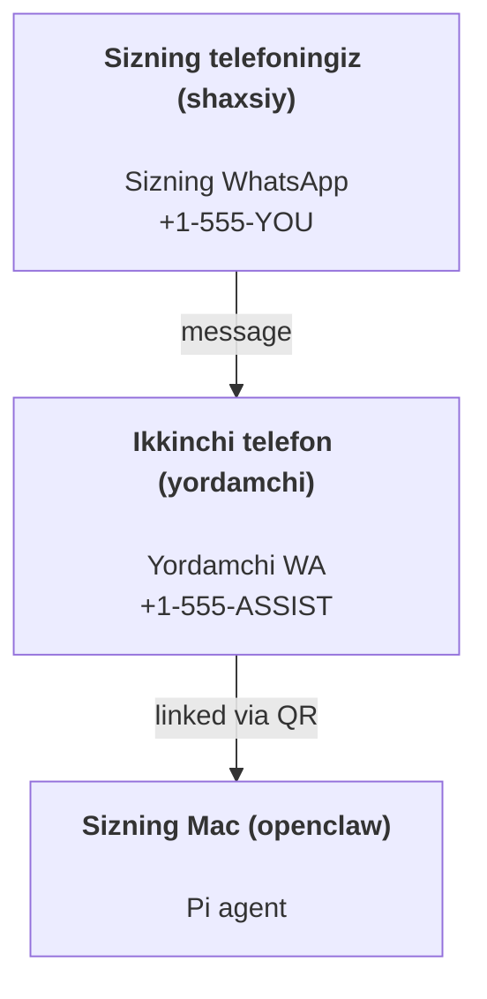

# OpenClaw yordamida shaxsiy yordamchi yaratish

OpenClaw is a WhatsApp + Telegram + Discord + iMessage gateway for **Pi** agents. Plugins add Mattermost. This guide is the "personal assistant" setup: one dedicated WhatsApp number that behaves like your always-on agent.

## ⚠️ Avvalo xavfsizlik

Siz agentga quyidagi imkoniyatlarni berasiz:

- kompyuteringizda buyruqlar bajarish (Pi tool sozlamangizga qarab)
- ish muhitingizdagi fayllarni o‘qish/yozish
- WhatsApp/Telegram/Discord/Mattermost (plugin) orqali tashqariga xabar yuborish

Ehtiyotkorlik bilan boshlang:

- Har doim `channels.whatsapp.allowFrom` ni sozlang (shaxsiy Mac’ingizda hech qachon hammaga ochiq rejimda ishlatmang).
- Yordamchi uchun alohida WhatsApp raqamidan foydalaning.
- Heartbeats now default to every 30 minutes. Disable until you trust the setup by setting `agents.defaults.heartbeat.every: "0m"`.

## Talablar

- OpenClaw o‘rnatilgan va dastlabki sozlamalar bajarilgan — agar hali qilmagan bo‘lsangiz, [Getting Started](/start/getting-started) ni ko‘ring
- Yordamchi uchun ikkinchi telefon raqami (SIM/eSIM/prepaid)

## Ikki telefonli sozlama (tavsiya etiladi)

Sizga quyidagisi kerak:



If you link your personal WhatsApp to OpenClaw, every message to you becomes “agent input”. That’s rarely what you want.

## 5 daqiqalik tezkor boshlash

1. WhatsApp Web’ni ulang (QR ko‘rsatadi; yordamchi telefon bilan skaner qiling):

```bash
openclaw channels login
```

2. Gateway’ni ishga tushiring (ochiq qoldiring):

```bash
openclaw gateway --port 18789
```

3. `~/.openclaw/openclaw.json` fayliga minimal konfiguratsiya yozing:

```json5
{
  channels: { whatsapp: { allowFrom: ["+15555550123"] } },
}
```

Endi ruxsat berilgan telefoningizdan yordamchi raqamiga xabar yuboring.

When onboarding finishes, we auto-open the dashboard and print a clean (non-tokenized) link. If it prompts for auth, paste the token from `gateway.auth.token` into Control UI settings. To reopen later: `openclaw dashboard`.

## Agent uchun ish maydoni (AGENTS)

OpenClaw ish ko‘rsatmalari va “xotira”ni workspace katalogidan o‘qiydi.

By default, OpenClaw uses `~/.openclaw/workspace` as the agent workspace, and will create it (plus starter `AGENTS.md`, `SOUL.md`, `TOOLS.md`, `IDENTITY.md`, `USER.md`, `HEARTBEAT.md`) automatically on setup/first agent run. `BOOTSTRAP.md` is only created when the workspace is brand new (it should not come back after you delete it). `MEMORY.md` is optional (not auto-created); when present, it is loaded for normal sessions. Subagent sessions only inject `AGENTS.md` and `TOOLS.md`.

Tip: treat this folder like OpenClaw’s “memory” and make it a git repo (ideally private) so your `AGENTS.md` + memory files are backed up. If git is installed, brand-new workspaces are auto-initialized.

```bash
openclaw setup
```

To‘liq workspace tuzilmasi va zaxiralash qo‘llanmasi: [Agent workspace](/concepts/agent-workspace)  
Xotira jarayoni: [Memory](/concepts/memory)

Ixtiyoriy: boshqa workspace tanlash uchun `agents.defaults.workspace` dan foydalaning (`~` qo‘llab-quvvatlanadi).

```json5
{
  agent: {
    workspace: "~/.openclaw/workspace",
  },
}
```

Agar siz allaqachon o‘z workspace fayllaringizni repodan yetkazib bersangiz, bootstrap fayllarini yaratishni to‘liq o‘chirishingiz mumkin:

```json5
{
  agent: {
    skipBootstrap: true,
  },
}
```

## Uni “yordamchi”ga aylantiradigan konfiguratsiya

OpenClaw sukut bo‘yicha yaxshi yordamchi sozlamalari bilan keladi, ammo odatda quyidagilarni moslashtirasiz:

- `SOUL.md` dagi persona/ko‘rsatmalar
- thinking default sozlamalari (agar kerak bo‘lsa)
- heartbeat (ishga ishonch hosil qilganingizdan so‘ng)

Misol:

```json5
{
  logging: { level: "info" },
  agent: {
    model: "anthropic/claude-opus-4-6",
    workspace: "~/.openclaw/workspace",
    thinkingDefault: "high",
    timeoutSeconds: 1800,
    // Avval 0 dan boshlang; keyinroq yoqing.
    heartbeat: { every: "0m" },
  },
  channels: {
    whatsapp: {
      allowFrom: ["+15555550123"],
      groups: {
        "*": { requireMention: true },
      },
    },
  },
  routing: {
    groupChat: {
      mentionPatterns: ["@openclaw", "openclaw"],
    },
  },
  session: {
    scope: "per-sender",
    resetTriggers: ["/new", "/reset"],
    reset: {
      mode: "daily",
      atHour: 4,
      idleMinutes: 10080,
    },
  },
}
```

## Sessiyalar va xotira

- Sessiya fayllari: `~/.openclaw/agents/<agentId>/sessions/{{SessionId}}.jsonl`
- Sessiya metama’lumotlari (token sarfi, oxirgi route va boshqalar): `~/.openclaw/agents/<agentId>/sessions/sessions.json` (legacy: `~/.openclaw/sessions/sessions.json`)
- `/new` or `/reset` starts a fresh session for that chat (configurable via `resetTriggers`). If sent alone, the agent replies with a short hello to confirm the reset.
- `/compact [instructions]` sessiya kontekstini qisqartiradi va qolgan kontekst budjetini ko‘rsatadi.

## Heartbeat (proaktiv rejim)

By default, OpenClaw runs a heartbeat every 30 minutes with the prompt:
`Read HEARTBEAT.md if it exists (workspace context). Follow it strictly. Do not infer or repeat old tasks from prior chats. If nothing needs attention, reply HEARTBEAT_OK.`
Set `agents.defaults.heartbeat.every: "0m"` to disable.

- Agar `HEARTBEAT.md` mavjud bo‘lsa, lekin amalda bo‘sh (faqat bo‘sh qatorlar va `# Heading` kabi markdown sarlavhalardan iborat) bo‘lsa, OpenClaw API chaqiruvlarini tejash uchun heartbeat’ni o‘tkazib yuboradi.
- Agar fayl mavjud bo‘lmasa, heartbeat baribir ishlaydi va model nima qilishni o‘zi hal qiladi.
- Agar agent `HEARTBEAT_OK` bilan javob bersa (ixtiyoriy qisqa qo‘shimcha matn bilan; qarang `agents.defaults.heartbeat.ackMaxChars`), OpenClaw ushbu heartbeat uchun tashqi yuborishni bekor qiladi.
- Heartbeat to‘liq agent turn sifatida ishlaydi — qisqaroq interval ko‘proq token sarflaydi.

```json5
{
  agent: {
    heartbeat: { every: "30m" },
  },
}
```

## Media kirish va chiqish

Kirishdagi biriktirmalar (rasmlar/audio/hujjatlar) buyruqingizga template’lar orqali uzatilishi mumkin:

- `{{MediaPath}}` (lokal vaqtinchalik fayl yo‘li)
- `{{MediaUrl}}` (pseudo-URL)
- `{{Transcript}}` (agar audio transkripsiya yoqilgan bo‘lsa)

Outbound attachments from the agent: include `MEDIA:<path-or-url>` on its own line (no spaces). Example:

```
Mana skrinshot.
MEDIA:https://example.com/screenshot.png
```

OpenClaw ularni ajratib oladi va matn bilan birga media sifatida yuboradi.

## Operatsion tekshiruv ro‘yxati

```bash
openclaw status          # lokal holat (creds, sessiyalar, navbatdagi eventlar)
openclaw status --all    # to‘liq diagnostika (faqat o‘qish, ulashish mumkin)
openclaw status --deep   # gateway health probe qo‘shadi (Telegram + Discord)
openclaw health --json   # gateway health snapshot (WS)
```

Loglar `/tmp/openclaw/` ostida joylashadi (sukut bo‘yicha: `openclaw-YYYY-MM-DD.log`).

## Keyingi qadamlar

- WebChat: [WebChat](/web/webchat)
- Gateway operatsiyalari: [Gateway operatsion qo'llanmasi](/gateway)
- Cron + wakeups: [Cron jobs](/automation/cron-jobs)
- macOS menyu paneli ilovasi: [OpenClaw macOS app](/platforms/macos)
- iOS node ilovasi: [iOS app](/platforms/ios)
- Android node ilovasi: [Android app](/platforms/android)
- Windows holati: [Windows (WSL2)](/platforms/windows)
- Linux holati: [Linux app](/platforms/linux)
- Xavfsizlik: [Security](/gateway/security)
