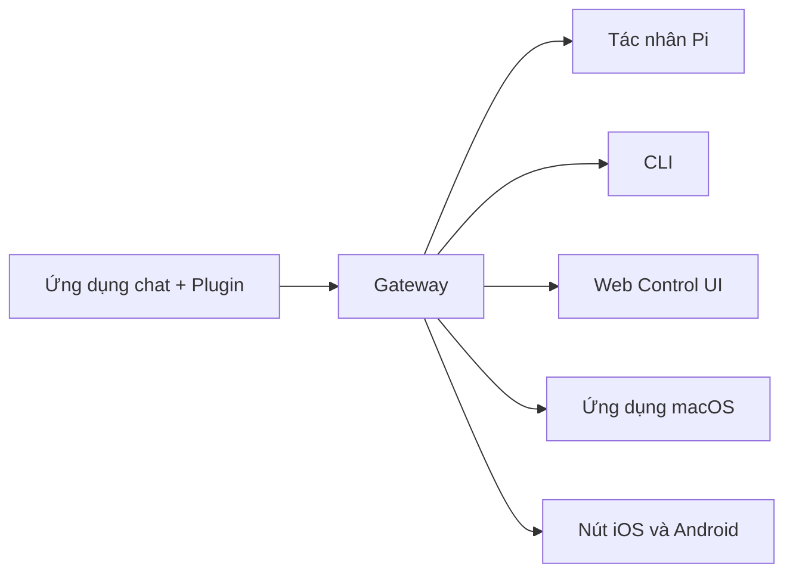

---
read_when:
  - 新規ユーザーにOpenClawを紹介するとき
summary: OpenClawは、あらゆるOSで動作するAIエージェント向けのマルチチャネルgatewayです。
title: OpenClaw
x-i18n:
  generated_at: "2026-02-08T17:15:47Z"
  model: claude-opus-4-5
  provider: pi
  source_hash: fc8babf7885ef91d526795051376d928599c4cf8aff75400138a0d7d9fa3b75f
  source_path: index.md
  workflow: 15
---

# OpenClaw 🦞

<p align="center">
    </img>
    </img>
</p>

> _「EXFOLIATE! EXFOLIATE!」_ — たぶん宇宙ロブスター

<p align="center"><strong>WhatsApp、Telegram、Discord、iMessageなどに対応した、あらゆるOS向けのAIエージェントgateway。</strong><br />
  メッセージを送信すれば、ポケットからエージェントの応答を受け取れます。プラグインでMattermostなどを追加できます。
</p>

<Columns>
  <Card title="はじめに" href="/start/getting-started" icon="rocket">
    OpenClawをインストールし、数分でGatewayを起動できます。
  
</Card>
  <Card title="ウィザードを実行" href="/start/wizard" icon="sparkles">
    `openclaw onboard`とペアリングフローによるガイド付きセットアップ。
  
</Card>
  <Card title="Control UIを開く" href="/web/control-ui" icon="layout-dashboard">
    チャット、設定、セッション用のブラウザダッシュボードを起動します。
  
</Card>
</Columns>

OpenClawは、単一のGatewayプロセスを通じてチャットアプリをPiのようなコーディングエージェントに接続します。OpenClawアシスタントを駆動し、ローカルまたはリモートのセットアップをサポートします。

## Cơ chế hoạt động



Gateway là nguồn thông tin đáng tin cậy duy nhất cho phiên, định tuyến và kết nối kênh.

## Tính năng chính

<Columns>
  <Card title="マルチチャネルgateway" icon="network">
    Hỗ trợ WhatsApp, Telegram, Discord, iMessage với một tiến trình Gateway duy nhất.
  
</Card>
  <Card title="プラグインチャネル" icon="plug">
    Thêm Mattermost và các nền tảng khác bằng gói mở rộng.
  
</Card>
  <Card title="マルチエージェントルーティング" icon="route">
    Phiên được tách biệt theo tác nhân, workspace và người gửi.
  
</Card>
  <Card title="メディアサポート" icon="image">
    Gửi và nhận hình ảnh, âm thanh và tài liệu.
  
</Card>
  <Card title="Web Control UI" icon="monitor">
    Bảng điều khiển trên trình duyệt cho chat, cài đặt, phiên và nút.
  
</Card>
  <Card title="モバイルノード" icon="smartphone">
    Ghép nối các nút iOS và Android hỗ trợ Canvas.
  
</Card>
</Columns>

## Bắt đầu nhanh

<Steps>
  <Step title="OpenClawをインストール">
    ```bash
    npm install -g openclaw@latest
    ```
  
</Step>
  <Step title="オンボーディングとサービスのインストール">
    ```bash
    openclaw onboard --install-daemon
    ```
  
</Step>
  <Step title="WhatsAppをペアリングしてGatewayを起動">
    ```bash
    openclaw channels login
    openclaw gateway --port 18789
    ```
  
</Step>
</Steps>

Cần cài đặt đầy đủ và thiết lập môi trường phát triển? Xem [Bắt đầu nhanh](/start/quickstart).

## Bảng điều khiển

Sau khi khởi động Gateway, mở Control UI trong trình duyệt.

- Mặc định cục bộ: [http://127.0.0.1:18789/](http://127.0.0.1:18789/)
- Truy cập từ xa: [Web Surface](/web) và [Tailscale](/gateway/tailscale)

<p align="center">
  </img>
</p>

## Cấu hình (tùy chọn)

Cấu hình nằm tại `~/.openclaw/openclaw.json`.

- **Nếu không cấu hình gì**, OpenClaw sẽ sử dụng Pi binary đi kèm ở chế độ RPC và tạo phiên theo từng người gửi.
- Nếu bạn muốn đặt giới hạn, hãy bắt đầu với `channels.whatsapp.allowFrom` và (đối với nhóm) quy tắc mention.

Ví dụ:

```json5
{
  channels: {
    whatsapp: {
      allowFrom: ["+15555550123"],
      groups: { "*": { requireMention: true } },
    },
  },
  messages: { groupChat: { mentionPatterns: ["@openclaw"] } },
}
```

## Bắt đầu từ đây

<Columns>
  <Card title="ドキュメントハブ" href="/start/hubs" icon="book-open">
    Tất cả tài liệu và hướng dẫn được sắp xếp theo từng trường hợp sử dụng.
  
</Card>
  <Card title="設定" href="/gateway/configuration" icon="settings">
    Cấu hình cốt lõi của Gateway, token và cấu hình nhà cung cấp.
  
</Card>
  <Card title="リモートアクセス" href="/gateway/remote" icon="globe">
    Mô hình truy cập SSH và tailnet.
  
</Card>
  <Card title="チャネル" href="/channels/telegram" icon="message-square">
    Thiết lập riêng cho từng kênh như WhatsApp, Telegram, Discord.
  
</Card>
  <Card title="ノード" href="/nodes" icon="smartphone">
    Ghép nối và các nút iOS và Android hỗ trợ Canvas.
  
</Card>
  <Card title="ヘルプ" href="/help" icon="life-buoy">
    Các bản sửa lỗi phổ biến và điểm bắt đầu cho xử lý sự cố.
  
</Card>
</Columns>

## Chi tiết

<Columns>
  <Card title="全機能リスト" href="/concepts/features" icon="list">
    Danh sách đầy đủ các kênh, định tuyến và tính năng media.
  
</Card>
  <Card title="マルチエージェントルーティング" href="/concepts/multi-agent" icon="route">
    Cách ly workspace và phiên theo từng tác nhân.
  
</Card>
  <Card title="セキュリティ" href="/gateway/security" icon="shield">
    Token, danh sách cho phép và kiểm soát bảo mật.
  
</Card>
  <Card title="トラブルシューティング" href="/gateway/troubleshooting" icon="wrench">
    Chẩn đoán Gateway và các lỗi thường gặp.
  
</Card>
  <Card title="概要とクレジット" href="/reference/credits" icon="info">
    Nguồn gốc dự án, người đóng góp và giấy phép.
  
</Card>
</Columns>
