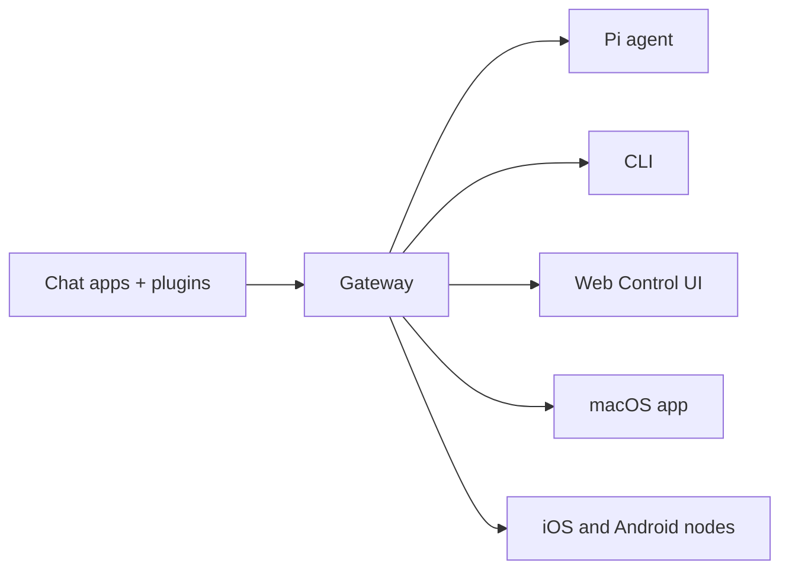

# OpenClaw 🦞

<p align="center">
    </img>
    </img>
</p>

> _"EXFOLIATE! _"去壳！去壳！"_ — 大概是一只太空龙虾说的

<p align="center"><strong>适用于任何操作系统的 AI 智能体 Gateway 网关，支持 WhatsApp、Telegram、Discord、iMessage 等。</strong><br />
  发送消息，随时随地获取智能体响应。通过插件可添加 Mattermost 等更多渠道。
<br />
  Send a message, get an agent response from your pocket. Plugins add Mattermost and more.
</p>

<Columns>
  <Card title="Get Started" href="/start/getting-started" icon="rocket">
    安装 OpenClaw 并在几分钟内启动 Gateway 网关。
  
</Card>
  <Card title="Run the Wizard" href="/start/wizard" icon="sparkles">
    通过 `openclaw onboard` 和配对流程进行引导式设置。
  
</Card>
  <Card title="Open the Control UI" href="/web/control-ui" icon="layout-dashboard">
    启动浏览器仪表板，管理聊天、配置和会话。
  
</Card>
</Columns>

## What is OpenClaw?

OpenClaw 通过单个 Gateway 网关进程将聊天应用连接到 Pi 等编程智能体。它为 OpenClaw 助手提供支持，并支持本地或远程部署。 You run a single Gateway process on your own machine (or a server), and it becomes the bridge between your messaging apps and an always-available AI assistant.

**Who is it for?** Developers and power users who want a personal AI assistant they can message from anywhere — without giving up control of their data or relying on a hosted service.

**What makes it different?**

- **Self-hosted**: runs on your hardware, your rules
- **Multi-channel**: one Gateway serves WhatsApp, Telegram, Discord, and more simultaneously
- **Agent-native**: built for coding agents with tool use, sessions, memory, and multi-agent routing
- **Open source**: MIT licensed, community-driven

**What do you need?** Node 22+, an API key (Anthropic recommended), and 5 minutes.

## How it works



Gateway 网关是会话、路由和渠道连接的唯一事实来源。

## 核心功能

<Columns>
  <Card title="Multi-channel gateway" icon="network">
    通过单个 Gateway 网关进程连接 WhatsApp、Telegram、Discord 和 iMessage。
  
</Card>
  <Card title="Plugin channels" icon="plug">
    通过扩展包添加 Mattermost 等更多渠道。
  
</Card>
  <Card title="Multi-agent routing" icon="route">
    Isolated sessions per agent, workspace, or sender.
  
</Card>
  <Card title="Media support" icon="image">
    发送和接收图片、音频和文档。
  
</Card>
  <Card title="Web Control UI" icon="monitor">
    浏览器仪表板，用于聊天、配置、会话和节点管理。
  
</Card>
  <Card title="Mobile nodes" icon="smartphone">
    配对 iOS 和 Android 节点，支持 Canvas。
  
</Card>
</Columns>

## 快速开始

<Steps>
  <Step title="Install OpenClaw">
    ```bash
    npm install -g openclaw@latest
    ```
  
</Step>
  <Step title="Onboard and install the service">
    ```bash
    openclaw onboard --install-daemon
    ```
  
</Step>
  <Step title="Pair WhatsApp and start the Gateway">
    ```bash
    openclaw channels login
    openclaw gateway --port 18789
    ```
  
</Step>
</Steps>

需要完整的安装和开发环境设置？请参阅[快速开始](/start/quickstart)。 See [Quick start](/start/quickstart).

## 仪表板

Gateway 网关启动后，打开浏览器控制界面。

- 本地默认地址：http://127.0.0.1:18789/
- 远程访问：[Web 界面](/web)和 [Tailscale](/gateway/tailscale)

<p align="center">
  </img>
</p>

## 配置（可选）

配置文件位于 `~/.openclaw/openclaw.json`。

- 如果你**不做任何修改**，OpenClaw 将使用内置的 Pi 二进制文件以 RPC 模式运行，并按发送者创建独立会话。
- 如果你想要限制访问，可以从 `channels.whatsapp.allowFrom` 和（针对群组的）提及规则开始配置。

示例：

```json5
{
  channels: {
    whatsapp: {
      allowFrom: ["+15555550123"],
      groups: { "*": { requireMention: true } },
    },
  },
  messages: { groupChat: { mentionPatterns: ["@openclaw"] } },
}
```

## 从这里开始

<Columns>
  <Card title="Docs hubs" href="/start/hubs" icon="book-open">
    所有文档和指南，按用例分类。
  
</Card>
  <Card title="Configuration" href="/gateway/configuration" icon="settings">
    核心 Gateway 网关设置、令牌和提供商配置。
  
</Card>
  <Card title="Remote access" href="/gateway/remote" icon="globe">
    SSH 和 tailnet 访问模式。
  
</Card>
  <Card title="Channels" href="/channels/telegram" icon="message-square">
    WhatsApp、Telegram、Discord 等渠道的具体设置。
  
</Card>
  <Card title="Nodes" href="/nodes" icon="smartphone">
    iOS 和 Android 节点的配对与 Canvas 功能。
  
</Card>
  <Card title="Help" href="/help" icon="life-buoy">
    常见修复方法和故障排除入口。
  
</Card>
</Columns>

## 了解更多

<Columns>
  <Card title="Full feature list" href="/concepts/features" icon="list">
    全部渠道、路由和媒体功能。
  
</Card>
  <Card title="Multi-agent routing" href="/concepts/multi-agent" icon="route">
    工作区隔离和按智能体的会话管理。
  
</Card>
  <Card title="Security" href="/gateway/security" icon="shield">
    令牌、白名单和安全控制。
  
</Card>
  <Card title="Troubleshooting" href="/gateway/troubleshooting" icon="wrench">
    Gateway 网关诊断和常见错误。
  
</Card>
  <Card title="About and credits" href="/reference/credits" icon="info">
    项目起源、贡献者和许可证。
  
</Card>
</Columns>
