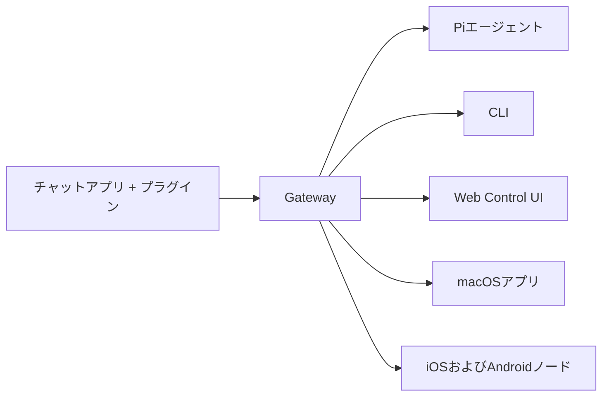

---
read_when:
  - 新規ユーザーにOpenClawを紹介するとき
summary: OpenClawは、あらゆるOSで動作するAIエージェント向けのマルチチャネルgatewayです。
title: OpenClaw
x-i18n:
  generated_at: "2026-02-08T17:15:47Z"
  model: claude-opus-4-5
  provider: pi
  source_hash: fc8babf7885ef91d526795051376d928599c4cf8aff75400138a0d7d9fa3b75f
  source_path: index.md
  workflow: 15
---

# OpenClaw 🦞

<p align="center">
    </img>
    </img>
</p>

> _「EXFOLIATE! EXFOLIATE!」_ — たぶん宇宙ロブスター

<p align="center"><strong>WhatsApp、Telegram、Discord、iMessageなどに対応した、あらゆるOS向けのAIエージェントgateway。</strong><br />
  メッセージを送信すれば、ポケットからエージェントの応答を受け取れます。プラグインでMattermostなどを追加できます。
</p>

<Columns>
  <Card title="はじめに" href="/start/getting-started" icon="rocket">
    OpenClawをインストールし、数分でGatewayを起動できます。
  
</Card>
  <Card title="ウィザードを実行" href="/start/wizard" icon="sparkles">
    `openclaw onboard`とペアリングフローによるガイド付きセットアップ。
  
</Card>
  <Card title="Control UIを開く" href="/web/control-ui" icon="layout-dashboard">
    チャット、設定、セッション用のブラウザダッシュボードを起動します。
  
</Card>
</Columns>

OpenClawは、単一のGatewayプロセスを通じてチャットアプリをPiのようなコーディングエージェントに接続します。OpenClawアシスタントを駆動し、ローカルまたはリモートのセットアップをサポートします。

## 仕組み



Gateway 是会话、路由和通道连接的唯一可信信息源。

## 主な機能

<Columns>
  <Card title="マルチチャネルgateway" icon="network">    通过单一 Gateway 进程支持 WhatsApp、Telegram、Discord、iMessage。
  
</Card>
  <Card title="プラグインチャネル" icon="plug">    通过扩展包添加 Mattermost 等。
  
</Card>
  <Card title="マルチエージェントルーティング" icon="route">    按代理、工作区和发送者隔离的会话。
  
</Card>
  <Card title="メディアサポート" icon="image">    支持图片、语音和文档的收发。
  
</Card>
  <Card title="Web Control UI" icon="monitor">    用于聊天、设置、会话和节点的浏览器仪表板。
  
</Card>
  <Card title="モバイルノード" icon="smartphone">    配对支持 Canvas 的 iOS 和 Android 节点。
  
</Card>
</Columns>

## 快速开始

<Steps>
  <Step title="OpenClawをインストール">    ```bash
    npm install -g openclaw@latest
    ```
  
</Step>
  <Step title="オンボーディングとサービスのインストール">    ```bash
    openclaw onboard --install-daemon
    ```
  
</Step>
  <Step title="WhatsAppをペアリングしてGatewayを起動">    ```bash
    openclaw channels login
    openclaw gateway --port 18789
    ```
  
</Step>
</Steps>

需要完整的安装和开发环境设置？请参阅[快速开始](/start/quickstart)。

## 仪表板

启动 Gateway 后，在浏览器中打开 Control UI。

- 本地默认地址: [http://127.0.0.1:18789/](http://127.0.0.1:18789/)
- 远程访问: [Web 界面](/web) 和 [Tailscale](/gateway/tailscale)

<p align="center">
  </img>
</p>

## 配置（可选）

配置位于 `~/.openclaw/openclaw.json`。

- **如果不进行任何操作**，OpenClaw 将使用内置的 Pi 二进制文件以 RPC 模式运行，并为每个发送者创建会话。
- 如果需要设置限制，请从 `channels.whatsapp.allowFrom` 以及（针对群组）提及规则开始。

示例：

```json5
{
  channels: {
    whatsapp: {
      allowFrom: ["+15555550123"],
      groups: { "*": { requireMention: true } },
    },
  },
  messages: { groupChat: { mentionPatterns: ["@openclaw"] } },
}
```

## 从这里开始

<Columns>
  <Card title="ドキュメントハブ" href="/start/hubs" icon="book-open">    按使用场景整理的所有文档和指南。
  
</Card>
  <Card title="設定" href="/gateway/configuration" icon="settings">    Gateway 的核心配置、令牌和提供商设置。
  
</Card>
  <Card title="リモートアクセス" href="/gateway/remote" icon="globe">    SSH 和 tailnet 访问模式。
  
</Card>
  <Card title="チャネル" href="/channels/telegram" icon="message-square">    WhatsApp、Telegram、Discord 等渠道的专属设置。
  
</Card>
  <Card title="ノード" href="/nodes" icon="smartphone">    配对及支持 Canvas 的 iOS 和 Android 节点。
  
</Card>
  <Card title="ヘルプ" href="/help" icon="life-buoy">    常见修复和故障排除入口。
  
</Card>
</Columns>

## 详细信息

<Columns>
  <Card title="全機能リスト" href="/concepts/features" icon="list">    渠道、路由和媒体功能的完整列表。
  
</Card>
  <Card title="マルチエージェントルーティング" href="/concepts/multi-agent" icon="route">    工作区隔离和按代理划分的会话。
  
</Card>
  <Card title="セキュリティ" href="/gateway/security" icon="shield">    令牌、允许列表和安全控制。
  
</Card>
  <Card title="トラブルシューティング" href="/gateway/troubleshooting" icon="wrench">    Gateway 诊断和常见错误。
  
</Card>
  <Card title="概要とクレジット" href="/reference/credits" icon="info">    项目起源、贡献者和许可证。
  
</Card>
</Columns>
