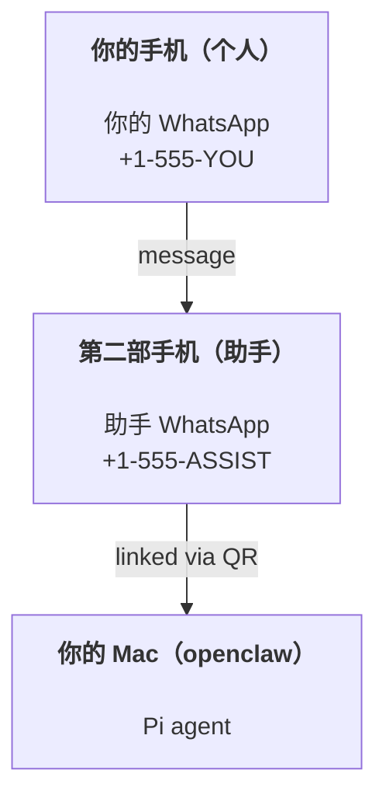

# 使用 OpenClaw 构建个人助手

OpenClaw 是 **Pi** 智能体的 WhatsApp + Telegram + Discord + iMessage Gateway 网关。插件可添加 Mattermost。本指南是"个人助手"设置：一个专用的 WhatsApp 号码，表现得像你的常驻智能体。 26. 插件添加了 Mattermost。 This guide is the "personal assistant" setup: one dedicated WhatsApp number that behaves like your always-on agent.

## ⚠️ 安全第一

You’re putting an agent in a position to:

- 在你的机器上运行命令（取决于你的 Pi 工具设置）
- 在你的工作区读/写文件
- 通过 WhatsApp/Telegram/Discord/Mattermost（插件）发送消息

从保守开始：

- 始终设置 `channels.whatsapp.allowFrom`（永远不要在你的个人 Mac 上对全世界开放）。
- 为助手使用专用的 WhatsApp 号码。
- Heartbeats now default to every 30 minutes. 心跳现在默认每 30 分钟一次。在你信任设置之前，通过设置 `agents.defaults.heartbeat.every: "0m"` 来禁用。

## 先决条件

- OpenClaw installed and onboarded — see [Getting Started](/start/getting-started) if you haven't done this yet
- 助手的第二个手机号码（SIM/eSIM/预付费）

## 双手机设置（推荐）

你需要这样：



如果你将个人 WhatsApp 关联到 OpenClaw，发给你的每条消息都会变成"智能体输入"。这通常不是你想要的。 That’s rarely what you want.

## 5 分钟快速开始

1. 配对 WhatsApp Web（显示二维码；用助手手机扫描）：

```bash
openclaw channels login
```

2. 启动 Gateway 网关（保持运行）：

```bash
openclaw gateway --port 18789
```

3. 在 `~/.openclaw/openclaw.json` 中放置最小配置：

```json5
{
  channels: { whatsapp: { allowFrom: ["+15555550123"] } },
}
```

现在从你允许列表中的手机向助手号码发消息。

When onboarding finishes, we auto-open the dashboard and print a clean (non-tokenized) link. If it prompts for auth, paste the token from `gateway.auth.token` into Control UI settings. To reopen later: `openclaw dashboard`.

## 给智能体一个工作区（AGENTS）

OpenClaw 从其工作区目录读取操作指令和"记忆"。

1. 默认情况下，OpenClaw 使用 `~/.openclaw/workspace` 作为代理工作区，并会在设置/首次代理运行时自动创建它（以及初始的 `AGENTS.md`、`SOUL.md`、`TOOLS.md`、`IDENTITY.md`、`USER.md`、`HEARTBEAT.md`）。 默认情况下，OpenClaw 使用 `~/.openclaw/workspace` 作为智能体工作区，并会在设置/首次智能体运行时自动创建它（加上起始的 `AGENTS.md`、`SOUL.md`、`TOOLS.md`、`IDENTITY.md`、`USER.md`）。`BOOTSTRAP.md` 仅在工作区是全新的时候创建（删除后不应再出现）。 3. `MEMORY.md` 是可选的（不会自动创建）；存在时会在普通会话中加载。 4. 子代理会话只注入 `AGENTS.md` 和 `TOOLS.md`。

提示：将此文件夹视为 OpenClaw 的"记忆"，并将其设为 git 仓库（最好是私有的），这样你的 `AGENTS.md` + 记忆文件就有了备份。如果安装了 git，全新的工作区会自动初始化。 6. 如果已安装 git，全新的工作区会自动初始化。

```bash
openclaw setup
```

完整工作区布局 + 备份指南：[智能体工作区](/concepts/agent-workspace)
记忆工作流：[记忆](/concepts/memory)

可选：使用 `agents.defaults.workspace` 选择不同的工作区（支持 `~`）。

```json5
{
  agent: {
    workspace: "~/.openclaw/workspace",
  },
}
```

如果你已经从仓库提供了自己的工作区文件，可以完全禁用引导文件创建：

```json5
{
  agent: {
    skipBootstrap: true,
  },
}
```

## 将其变成"助手"的配置

OpenClaw 默认为良好的助手设置，但你通常需要调整：

- `SOUL.md` 中的人设/指令
- 思考默认值（如果需要）
- 心跳（一旦你信任它）

示例：

```json5
{
  logging: { level: "info" },
  agent: {
    model: "anthropic/claude-opus-4-5",
    workspace: "~/.openclaw/workspace",
    thinkingDefault: "high",
    timeoutSeconds: 1800,
    // 从 0 开始；稍后启用。
    heartbeat: { every: "0m" },
  },
  channels: {
    whatsapp: {
      allowFrom: ["+15555550123"],
      groups: {
        "*": { requireMention: true },
      },
    },
  },
  routing: {
    groupChat: {
      mentionPatterns: ["@openclaw", "openclaw"],
    },
  },
  session: {
    scope: "per-sender",
    resetTriggers: ["/new", "/reset"],
    reset: {
      mode: "daily",
      atHour: 4,
      idleMinutes: 10080,
    },
  },
}
```

## 会话和记忆

- 会话文件：`~/.openclaw/agents/<agentId>/sessions/{{SessionId}}.jsonl`
- 会话元数据（token 使用量、最后路由等）：`~/.openclaw/agents/<agentId>/sessions/sessions.json`（旧版：`~/.openclaw/sessions/sessions.json`）
- `/new` 或 `/reset` 为该聊天启动新会话（可通过 `resetTriggers` 配置）。如果单独发送，智能体会回复一个简短的问候来确认重置。 32. 如果单独发送，代理会回复一个简短的问候以确认重置。
- `/compact [instructions]` 压缩会话上下文并报告剩余的上下文预算。

## 心跳（主动模式）

默认情况下，OpenClaw 每 30 分钟运行一次心跳，提示词为：
`Read HEARTBEAT.md if it exists (workspace context). Follow it strictly. Do not infer or repeat old tasks from prior chats. If nothing needs attention, reply HEARTBEAT_OK.`
设置 `agents.defaults.heartbeat.every: "0m"` 来禁用。

- 如果 `HEARTBEAT.md` 存在但实际上是空的（只有空行和 markdown 标题如 `# Heading`），OpenClaw 会跳过心跳运行以节省 API 调用。
- 如果文件不存在，心跳仍然运行，模型决定做什么。
- 如果智能体回复 `HEARTBEAT_OK`（可选带有短填充；参见 `agents.defaults.heartbeat.ackMaxChars`），OpenClaw 会为该心跳抑制出站投递。
- 心跳运行完整的智能体轮次 — 更短的间隔会消耗更多 token。

```json5
{
  agent: {
    heartbeat: { every: "30m" },
  },
}
```

## 媒体输入和输出

入站附件（图片/音频/文档）可以通过模板暴露给你的命令：

- `{{MediaPath}}`（本地临时文件路径）
- `{{MediaUrl}}`（伪 URL）
- `{{Transcript}}`（如果启用了音频转录）

来自智能体的出站附件：在单独一行包含 `MEDIA:<path-or-url>`（无空格）。示例： 45. 运维清单

```
这是截图。
MEDIA:https://example.com/screenshot.png
```

OpenClaw 会提取这些并将它们作为媒体与文本一起发送。

## 运维检查清单

```bash
openclaw status          # 本地状态（凭证、会话、排队事件）
openclaw status --all    # 完整诊断（只读，可粘贴）
openclaw status --deep   # 添加 Gateway 网关健康探测（Telegram + Discord）
openclaw health --json   # Gateway 网关健康快照（WS）
```

日志位于 `/tmp/openclaw/`（默认：`openclaw-YYYY-MM-DD.log`）。

## 下一步

- WebChat：[WebChat](/web/webchat)
- Gateway 网关运维：[Gateway 网关运行手册](/gateway)
- 定时任务 + 唤醒：[定时任务](/automation/cron-jobs)
- macOS 菜单栏配套应用：[OpenClaw macOS 应用](/platforms/macos)
- iOS 节点应用：[iOS 应用](/platforms/ios)
- Android 节点应用：[Android 应用](/platforms/android)
- Windows 状态：[Windows (WSL2)](/platforms/windows)
- Linux 状态：[Linux 应用](/platforms/linux)
- 安全：[安全](/gateway/security)

