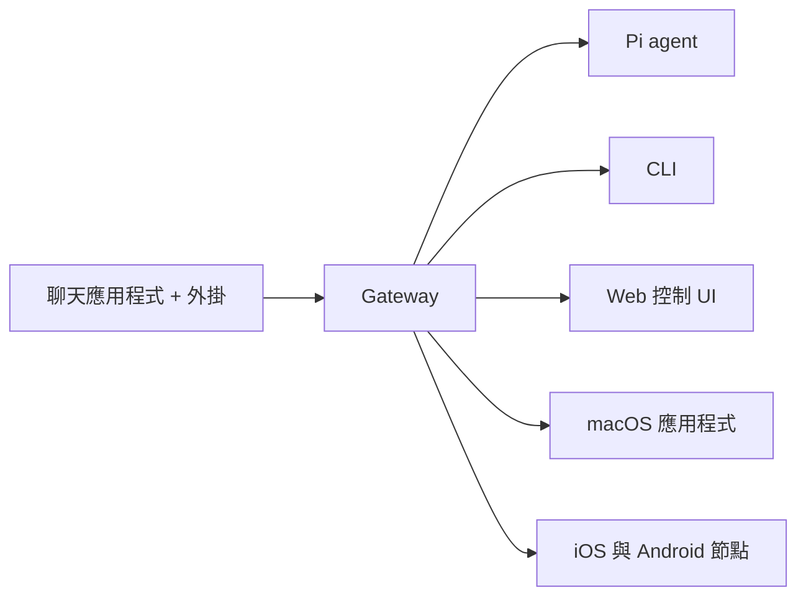

---
read_when:
  - 向新使用者介紹 OpenClaw 時
summary: OpenClaw 是一個可在各種作業系統上運行、為 AI 代理設計的多通道 gateway。
title: OpenClaw
x-i18n:
  generated_at: "2026-02-08T17:15:47Z"
  model: claude-opus-4-5
  provider: pi
  source_hash: fc8babf7885ef91d526795051376d928599c4cf8aff75400138a0d7d9fa3b75f
  source_path: index.md
  workflow: 15
---

# OpenClaw 🦞

<p align="center">
    </img>
    </img>
</p>

> _「脫殼！ 脫殼！」_ — 也許是宇宙龍蝦

<p align="center"><strong>支援 WhatsApp、Telegram、Discord、iMessage 等、適用於各種 OS 的 AI agent gateway。</strong><br />
  只要傳送訊息，就能從口袋中收到 agent 的回應。也可透過外掛新增 Mattermost 等服務。</p>

<Columns>
  <Card title="はじめに" href="/start/getting-started" icon="rocket">
    安裝 OpenClaw，幾分鐘內即可啟動 Gateway。
  
</Card>
  <Card title="ウィザードを実行" href="/start/wizard" icon="sparkles">
    透過 `openclaw onboard` 與配對流程進行引導式設定。
  
</Card>
  <Card title="Control UIを開く" href="/web/control-ui" icon="layout-dashboard">
    啟動用於聊天、設定與工作階段的瀏覽器儀表板。
  
</Card>
</Columns>

OpenClaw 透過單一 Gateway 程序，將聊天應用程式連接到如 Pi 等程式開發 agent。它驅動 OpenClaw 助理，並支援本機或遠端設定。

## 運作方式



Gateway 是工作階段、路由與通道連線的唯一可信來源。

## 主要功能

<Columns>
  <Card title="マルチチャネルgateway" icon="network">
    透過單一 Gateway 程序支援 WhatsApp、Telegram、Discord、iMessage。
  
</Card>
  <Card title="プラグインチャネル" icon="plug">
    透過擴充套件新增 Mattermost 等服務。
  
</Card>
  <Card title="マルチエージェントルーティング" icon="route">
    依 agent、workspace 與傳送者分離的工作階段。
  
</Card>
  <Card title="メディアサポート" icon="image">
    收發圖片、語音與文件。
  
</Card>
  <Card title="Web Control UI" icon="monitor">
    提供用於聊天、設定、工作階段與節點的瀏覽器儀表板。
  
</Card>
  <Card title="モバイルノード" icon="smartphone">
    配對支援 Canvas 的 iOS 與 Android 節點。
  
</Card>
</Columns>

## 快速開始

<Steps>
  <Step title="OpenClawをインストール">
    ```bash
    npm install -g openclaw@latest
    ```
  
</Step>
  <Step title="オンボーディングとサービスのインストール">
    ```bash
    openclaw onboard --install-daemon
    ```
  
</Step>
  <Step title="WhatsAppをペアリングしてGatewayを起動">
    ```bash
    openclaw channels login
    openclaw gateway --port 18789
    ```
  
</Step>
</Steps>

需要完整的安裝與開發設定嗎？請參閱[快速開始](/start/quickstart)。

## 儀表板

啟動 Gateway 後，在瀏覽器中開啟 Control UI。

- 本機預設：[http://127.0.0.1:18789/](http://127.0.0.1:18789/)
- 遠端存取：[Web 介面](/web) 及 [Tailscale](/gateway/tailscale)

<p align="center">
  </img>
</p>

## 設定（選用）

設定位於 `~/.openclaw/openclaw.json`。

- **若未進行任何設定**，OpenClaw 會以 RPC 模式使用隨附的 Pi 二進位檔，並為每位傳送者建立工作階段。
- 若想設置限制，請從 `channels.whatsapp.allowFrom` 以及（群組情況下）提及規則開始設定。

範例：

```json5
{
  channels: {
    whatsapp: {
      allowFrom: ["+15555550123"],
      groups: { "*": { requireMention: true } },
    },
  },
  messages: { groupChat: { mentionPatterns: ["@openclaw"] } },
}
```

## 從這裡開始

<Columns>
  <Card title="ドキュメントハブ" href="/start/hubs" icon="book-open">
    依使用情境整理的所有文件與指南。
  
</Card>
  <Card title="設定" href="/gateway/configuration" icon="settings">
    Gateway 核心設定、權杖與供應商設定。
  
</Card>
  <Card title="リモートアクセス" href="/gateway/remote" icon="globe">
    SSH 與 tailnet 存取模式。
  
</Card>
  <Card title="チャネル" href="/channels/telegram" icon="message-square">
    WhatsApp、Telegram、Discord 等通道專屬設定。
  
</Card>
  <Card title="ノード" href="/nodes" icon="smartphone">
    配對與支援 Canvas 的 iOS 與 Android 節點。
  
</Card>
  <Card title="ヘルプ" href="/help" icon="life-buoy">
    常見修正與疑難排解的入口。
  
</Card>
</Columns>

## 詳細資訊

<Columns>
  <Card title="全機能リスト" href="/concepts/features" icon="list">
    通道、路由與媒體功能的完整清單。
  
</Card>
  <Card title="マルチエージェントルーティング" href="/concepts/multi-agent" icon="route">
    workspace 隔離與各 agent 的工作階段。
  
</Card>
  <Card title="セキュリティ" href="/gateway/security" icon="shield">    權杖、允許清單、安全控制。
  
</Card>
  <Card title="トラブルシューティング" href="/gateway/troubleshooting" icon="wrench">    Gateway 的診斷與常見錯誤。
  
</Card>
  <Card title="概要とクレジット" href="/reference/credits" icon="info">    專案的起源、貢獻者與授權條款。
  
</Card>
</Columns>
